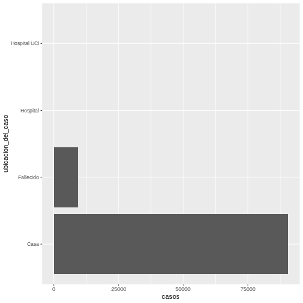
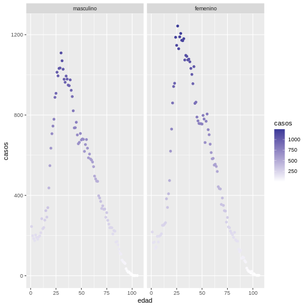
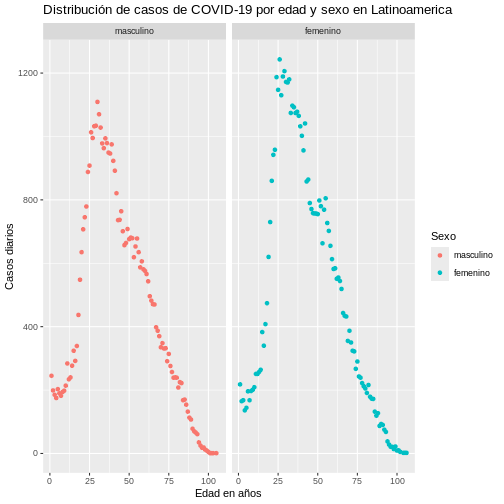

::: questions

- ¿Cómo visualizar datos epidemiologicos con ggplot2?

:::

::: objectives

Al final de este taller usted podrá:

- Reconocer las funciones que componen el paquete ggplot2.
- Realizar gráficos básicos con la estructura de ggplot2

:::

::: prereq
Esta unidad tiene como prerequisitos:

-   Introducción a R y RStudio
:::


::: checklist
### Tabla de contenido

-   Módulo: Ciencia de datos en salud pública
    -   Unidad: Introducción a la visualización de datos en R con ggplot2
        -   Tema 1: Principios de la gramática de gráficos con `ggplot2`
        -   Tema 2: Gramática de gráficos
            -   Datos (Data)
            -   Estética (Aesthetics)
            -   Geometría (Geometry)
            -   Escala (Scale)
            -   Facetas (Facets)
            -   Temas (Themes)
            
:::

**Desarrollo del contenido** (desarrolle cada uno de los temas teniendo
en cuenta la tabla de contenido)

## Introducción

En el ámbito de la ciencia de datos y la toma de decisiones, la
habilidad para transformar datos en información comprensible y que
genere impacto es esencial. Esta unidad brindará una introducción a las
herramientas necesarias para convertir conjuntos de datos en gráficos.
En esta unidad haremos uso de ggplot2, una poderosa librería de gráficos
de R basada en la gramática de gráficos, para crear visualizaciones
impactantes.

## Tema 1: Principios de la gramática de gráficos con `ggplot2`

`ggplot2` es un paquete de R basado en la gramática de gráficos que
permite visualizar datos de una manera consistente y estructurada.

`ggplot2`recibe su nombre precisamente de la abreviación del término
gramática de gráficos (gg). La gramática de gráficos se refiere a un
enfoque conceptual propuesto y desarrollado por Leland Wilkinson para la
creación de gráficos, el cual sirvió como base para el desarrollo de
`ggplot2` a manos de Hadley Wickham.

La gramática de gráficos proporciona un marco conceptual para pensar
sobre cómo construir y entender visualizaciones de datos de una manera
coherente y estructurada. En términos simples, la gramática de gráficos
descompone un gráfico en sus componentes fundamentales y define cómo se
combinan estos componentes para representar datos.

::: checklist
### Estos componentes básicos son:

**1. Datos (Data):** representan los datos que queremos visualizar.
Puede ser una tabla de datos (data.frame) en R u otra fuente de datos.

**2. Estética (Aesthetics):** definen cómo se mapean los atributos de
los datos a propiedades visuales del gráfico, como posición en el eje X
(x), posición en el eje Y (y), color, forma, tamaño, etc. Esto se
especifica mediante la función `aes()` en `ggplot2`.

**3. Geometría (Geometry):** representa la forma en que los datos se
visualizan en el gráfico, como puntos, líneas, barras, áreas, etc. Cada
tipo de gráfico tiene su función correspondiente en`ggplot2`, como
geom_point() para un gráfico de dispersión o geom_bar() para un gráfico
de barras.

**4. Escala (Scale):** define cómo se mapean los valores de los datos a
los valores visuales, como el rango de colores o el rango de los ejes.
`ggplot2`ajusta automáticamente las escalas, pero también podemos
`ggplot2`ajusta automáticamente las escalas, pero también podemos
personalizarlas con funciones como `scale_log10()`,
`scale_x_continuous()` o `scale_color_manual()`.

**5. Facetas (Facets):** permiten dividir los datos en subconjuntos y
mostrarlos en paneles múltiples (facetas) según ciertas variables.
Podemos usar facet_wrap() o `facet_grid()` en `ggplot2`para implementar
Podemos usar facet_wrap() o `facet_grid()` en `ggplot2`para implementar
esta funcionalidad.

**6. Temas (Themes):** controlan la apariencia visual general del
gráfico, como títulos, etiquetas de ejes, fondos, etc. Podemos gráfico,
como títulos, etiquetas de ejes, fondos, etc. Podemos personalizar el
tema con la función `theme()` en `ggplot2`.

Por ejemplo, una estructura clásica de un gráfico de puntos será:

```         
ggplot(data, \# Los datos

   aes(x, y) \# La estética
)+
   geom_point() \# la geometría
```
:::

## Tema 2: Ejemplos del uso de la gramática de gráficos con ggplot

Aquí vamos a ir explicando cómo puedes hacer uso de esta herramienta en
tu computador. A medida que avanzas trata de ir replicando los
ejercicios.

::: callout
#### **NOTA.**

Para hacer más versátil su uso, se recomienda conocer el funcionamiento
del paquete dplyr y el uso de tuberías (pipes `%>%`), puedes repasar
estos temas en la Unidad 1 de este módulo "Introducción a R y RStudio".
Por su parte, `ggplot2` está contenido dentro de la librería Tidyverse.
Además, Tidiverse incluye otras librerías como dplyr que, a su vez,
incluye las pipes (`%>%`). Para más detalles sobre Tidyverse consulta la
unidad de "Introducción a R y RStudio".
:::

Para los ejercicios prácticos de esta unidad es necesario cargar las
siguientes librerías:


``` r
library(ggplot2) 
```


``` r
library(tidyverse)
```

``` output
── Attaching core tidyverse packages ──────────────────────── tidyverse 2.0.0 ──
✔ dplyr     1.1.4     ✔ readr     2.1.5
✔ forcats   1.0.0     ✔ stringr   1.5.1
✔ lubridate 1.9.3     ✔ tibble    3.2.1
✔ purrr     1.0.2     ✔ tidyr     1.3.1
── Conflicts ────────────────────────────────────────── tidyverse_conflicts() ──
✖ dplyr::filter() masks stats::filter()
✖ dplyr::lag()    masks stats::lag()
ℹ Use the conflicted package (<http://conflicted.r-lib.org/>) to force all conflicts to become errors
```

Ahora, veremos cada uno de los componentes para realizar gráficos de
datos con `ggplot2` a través de un ejercicio práctico. Se requiere una
tabla de datos (una estructura con filas y columnas) para poder ser
usada en la estética de los gráficos. Previo al uso de `ggplot2`, suele
ser necesario realizar un proceso de limpieza y organización de los
datos. Para este ejercicio práctico usaremos una base de datos limpia,
que nos permita hacer las visualizaciones sin la necesidad de
pre-procesar los datos.

::: callout
La tabla de datos para este ejercicio puedes encontrarla en:
<https://github.com/TRACE-LAC/TRACE-LAC-data/blob/main/otros/muestra_covid.RDS?raw=true>
:::

Cuando ya tengas los datos descargados en tu computador y en la carpeta
de data de tu proyecto puedes ejecutar el siguiente comando:


``` r
covid19 <- readRDS("data/muestra_covid.RDS")
```

Una vez obtenida la tabla de datos vamos a explorar los datos para
conocer el estado actual y revisar qué variables podríamos usar para las
visualizaciones. Para esto utilizamos una de las funciones vistas en la
unidad de "Introducción a R y RStudio" llamada `glimpse.`Úsala y
verifica la estructura de la tabla de datos


``` r
glimpse(covid19)
```

``` output
Rows: 100,000
Columns: 19
$ fecha_reporte_web                     <date> 2021-04-09, 2021-03-18, 2022-01…
$ id_de_caso                            <dbl> 2493495, 2318883, 5290100, 43526…
$ fecha_de_notificacion                 <date> 2021-03-27, 2021-03-06, 2022-01…
$ edad                                  <dbl> 45, 38, 34, 64, 24, 16, 25, 72, …
$ sexo                                  <fct> femenino, masculino, masculino, …
$ tipo_de_contagio                      <chr> "Comunitaria", "Comunitaria", "C…
$ ubicacion_del_caso                    <chr> "Casa", "Casa", "Casa", "Casa", …
$ estado                                <fct> Leve, Leve, Leve, Leve, Leve, Le…
$ recuperado                            <fct> Recuperado, Recuperado, Recupera…
$ fecha_de_inicio_de_sintomas           <date> 2021-03-24, 2021-03-03, 2022-01…
$ fecha_de_muerte                       <date> NA, NA, NA, NA, NA, NA, NA, NA,…
$ fecha_de_diagnostico                  <date> 2021-04-07, 2021-03-17, 2022-01…
$ fecha_de_recuperacion                 <date> 2021-04-10, 2021-03-19, 2022-01…
$ fecha_de_nacimiento                   <date> 1975-06-01, 1975-06-08, 1975-06…
$ nombre_del_pais                       <chr> "Colombia", "Cuba", "Nicaragua",…
$ sintomas                              <fct> Leve, Leve, Leve, Leve, Leve, Le…
$ numero_de_hospitalizaciones_recientes <dbl> 0, 2, 1, 0, 0, 0, 0, 0, 0, 0, 1,…
$ tension_sistolica                     <dbl> 107, 126, 107, 134, 126, 156, 14…
$ tension_diastolica                    <dbl> 87, 64, 73, 76, 83, 96, 76, 87, …
```

### Estética (Aesthetics)

En el contexto de la gramática de gráficos, la estética (aesthetics) se
refiere a cómo mapeamos los atributos de nuestros datos a propiedades
visuales en el gráfico. Estas propiedades visuales pueden ser elementos
tales como la posición en el eje X (x), la posición en el eje Y (y), el
color (color), la forma(shape), el tamaño(size), etc. Al mapear estos
atributos podemos crear visualizaciones que nos permiten comprender y
comunicar patrones y relaciones en los datos de manera efectiva.

En `ggplot2` la función principal para especificar la estética es
`aes()`. A continuación algunos ejemplos para ilustrar cómo usar la
estética en `ggplot2`.

#### Ejemplo 1: Gráfico de dispersión (scatter plot)

Supongamos que tenemos una tabla que cuenta con las variables x e y*.*
Queremos crear un gráfico de dispersión donde la variable x se mapea en
el eje X y la variable y en el eje Y. Además, queremos que los puntos se
coloreen según la variable grupo. Mediante la función `aes()` de
`ggplot2` es posible asignar estas variables a los correspondientes
atributos visuales del gráfico, como veremos en el ejemplo a
continuación.

Consideremos la base covid19 que cargamos previamente. El requerimiento
es realizar un gráfico de dispersión que muestre el número de casos por
fecha de reporte y desagregados por sexo. Para esto, primero organizamos
los datos para lograr una tabla resumen con la información que queremos
graficar, usando las funciones vistas en la unidad de "Introducción a R
y RStudio" de la siguiente manera:


``` r
covid19_resumen <- covid19 %>%
  group_by(fecha_reporte_web, sexo) %>%
  summarise(casos = n())
```

``` output
`summarise()` has grouped output by 'fecha_reporte_web'. You can override using
the `.groups` argument.
```

Luego, podemos usar la estética de los gráficos de `ggplot2` indicando
las variables a usar en cada dimensión, en este caso en el eje X
tendremos la variable de tiempo (fecha_reporte_web) y en el eje Y el
número de casos (casos). Para ver la desagregación por sexo haremos uso
de uno de los atributos como el color. Estas instrucciones pueden
seguirse a través del siguiente código:


``` r
ggplot(data = covid19_resumen,
       aes(x = fecha_reporte_web, y = casos, colour = sexo)) +
  geom_point()
```

La visualización que generamos es la siguiente:


### Geometría (Geometry)

La geometría representa la forma en que los datos se visualizan en el
gráfico; como puntos, líneas, barras, áreas, etc. Cada tipo de gráfico
tiene su función correspondiente en `ggplot2`; por ejemplo
`geom_point()` para un gráfico de dispersión o `geom_bar()` para un
gráfico de barras.

::: checklist
En la siguiente tabla se muestran algunos ejemplos de los distintos
tipos de geometrías más usados en `ggplot2` con su correspondiente
comando:


:::

#### Ejemplo 2: Gráfico de líneas

Supongamos que queremos visualizar la evolución del número de casos de
covid-19 a lo largo del tiempo. Para esto, primero debemos preparar el
conjunto de datos que formarán el gráfico:


``` r
covid19_fecha <- covid19 %>%
  group_by(fecha_reporte_web) %>%
  summarise(casos = n())
```

Una vez el conjunto de datos esté listo, procedemos a usar la geometría
de `ggplot2`:


``` r
ggplot(data = covid19_fecha, 
       aes(x = fecha_reporte_web, y = casos)) +
  geom_line()
```

Y obtenemos el siguiente gráfico:


#### Ejemplo 3: Gráfico de barras

Ahora, hagamos una visualización en forma de gráfico de barras del total
de casos positivos por sexo, para esto utilizamos el comando
`geom_bar()` así:


``` r
ggplot(data = covid19) +
  geom_bar(aes(x = sexo))
```


En este ejemplo podemos observar que `ggplot2` automáticamente calcula
el eje Y.

#### Ejemplo 4. Gráfico de barras más complejo

Primero vamos a preparar los datos en una tabla de datos que permita
contar el número de casos por ubicación del caso:


``` r
covid19_ubicacion <- covid19 %>%  
group_by(ubicacion_del_caso) %>%
  summarise(casos = n())
```

Ahora, por medio de la geometría de `ggplot`, hacemos la visualización
usando el argumento `stat = "identity"` que calcula la suma de la
variable `y = casos` agrupando por la variable `x = ubicacion_del_caso`:


``` r
ggplot(data = covid19_ubicacion, aes(x = ubicacion_del_caso, y = casos)) + 
  geom_bar(stat = "identity")
```

Se obtendrá la siguiente gráfica:


En este caso tenemos las barras en orientación vertical. Si desearamos
poner las barras en orientación horizontal podemos lograrlo, usando al
final el comando `coord_flip` de la siguiente manera:


``` r
ggplot(data = covid19_ubicacion, aes(x = ubicacion_del_caso, y = casos)) +
  geom_bar(stat = "identity") +
  coord_flip()
```

Obteniendo como resultado:



Si queremos ordenar la ubicación del caso por el número de casos,
podemos utilizar el comando `reorder` en el eje donde está la ubicación
del caso. La función `reorder` tiene dos argumentos: el primero es la
variable a ordenar y el segundo es la variable que otorga el orden. En
este caso sería `reorder(ubicacion_del_caso, +casos)` si queremos
ordenar de mayor a menor cantidad de casos. El código sería el
siguiente:


``` r
ggplot(covid19_ubicacion, 
       aes(x = reorder(ubicacion_del_caso, +casos), y = casos)) +
  geom_bar(stat = "identity") +
  coord_flip()
```

Y la gráfica queda así:


::: challenge
Pregunta ¿cómo produciría esta misma gráfica, pero en orden ascendente?
:::

### Escala

En la gramática de gráficos en `ggplot2`, la escala se refiere a la
forma en que los valores de los datos se traducen en propiedades
visuales. La elección adecuada de las escalas es esencial para que los
gráficos sean interpretables y precisos.

A continuación, veremos algunos de los diferentes tipos de escalas
disponibles en `ggplot2` y sus funciones:

::: checklist
#### 1. Para **datos de tipo continuo o numéricos** tenemos **escalas continuas como:**

-   `scale_x_continuous()` y `scale_y_continuous()` : para el eje x y el
    eje y, respectivamente.

-   `scale_color_continuous()`: asigna colores a los valores continuos.

-   `scale_size_continuous()`: asigna tamaño a los valores.
:::

::: checklist
#### 2. Para **datos categóricos o de carácter** tenemos escalas discretas como:

-   `scale_x_discrete()` y `scale_y_discrete()`: para el eje x y el eje
    y, respectivamente.

-   `scale_color_discrete()`: asigna colores a los valores discretos.

-   `scale_shape_discrete()`: asigna diferentes formas a los diferentes
    valores discretos.
:::

::: checklist
#### 3. Para **datos de fecha** tenemos escalas de fechas como:

-   `scale_x_date()` y `scale_y_date()`: para el eje x y el eje y,
    respectivamente cuando se tengan datos de fecha.
:::

::: checklist
#### 4. Para hacer uso de escalas personalizadas se hace uso de escalas manuales en las que podemos especificar nuestros propios valores.

-   `scale_color_manual()`: se especifica manualmente los colores para
    los valores.

-   `scale_shape_manual()`: se especifica manualmente las formas para
    los valores.
:::

::: checklist
#### 5. Otras escalas:

-   `scale_fill_*`: se usa similar a las escalas de color pero para
    colores que queramos con relleno.

-   `scale_size_area()`: Asigna los valores al área en lugar del
    diámetro, lo que puede ser útil para los puntos.

-   `scale_linetype()`: para diferente tipos de línea

-   `scale_y_log10()`: para hacer uso de escala logarítmica en eje y.

-   `scale_colour_gradient()`: crea un degradé de color entre bajo y
    alto o `scale_colour_gradient2()` en bajo, medio y alto.

A continuación, veremos algunos ejemplos de cómo usar la escala en
`ggplot2`con el `data.frame` previamente cargada `covid19`.
:::

 <center>  
   
[{width="100"}](https://epiverse-trace.github.io/epitkit/Banco_errores.html)  
  
</center>

#### Ejemplo 5. Gráfico con escala logarítmica

Usaremos exactamente el mismo ejemplo anterior, pero en este caso al
final agregamos la escala `logarítmica scale_y_log10()` así:


``` r
ggplot(covid19_ubicacion, 
       aes(x = reorder(ubicacion_del_caso, -casos), y = casos)) +
  geom_bar(stat = "identity") +
  coord_flip() +
  scale_y_log10(name = "Casos Confirmados (escala log)")
```

De esta manera, el nuevo gráfico se vería así:


::: discussion
¿Qué diferencias ve con la última gráfica del Ejemplo 4.?
:::

### Facetas

Las Facetas (`Facets`) en la gramática de gráficos son una forma de
dividir los datos en subconjuntos y representarlos en múltiples paneles
dentro del mismo gráfico. Esto nos permite visualizar diferentes
aspectos de los datos o comparar grupos de manera más efectiva. En
`ggplot2`, podemos usar la función `facet_wrap()` o `facet_grid()` para
implementar las facetas, dependiendo del número de variables a usar para
la creación de los paneles.

#### Ejemplo 5. Gráfico con facet wrap

Primero vamos a preparar los datos en una tabla de datos que permita
contar el número de casos por `edad` y `sexo`:


``` r
covid19_sexo <- covid19 %>%
  group_by(edad, sexo) %>%
  summarise(casos = n())
```

``` output
`summarise()` has grouped output by 'edad'. You can override using the
`.groups` argument.
```

Usando los datos de `covid-19`, vamos a representar la variable `casos`
por `edad` en dos paneles por `sexo` usando `facet_wrap` así:


``` r
ggplot(data = covid19_sexo, aes(x = edad, y = casos)) +
  geom_point() +
  facet_wrap(~sexo)
```


::: challenge
De acuerdo con lo aprendido anteriormente, piense cómo podría hacer que
cada faceta quede de un color diferente, es decir, asignando color a la
variable `sexo` ¿cómo cambiaría el código?

El gráfico que debe producir es el siguiente:


::: solution

``` r
ggplot(data = covid19_sexo, aes(x = edad, y = casos)) +
  geom_point(aes(colour = sexo)) +
  facet_wrap(~sexo)
```
:::
:::

Agregando una escala de color degradé tenemos:


``` r
ggplot(covid19_sexo, aes(edad, casos)) + 
  geom_point(aes(colour = casos)) +
  scale_colour_gradient2() +
  facet_wrap(~sexo)
```



### Tema

En la gramática de gráficos, el tema se refiere a la personalización de
la apariencia visual general del gráfico; como los títulos, etiquetas de
ejes, fondos, colores, tamaños de fuente, entre otros elementos. Con los
temas, podemos mejorar la legibilidad y estética de los gráficos,
asegurando que la información se comunique de manera efectiva y
atractiva.

En `ggplot2`, podemos aplicar un tema predeterminado utilizando la
función `theme()`. A continuación, proporcionamos algunos ejemplos de
cómo utilizar los temas en *`ggplot2`* con la base de datos covid19.

Usando la misma gráfica del ejemplo anterior, comparemos dos temas:
`theme_classic()` y `theme_dark()`.

::: discussion
¿Qué diferencias encuentra?
:::

#### Ejemplo 6. Usando theme classic

Para usar el tema clásico tenemos:


``` r
ggplot(data = covid19_sexo, aes(x = edad, y = casos)) +
  geom_point() +
  facet_wrap(~sexo) +
  theme_classic()
```


#### Ejemplo 7. Usando theme classic

Para este tema tendríamos lo siguiente:


``` r
ggplot(data = covid19_sexo, aes(x = edad, y = casos)) +
  geom_point() +
  facet_wrap(~sexo) +
  theme_dark()
```


::: callout
Para revisar la lista de `theme()` que tiene disponible `ggplot2`, puede
consultarse en
[https://ggplot2.tidyverse.org/reference/ggtheme.html](https://%60ggplot2%60.tidyverse.org/reference/ggtheme.html){.uri}
:::

Finalmente, veamos un ejemplo de cómo modificar los themes manualmente.

#### Ejemplo 8. Cambiando títulos, subtítulos y ejes

Podemos usar comandos como `xlab`, `ylab` para cambiar los nombres de
los ejes. Igualmente, comandos como title y subtitle de la siguiente
forma:


``` r
ggplot(data = covid19_sexo, 
       aes(x = edad, y = casos, colour = sexo)) +
  geom_point() +
  facet_wrap(~sexo) +
  labs(
    y = "Casos diarios", x = "Edad en años",
    colour = "Sexo",
    title = "Distribución de casos de COVID-19 por edad y sexo en Latinoamerica"
  )
```



::: keypoints

Revise si al final de esta lección adquirió estas competencias:

-   Reconocer las funciones que componen el paquete ggplot2.
-   Realizar gráficos básicos con la estructura de ggplot2.

:::


 <center>  
   
[{width="100"}](https://epiverse-trace.github.io/epitkit/Banco_errores.html)  
  
</center>

### Contribuciones

-   Zulma M. Cucunuba: Versión inicial
-   Geraldine Gomez: Edición
-   Andree Valle: Ediciones menores
-   Laura Gómez-Bermeo: Ediciones menores
-   José M. Velasco-España: Ediciones menores

### Asuntos legales

**Copyright**: Zulma M. Cucunuba, 2023
