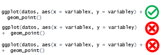
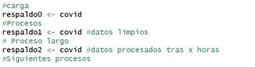
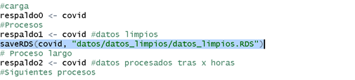
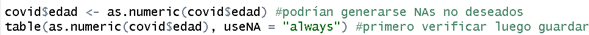
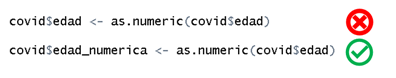
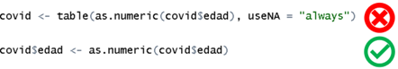

::: questions
### Pregunta introductoria

-   ¿Tiene algunas dificultades con el código en R?
:::

::: objectives
# Objetivo

En este documento usted podrá encontrar algunas de las preguntas y errores frecuentes de la ejecución del código en R.
:::

```{r setup, include=FALSE}
library(knitr)
opts_chunk$set(collapse = TRUE)
```

## Banco de preguntas

### [¿Cómo instalar un paquete o "librería" en R?]{#instr}

Para instalar un paquete en R puede hacerlo a través de:

-   Le recomendamos que lo haga a través de la función:

```{r eval = FALSE}
install.packages("paquete")
```

Algunos paquetes que están en su fase de desarrollo pueden ser instalados desde la última versión en github u otras ubicaciones utilizando los paquetes remotes o pak.

-   Otra opción es usar la función require:

```{r eval = FALSE}
if (!require("paquete")) {
  install.packages("paquete")
}
```

Esta opción es útil porque instala el paquete si no está previamente instalado. Se puede combinar con remotes o pak

-   Usar la interfaz de RStudio:

    1.  Haga click en la ventana `Packages`

    2.  Presione el botón `Install`

    3.  Escriba el nombre del (de los) paquete(s) a instalar

    4.  Presione botón `Install`.

### [¿Cómo usar una función?]{#funcr}

          Si la función pertenece a un paquete de R, puede hacerse de dos formas:

-   Llamar el nombre del paquete de R y poner dos veces dos puntos `(::)` y en seguida llamar el nombre de la función. Ahora debe diligenciar los argumentos

```{r eval = FALSE}
paquete::nombre_de_la_funcion(argumentos)
```

-   Cargar el paquete de R con `library`:

```{r eval = FALSE}
library("paquete")
```

y una vez cargada. Llamar el nombre de la función y diligenciar los argumentos

```{r eval = FALSE}
nombre_de_la_funcion(argumentos)
```

Es importante tener previamente el paquete instalado. Si tiene dudas vaya a [¿Cómo instalar un paquete en R?](instr)

-             Si la función fue creada por usted y se encuentra en el ambiente global:

Simplemente llame la función por su nombre y proporcione los argumentos necesarios:

```{r eval = FALSE}
nombre_de_su_funcion(argumentos)
```

### ¿Cómo cargar un paquete o "librería"?

Algunas opciones para cargar un paquete son:

-   La recomendada es utilizar la función library:

```{r eval = FALSE}
library("paquete")
```

-   Utilizando la interfaz de RStudio:

    1.  Vaya a la sección derecha inferior a la pestaña `Packages`

    2.  De click en el cuadro frente a cada función, esto activará la función `library`.

### ¿Si cargo las librerías debo cargarlas cada vez que vaya a usar la función?

No, solo es necesario cargarlas una vez por sesión de R. Sin embargo, si cerro su RStudio o abrió un nuevo proyecto, cuenta como una nueva sesión y, por lo tanto, debe cargarlas de nuevo para poder trabajar.

### ¿Puedo desactivar una librería que ya cargué sin reiniciar R?

Si, es posible mediante dos opciones:

-   Utilice la función `detach`

```{r eval = FALSE}
detach("package:paquete", unload = TRUE)
```

-   Utilizando la interfaz de RStudio:

    1.  Vaya a la sección derecha inferior a la pestaña `Packages`

    2.  De click en el cuadro frente a cada función (si el cuadro tiene un visto, el paquete está cargado; si el cuadro está vacío, el paquete no está cargado), esto activará la función `detach`. ***Advertencia*****: Si presiona el simbolo de x al lado del paquete lo desinstalará.**

### No veo el resultado de mi código

Esto puede ocurrir por varios motivos:

-   Si guardo el resultado usando el símbolo de asignación (ej. `nombre <- "Laura"`). Este aparecerá en el ambiente global (zona superior lateral derecha) y no se ejecutará en la consola a menos que se llame el objeto, es decir,

    1.  se ponga el nombre del objeto en la consola y se ejecute (presionando `Enter`)

    2.  o que en el script o Chunck de RMarkdown se presione `Control + Enter` en Windows o `Command + Enter` en Mac.

-   Falta alguna librería necesaria. Revise que todas las librerías necesarias estén cargadas al inicio del script.

-   Hay errores en el código. Verifique que no haya errores que impidan que el código se ejecute correctamente. Al ejecutar el código en la consola le aparecerán algunas alertas de errores que pueda tener el código.

-   El script no se ha ejecutado completamente. Asegúrese de ejecutar el script completo para que todas las líneas de código se ejecuten en el orden correcto.

-   El script no se ha ejecutado completamente. Asegúrese de ejecutar el script completo para que todas las líneas de código se ejecuten en el orden correcto.

### Errores frecuentes al usar `ggplot`

-   Sintaxis incorrecta:

    1.  Usar `++` en lugar de `+` para concatenar funciones.

    2.  También puede ocurrir que el `+` queda en la línea de abajo, es importante destacar que para concatenar funciones debe estar al terminar la línea anterior a la que se quiere concadenar.

        

-   No especificar estéticas (aesthetics):

    1.  No incluir `aes()`.
    2.  No definir `aes()` correctamente, por ejemplo, no indicar x o y.
    3.  Si bien aes en algunos casos puede ir en la parte inicial, la geometría o estar dividido en secciones, es fundamental que siempre este presente.

-   Datos no presentes:

La columna mencionada en aes() no existe en el conjunto de datos. Usar el nombre incorrecto, recuerde que R es sensible a mayúsculas y minúsculas por los tanto `VariableX` es diferente a `variableX` o a `variablex`.

-   Falta de librerías:

Antes de trabajar con `ggplot` siempre recuerde cargar la librería con `library`:

```{r eval = FALSE}
library(ggplot2)
```

-   Errores en `geom`:

```         
Seleccionar la geom incorrecta para el tipo de datos que se desea representar.

### `filter` no funciona

Esto puede ocurrir por varios motivos:
```

-   El paquete `dplyr` no está cargada. Aseguresé de incluir `library(dplyr)` o `library(tidyverse)` en su script, y ejecutarlo cada nueva sesión.

-   Hay conflictos de nombres de funciones con otros paquetes. Use `dplyr::filter()` para especificar qué quiere utilizar la función `filter` de `dplyr`.

-   Los datos pueden no estar en el formato esperado. Verifique que la columna que está filtrando existe y tiene los valores adecuados.

`filter` acepta condiciones lógicas para seleccionar filas. Veamos unos ejemplos:

-          Valores específicos:

```{r eval = FALSE}
covid19 %>% filter(estado == "Fallecido")
```

-          Rangos de valores:

```{r eval = FALSE}
covid19 %>% filter(fecha_de_notificacion >= "2020-01-01" & fecha_de_notificacion <= "2020-12-31")
```

-          Condiciones múltiples:

```{r eval = FALSE}
covid19 %>% filter(estado == "Fallecido" & nombre_del_pais == "Colombia")
```

-          Condiciones con funciones:

```{r eval = FALSE}
covid19 %>% filter(grepl("Colombia", nombre_del_pais))
```

Para saber más sobre filter consulte la [documentación](https://dplyr.tidyverse.org/reference/filter.html).

### ¿Dónde está el objeto que cree?

Cuando se crea un objeto este se almacena en el ambiente global. Podemos ver el ambiente global en la interfaz de R ubicado en la parte superior lateral derecha.

### No funciona el pipe `%>%`

Recuerde que es importante cargar previamente una librería quecontenga el pipe. Por ejemplo: `magrittr`, `dplyr`, `tidyr` o `purrr`.

### Cómo evitar accidentes {#prevención}

Cuando se va a almacenar cambios en el objeto donde esta almacenado el dataframe, es recomendable tener algunas precauciones para evitar perder información:

-   Crear un respaldo de los datos en objetos:

o   Hacer copias de seguridad regularmente durante el proceso. Se recomienda hacer una copia inicial para evitar cargar la base de nuevo. Tras hacer algunos procesos, en especial, aquellos que consumen tiempo se recomienda crear respaldos. Puede crear tanto como considere convenientes. Se recomienda crear notas para identificar cada proceso



-   Crear un respaldo de los datos en archivos:

o   Al igual que guardar en objetos, es buena idea guardar los datos que ya han pasado algunos procesos en el disco del computador. Esto evita que si se bloquea la sesión o se apaga el computador los datos procesados estén resguardados. Cada cuanto se deben almacenar depende de quién realiza el procesamiento.



-   Pruebas antes de almacenar:

o   Realizar pruebas de los cambios deseados antes de guardarlos definitivamente.

o   Ejemplo: Si se quiere transformar una variable a numérica, antes de almacernarla y terminar teniendo `NAs` no deseados en los datos, es recomendable hacer una prueba antes de si se originaran esos `NAs`



-   Crear variables de respaldo:

o   Algunas veces cuando vamos a transformar una variable es mejor crear una nueva que almacene el contenido de la transformación. Esto evita el riesgo de pérdida de información al transformar una variable.



-   Cuidado al almacenar:

o   No almacenar tablas u objetos transformados accidentalmente.

o   Ej. si creamos una tabla para ver si la variable cambio como se deseaba y luego reutilizamos el código y añadimos la asignación adelante, almacenaríamos la tabla y perderíamos la información que tenía el objeto



### Mi dataframe cambió inesperadamente

Cuando tenemos accidentes con nuestros datos algunas opciones son:

-          Revisar cual es el daño y ver si es reparable. Por ejemplo, se cambió el carácter incorrecto en una cadena de texto.

-          Cargar los datos a partir de un respaldo. Si hemos creado respaldos del proceso podemos evitarnos tiempos largo de procesamiento. Entre estos respaldos están las variables de respaldo o los objetos de respaldo (ver (Cómo evitar accidentes)[prevencion]).

### Uso de la función `rename`

1.      Llame la base de datos

```{r eval = FALSE}
datos
```

2.      Use el pipe`%>%` para enlazarlo a la función rename

3.      Llame la función `rename` y escriba primero el nuevo nombre de la columna y después el nombre de la columna preexistente a la que quiere cambiar el nombre

```{r eval = FALSE}
datos <- datos %>% rename(nombrenuevo = nombreantiguo)
```

n.      Seleccionar algunas filas de un grupo de datos

1.      Llame la base de datos

```{r eval = FALSE}
datos
```

2.      Use el pipe `%>%` para enlazarlo a la función `group_by`

```{r eval = FALSE}
datos %>% group_by(variable_grupo)
```

La función `group_by` creará grupos de datos según una variable determinada en los cuales puede realizar otras acciones como por ejemplo seleccionar los datos en el encabezado de cada grupo.

4.      Enseguida use la función como en este ejemplo podríamos usar `head` solo para los datos del encabezado de cada grupo.

```{r eval = FALSE}
datos <- datos %>% group_by(variabledeinteres) %>% head()
```

### Cómo usar `summarise`

1.      Llame la base de datos

```{r eval = FALSE}
datos
```

2.      Use el pipe`%>%`para enlazarlo a la función `summarise`

```{r eval = FALSE}
datos %>% summarise()
```

La función summarise no puede utilizarse de forma directa, por lo tanto, debe usarse junto a un argumento adentro, por ejemplo:

a.      Obtener el promedio

```{r eval = FALSE}
datos %>% 
  summarise(mean = mean(variabledeinteres))
```

b.      Obtener la desviación estandar

```{r eval = FALSE}
datos %>% 
  summarise(sd = sd(variabledeinteres))
```

Esta función puede usarse con agrupación previa (`group_by`) para obtener estos valores por cada grupo, por ejemplo,

```{r eval = FALSE}
datos %>%  group_by(pais) %>% 
  summarise(
    mean = mean(variabledeinteres), 
    sd = sd(variabledeinteres))
```

### Material adicional que puede aportar a su aprendizaje:

**Manejo de datos con Tidyverse y R:**

<https://www.youtube.com/watch?v=6STcQVX8Hk0>

::: keypoints
## Puntos clave

Si después de buscar en esta guía sus preguntas no encontro respuesta por favor diligencie el siguiente formulario [Dudas por resolver](https://forms.office.com/pages/responsepage.aspx?id=Dpn32j-KnECbdipUdQmAAMjWJqHZ8P1DkQQdb07M30RUOEY5N1U1UDFYMExGMzFHRkRKT1BTRTFRWS4u&route=shorturl&sid=6a94f23c-049c-4f54-9732-fc25789059b3){.uri}
:::

## Contribuciones

-   José M. Velasco-España: Versión inicial

-   Andree Valle-Campos: Ediciones menores

-   Laura Gómez-Bermeo: Ediciones menores

-   Geraldine Gomez: Ediciones menores
