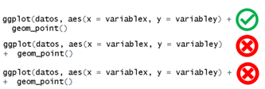

::: questions

- Do you have some difficulties with R code?

:::

::: objectives

- In this document you will find some of the frequently asked questions and errors in R code execution.

:::

## Question Bank

### Is RTools necessary?

There are several common problems in R that may require the installation of Rtools.

1. Installing packages that require compilation: Some R packages need to be compiled from source code, which requires compilation tools that Rtools provides.

2. C, C++ or Fortran dependencies: If you want to install packages that depend on code written in C, C++ or Fortran, you will need Rtools to compile these components.

3. Compilation errors: If you encounter errors during the installation of packages that mention compilation problems, Rtools can resolve these problems by providing the necessary tools.

4. Custom package development: If you are developing your own R package and need to compile source code, Rtools is essential for this process.

### How to install RTools?

*Before you start please check that you have administrator permissions on the computer or laptop.*

Installing Rtools

The installation of Rtools depends on the operating system you are using.

### Windows

1. Check which version of R you have:

In the R console type and run this command:

```{r}
sessionInfo()
```

**You will get information similar to this. In this case the version is 4.4.1**

2. Visit the RTools page on CRAN in the browser of your choice:
  <https://cran.r-project.org/bin/windows/Rtools/>and select the version of Rtools that matches the current version of R you have on your machine and your computer architecture.
  Or click on one of the following links to download the installer:

\\

| For versions of R...   | Install: |
| ---------------------- | -------- |
| From 4.4.0             | [RTools 4.4](https://cran.r-project.org/bin/windows/Rtools/rtools44/rtools.html)         |
| Since 4.3.0            | [RTools 4.3](https://cran.r-project.org/bin/windows/Rtools/rtools43/rtools.html)         |
| Starting with 4.2.     | [RTools 4.2](https://cran.r-project.org/bin/windows/Rtools/rtools42/rtools.html)         |
| Between 4.0.0 to 4.1.3 | [RTools 4.0](https://cran.r-project.org/bin/windows/Rtools/rtools40.html)         |
| Prior to 4.0.0         | [older versions of RTools](https://cran.r-project.org/bin/windows/Rtools/history.html)         |

3. On the download page, look for the phrase: "***may be installed from the***"and click on **[*Rtools44 installer*](https://cran.r-project.org/bin/windows/Rtools/rtools44/files/rtools44-6335-6327.exe)** or in the version you have selected **above *RtoolsXX installer***.


4. Wait for the download to finish and run the file.

5. Click on "*Next*" o "*Next*"for all the options displayed on the screen.

### Mac

On Mac, you only need to install Xcode Command Line Tools.

1. Click Spotlight Search at the top right of the screen, then search for "Terminal".

2. Open a terminal or command line on your machine.

3. In the terminal, copy and paste the following command:
  `xcode-select –install`

4. You will probably need to provide your password to install the software.

5. Follow the instructions on the terminal and wait for the installation to complete.

You can also do it directly from R as explained in this video: [Installation using R](https://www.youtube.com/watch?v=_fckF0fefXQ&t=5s)

### [How to install a package or "library" in R?]{#instr}

To install a package in R, you can do so via:

- We recommend that you do this through the function:

```{r, eval=FALSE}
install.packages("paquete")
```

Some packages that are in their development phase can be installed from the latest version on github or other locations using remotes or pak packages.

- Another option is to use the require function:

```{r, eval=FALSE}
if (!require("paquete")) {
  install.packages("paquete")
}
```

This option is useful because it installs the package if it is not previously installed.
It can be combined with remotes or pak

- Use the RStudio interface:

  1. Click on the `Packages`

  2. Click on the button `Install`

  3. Enter the name of the package(s) to install.

  4. Press button `Install`.

### [How to use a function?]{#funcr}

If the function belongs to an R package, this can be done in two ways:

- Call the name of the R package and put a colon twice. `(::)` and then call the function name. Now you must fill in the arguments

```{r, eval=FALSE}
package::function_name(arguments)
```

- Load the R package with `library`:

```{r, eval=FALSE}
library("package")
```

and once loaded.
Call the name of the function and fill in the arguments

```{r, eval=FALSE}
function_name(arguments)
```

It is important to have the package previously installed.
If in doubt, go to [How to install a package in R?](instr)

-           If the function was created by you and is in the global environment:

Simply call the function by name and provide the necessary arguments:

```{r, eval=FALSE}
function_name(arguments)
```

### How to load a package or "library"?

Some options for uploading a package are:

- The recommended one is to use the library function:

```{r, eval=FALSE}
library("package")
```

- Using the RStudio interface:

  1. Go to the bottom right section to the `Packages`

  2. Click on the box in front of each function, this will activate the function. `library`.

### If I load the libraries, do I have to load them every time I use the function?

No, you only need to load them once per R session.
However, if you close your RStudio or open a new project, it counts as a new session and therefore you must load them again in order to work.

### Can I deactivate a library that I already loaded without restarting R?

Yes, it is possible through two options:

- Use the function `detach`

```{r, eval=FALSE}
detach("package_name", unload = TRUE)
```

- Using the RStudio interface:

  1. Go to the bottom right section to the `Packages`

  2. Click on the box in front of each function (if the box has a tick, the package is loaded; if the box is empty, the package is not loaded), this will activate the function. `detach`. ***Warning*: Pressing the x symbol next to the package will uninstall it.**

### The object or function was not created

This can happen for several reasons:

- **Incomplete execution of the code** The most common reason is that the code has not been executed partially or completely. Make sure you run the entire script so that all the lines of code are executed in the correct order. To create the object, make sure you have done one of these two actions:

1. type the code into the console and run (by pressing `Enter`)

2. or in the RMarkdown script or Chunck press `Control` + `Enter` on Windows or `Command` + `Enter` on Mac.

If the object or function was created correctly, it will appear in the global environment (*Environment*) located in the upper right-hand side area.

- Missing required packages: Check that all required packages or libraries are loaded at the start of the script.

- Errors in the code: Check that there are no errors that prevent the code from executing correctly. When executing the code in the console, some error alerts will appear.

:::: callout

## Recommendation

Always look at the console to check whether:

1. The code was executed successfully. In case it did not run, you can run it again.
2. If a command is still executing and you see the red **stop**. In this case, wait for R to finish the process before executing other commands.
3. If an error has occurred. Review the errors or warnings, as this may give you clues on how to fix the problem.

:::

### I don't see the result of my code

This can happen for several reasons:

- If I save the result using the allocation symbol (i.e. `nombre <- "Laura"`). This will appear in the global environment (top right side area) and will not be executed on the console unless the object is called, i.e,

  1. the name of the object is put in the console and executed (by pressing the `Enter`)

  2. or that in the RMarkdown script or Chunck you press `Control + Enter` in Windows or `Command + Enter` on Mac.

- A required library is missing. Check that all required libraries are loaded at the start of the script.

- There are errors in the code. Check that there are no errors that prevent the code from executing correctly. When executing the code in the console you will see some error alerts that the code may have.

- The script has not executed completely. Be sure to run the entire script so that all lines of code are executed in the correct order.

### Common errors when using `ggplot`

- Incorrect syntax:

  1. Use `++` instead of `+` to concatenate functions.

  2. It may also happen that the `+` is on the line below, it is important to note that to concatenate functions it must be at the end of the line before the one you want to concatenate.



- Do not specify aesthetics:

  1. Do not include `aes()`.
  2. Do not define `aes()` correctly, e.g. not stating x or y.
  3. Although aes may in some cases be in the initial part, the geometry or be divided into sections, it is essential that it is always present.

- Data not present:

The column referred to in aes() does not exist in the dataset.
Use the wrong name, remember that R is case sensitive therefore`VariableX` is different from `variableX` or `variablex`.

- Lack of bookshops:

Before working with `ggplot` always remember to load the library with `library`:

```{r, eval=FALSE}
library(ggplot2)
```

- Errors in `geom`:


Selecting the wrong geom for the type of data being represented.


### `filter` doesn't work

"This can happen for several reasons:"


- The package `dplyr` is not loaded. Be sure to include `library(dplyr)` o `library(tidyverse)` in your script, and run it every new session.

- There are function name conflicts with other packages. Use `dplyr::filter()` to specify which function you want to use `filter` function from `dplyr`.

- The data may not be in the expected format. Verify that the column you are filtering exists and has the appropriate values.

`filter` Accept logical conditions for selecting rows.

For more information on filtering, see the [documentation](https://dplyr.tidyverse.org/reference/filter.html).

### Where is the object you create?

When an object is created it is stored in the global environment.
We can see the global environment in the R interface located on the top right side.

### The pipe does not work `%>%`

Remember the following points:

- It is important to pre-load a library containing the pipe. For example: `magrittr`, `dplyr`, `tidyr` o `purrr`.
- The pipe must go at the end of the line to be connected. Not at the beginning of the connected line.

### How to avoid accidents? {#prevencion}

When you are going to store changes in the object where the dataframe is stored, it is advisable to take some precautions to avoid losing information:

- Create a backup of the data in objects:

o Make regular backups during the process.
It is recommended to make an initial copy to avoid reloading the database.
After doing some processes, especially time-consuming ones, it is recommended to create backups.
You can create as many as you consider convenient.
It is recommended to create notes to identify each process


- Create a backup of the data in files:

o Like saving to objects, it is a good idea to save data that has already gone through some processes on the computer's disk.
This prevents processed data from being backed up if the session crashes or the computer is shut down.
How often it should be stored depends on who is doing the processing.


- Testing before storage:

o Conduct tests of desired changes before final storage.

o Example: If you want to transform a variable into a numeric variable, before storing it, and end up having `NAs` unwanted changes in the data, it is advisable to do a test before storing it, in order to see if these changes will be originated. `NAs`


- Create backup variables:

o Sometimes when we are going to transform a variable it is best to create a new one that stores the contents of the transformation.
This avoids the risk of losing information when transforming a variable.

- Be careful when storing:

o Do not store accidentally transformed tables or objects.

o E.g. if we create a table to see if the variable changed as desired and then reuse the code and add the assignment forward, we would store the table and lose the information that the object had.


### My dataframe changed unexpectedly

When we have accidents with our data some options are:

- Check what the damage is and see if it is repairable.
  For example, the wrong character was changed in a text string.

- Load the data from a backup.
  If we have created backups of the process we can avoid long processing times.
  Among these backups are the backup variables or backup objects (see [How to avoid crashes?](Banco_errores.Rmd#prevencion)).

### Use of the function `rename`

1. Call up the database

```{r, eval=FALSE}
data
```

2. Use the pipe`%>%` to link to the rename function

3. Call the function`rename` and first type the new column name and then the name of the pre-existing column you want to rename

```{r, eval=FALSE}
data <- data %>% rename(newname = oldname)
```

Select some rows of a data group

1. Call up the database

```{r, eval=FALSE}
data
```

2. Use the pipe`%>%` to link to the `group_by`

```{r, eval=FALSE}
data %>% group_by(group_variable)
```

The function `group_by` function will create groups of data according to a given variable in which you can perform other actions such as selecting the data in the header of each group.

4. Then use the function as in this example we could use`head` only for the data in the header of each group.

```{r, eval=FALSE}
data <- data %>% group_by(variable) %>% head()
```

### How to use `summarise`?

1. Call the database

```{r, eval=FALSE}
data
```

2. Use the pipe`%>%`to link to the `summarise`

```{r, eval=FALSE}
data %>% summarise()
```

The summarise function cannot be used directly, so it must be used in conjunction with an argument inside, for example:

a. Get the average

```{r, eval=FALSE}
data %>%
  summarise(mean = mean(variable))
```

b. Obtain the standard deviation

```{r, eval=FALSE}
data %>%
  summarise(sd = sd(variable))
```

This function can be used with pre-clustering (`group_by`) to obtain these values for each group, for example,

```{r, eval=FALSE}
data %>%  group_by(country) %>%
  summarise(
    mean = mean(variable),
    sd = sd(variable))
```

### Group-related errors (`group_by` y `ungroup`)

- A very frequent error is that the grouped object is stored (`group_by`), since the ungrouping action was not performed at the end. This can lead to errors such as incorrect calculations, summaries per group instead of over the whole data, and problems when performing subsequent operations on the dataset. Therefore, we recommend always using (`ungroup`) before storing. To use `ungroup()` just put it at the end.

```{r, eval=FALSE}
datos <- data %>%
  group_by(category) %>%
  data_processing(...) %>%
  ungroup()
```

Let's look at an example of an error that can occur by not ungrouping:

```{r, warning=FALSE, message=FALSE}
library("tidyverse")  
set.seed(123) # For reproducibility  

# Example dataframe  
blood_type <- c("A", "B", "O", "AB")  
rh_factor <- sample(c("+", "-"), 10, replace = TRUE)  
day <- c(1:5)  
heart_rate <- sample(60:100, 200, replace = TRUE)  
resp_rate <- sample(12:20, 200, replace = TRUE)  
df <- data.frame(blood_type, rh_factor, day, heart_rate, resp_rate)  

# Summary by columns (without ungrouping)  
by_day <- df %>%  
  group_by(blood_type, rh_factor, day) %>%  
  summarize(  
    hr_avg = mean(heart_rate),  
    rr_avg = mean(resp_rate)  
  )
```

Let's create a variable containing unique ids for each row.

```{r}
by_day %>% mutate(id = row_number())
```

As you can see in the id column instead of unique identifiers we have repeating ids.
Why did this happen if each row is different?

The reason for this problem lies in the fact that the data is still grouped together.
Even if we do not directly apply the`ungroup` as explained above, we can still solve it.

Let's see how it would not be solved first.
A common mistake when trying to solve this problem is to apply the ungroup function without storing the result.

```{r}
# aplicación equivocada de ungroup
by_day %>% ungroup()

# si bien desagrupa el objeto para imprimirlo,
# mientras no se almacene  el objeto serguirá agrupado
by_day %>% mutate(id = row_number())
```

As you can see the problem has not been corrected.

To correct it we can either include the `ungroup` from the beginning when we create the object `por_dia` or apply the change and save it to the object:

```{r}
# Remove grouping from by_day
by_day_no_group <- by_day %>% ungroup()  

# Add an ID column with row numbers
by_day_no_group %>% mutate(id = row_number())
```

As you can see now if we have each row with its own id.

Note: It is important to clarify that the ungrouping in the previous scenarios would go after the operation, however, in this case it would go before the operation.

### When I try to create a pdf in RMarkdown I get the error

If the file comes out correctly in other formats except pdf.
One of the most frequent situations is that the LaTeX installation is missing: RMarkdown needs LaTeX to generate PDFs.
Make sure you have LaTeX installed on your system.

To install LaTeX from RStudio, you can use the TinyTeX package:

```{r, eval=FALSE}
install.packages("tinytex")
tinytex::install_tinytex()
```

Configure RStudio:

Go to Tools > Global Options > Sweave.

Make sure that the "Typeset PDF" option is set to use TinyTeX.

### Additional material that can contribute to your learning:

**Data handling with Tidyverse and R:**

<https://www.youtube.com/watch?v=6STcQVX8Hk0>

::: keypoints

If you did not find an answer to your question after searching this guide, please fill in the following form. [Unanswered questions](https://forms.office.com/pages/responsepage.aspx?id=Dpn32j-KnECbdipUdQmAAMjWJqHZ8P1DkQQdb07M30RUOEY5N1U1UDFYMExGMzFHRkRKT1BTRTFRWS4u&route=shorturl&sid=6a94f23c-049c-4f54-9732-fc25789059b3){.uri}

:::

## Contributions

- José M. Velasco-España: Initial version

- Andree Valle-Campos: Minor editions

- Laura Gómez-Bermeo: Minor Editions

- Geraldine Gomez: Minor Editions

- Hugo Gruson: Translation to english
