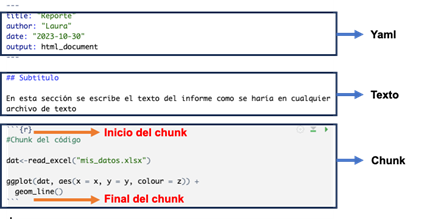
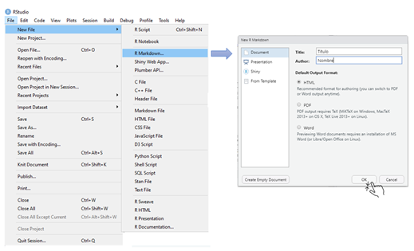
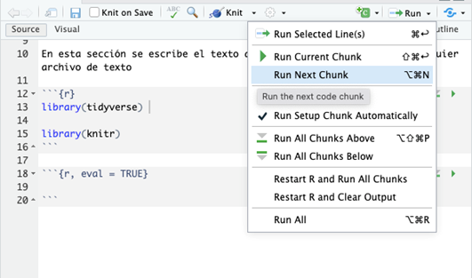
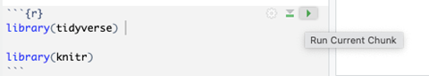
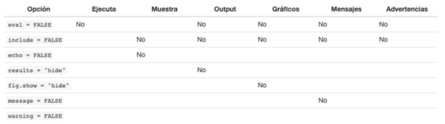
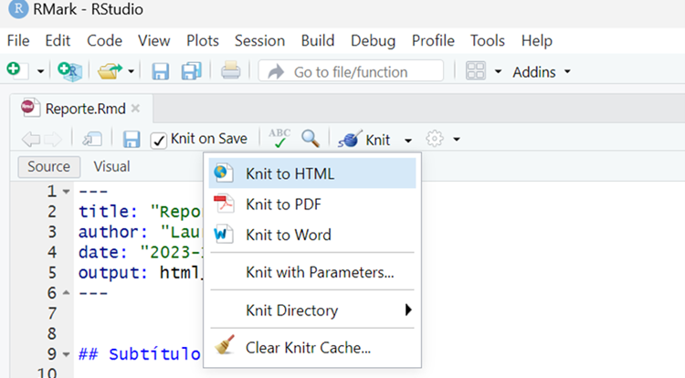

:::::::::::::::::::::::::::::::::::::: questions 

## Pregunta introductoria 

- ¿Cómo se utilizan R markdown para presentar un reporte?

::::::::::::::::::::::::::::::::::::::::::::::::

::::::::::::::::::::::::::::::::::::: objectives

## Objetivos 

Al final de este taller usted podrá:

-   Reconocer la importancia de generar informes en R Markdown  
-   Aprender a utilizar R markdown de forma básica  

::::::::::::::::::::::::::::::::::::::::::::::::


::::::::::::::::::::: prereq

Esta unidad tiene como prerequisitos:

- Introducción a R y RStudio
:::::::::::::::::::::

```{r setup, include=FALSE}
library(knitr)
opts_chunk$set(collapse = TRUE)
```

# Introducción

En esta unidad aprenderemos sobre el uso del formato R Markdown, el cual permite integrar código en la generación de informes sin la necesidad de importar gráficas o crear tablas manualmente. De esta manera, el formato R Markdown facilita la generación automática, actualización y redacción de informes técnicos al combinar la sintaxis del formato Markdown con código en R incrustado en el documento.  

# **Tema 1: ¿Qué es R Markdown?**

R Markdown es una extensión del formato Markdown que permite combinar
texto con código R incrustado en el documento. De esta manera, los
análisis y visualizaciones generados por medio del código se pueden
incorporar de manera natural en el texto.

R Markdown es ampliamente utilizado por científicos de datos, analistas,
investigadores y profesionales que necesitan presentar sus análisis y
resultados de manera clara y reproducible. Además, es una herramienta
muy valiosa para generar informes automatizados y documentos técnicos
interactivos

# **Tema 2: Estructura de R Markdown**

Un documento de R Markdown consta de tres tipos principales de
elementos:

1.      **Yaml:** Corresponde a especificaciones del estilo del
documento, título, fecha, autores, etc.

2.      **Texto:** Texto enriquecido con formato y explicaciones.

3.      **Chunk:** Bloque de código R en donde se ejecutan y se muestran
sus resultados.



# **Tema 3: Paso a Paso en R Markdown**

A continuación, seguiremos un paso a paso para crear un R Markdown.

## **Paso 1.** Abrir R Studio desde R Project

De acuerdo a lo aprendido en la unidad de Introducción a R y Rstudio, es
recomendable tener un R project donde quedará alojado el informe de R
Markdown. Abre un R Project y sigue con el Paso 2.

## **Paso 2. Crear un nuevo archivo R Markdown**

Siguiendo la ruta **File**\>**New File**\>**R Markdown** podemos crear
un archivo de R Markdown definiendo: título, autor(es) y con formato de
salida preferido (html, pdf o word).

Siga los pasos, que también pueden verse en la imagen, y cree su
archivo R Markdown con tu nombre y el título de Reporte.



## **Paso 3. Editar el archivo de R Markdown y el código**

:::::::::::::::::::::::::::::::::::: callout

Es importante recordar que R Markdown tiene tres secciones, todas
editables: Yaml, Texto y Chunk de código.
:::::::::::::::::::::::::::::::::::::::::::

Al haber creado su archivo de R Markdown podrá observar e identificar
las diferentes secciones que se muestran en la imagen.


A continuación, veremos cómo editar cada una de estas partes:

### **¿Cómo editar el texto?**

-   Para incluir el título de una sección se escribe el símbolo numeral
    \# y a continuación el nombre de la sección en una línea única.

-   Para poner subtítulos se utiliza dos símbolos numeral ##.

-   Para cada subtítulo en la estructura se agrega otro símbolo numeral #.  

-   Para escribir palabra en negritas use dos asteriscos a cada lado
    \*\*palabra\*\*

-   Para escribir una palabra en cursiva use un asterisco a cada lado
    \*palabra\*(uno a cada lado)

-   Para situar el texto en un bloque aparte, se antecede este texto con
    el símbolo \> en una línea única.

### **¿Cómo editar el *chunk* de código?**

Para incluir código en R, es necesario introducir un *chunk* en el
documento marcando en la barra de herramientas el icono +C de color
verde como se muestra en la siguiente imagen.

Al dar click en este ícono, aparecerá un espacio delimitado por los
siguientes símbolos que corresponde al *chunk:*

```` ```{r} ````

```` ``` ````

Luego que haya creado el chunk debemos cargar las librerías para esta
práctica. En el chunk cargamos las librerías a utilizar en R. En este
caso, necesitaremos dos

```` ```{r} ````

```{r message=FALSE}
library(tidyverse)

library(knitr)
```

```` ``` ````

Ahora debemos correr el Chunk dando click en el ícono de "`Run`" y
seleccionando el Chunk que queremos correr.



Otra opción es dar click al ícono de play verde que se encuentra en la
parte superior derecha de cada Chunk.



### **Especificar configuración del *chunk***

Dentro de un "chunk", podemos elegir si queremos que el código se
muestre en el reporte impreso o no; utilizando los comandos
"`echo = FALSE`" (para ocultarlo) o "`echo = TRUE`" (para mostrarlo).

La siguiente tabla incluye otras opciones que se pueden utilizar para
configurar un *chunk.* En la tabla se muestra que tipo de salidas quedan
suprimidas al especificar cada opción como `FALSE`:



Por ejemplo, en nuestra práctica especificaremos que se ejecute el
código, como se muestra aquí.

```` ```{r, eval = TRUE} ````

```` ``` ````

### **Hacer tablas en R Markdown**

:::::::::::::::::::::::::::::::::::: callout

La tabla de datos para esta práctica será la misma de la Unidad de
Introducción a la visualización de datos en R con `ggplot2`. Puede
encontrarla en:
<https://github.com/TRACE-LAC/TRACE-LAC-data/blob/main/otros/muestra_covid.RDS?raw=true>

:::::::::::::::::::::::::::::::::::::::::::

Para hacer tablas en R Markdown podemos utilizar la función `kable` de
la librería `knitr`, como se muestra a continuación:

```{r eval=FALSE, message=FALSE}
library(knitr)
library(tidyverse)

dat <- readRDS("data/muestra_covid.RDS")

covid_paises <- dat %>% 
  group_by(nombre_del_pais) %>% 
  summarise (casos = n()) %>% 
  filter (casos > 300)

kable(covid_paises)
```

Como resultado, obtenemos la siguiente tabla:

```{r echo=FALSE}
library(knitr)

dat <- readRDS("data/muestra_covid.RDS")

covid_paises <- dat %>% 
  group_by(nombre_del_pais) %>% 
  summarise (casos = n()) %>% 
  filter (casos > 300)
kable(covid_paises)
```

### **Poner parámetros automatizados en el texto**

En un reporte también es posible combinar código y texto, utilizando los
resultados obtenidos en el código como parte del texto del reporte. Es
decir, para evitar que debamos poner un resultado manualmente en el
texto del reporte, podemos utilizar el resultado que obtuvimos al
ejecutar el chunk  y hacer que este resultado aparezca en el texto de
manera automática. Para esto, simplemente se debe parametrizar un valor
y luego incluirlo en el texto usando su nombre correspondiente.

Por ejemplo, para calcular el total de casos de COVID-19 de sexo
femenino en nuestro conjunto de datos de datos `dat` dentro de un *chunk*
de R haríamos lo siguiente:

```{r}
total_casos_fem <- nrow(dat %>% filter (sexo == "femenino"))
```

Ahora, si queremos incluir este resultado en el texto del reporte,
debemos especificar el parámetro que queremos usar de esta manera \` r
total_casos_fem \`, y por ejemplo escribir directamente como texto:

El total de casos de sexo femenino es \` r total_casos_fem\`

Cuyo valor debe coincidir con el valor que obtenemos al imprimir el objeto `total_casos_fem`
```{r}
total_casos_fem
```
:::::::::::::::::::::::::::::::::::: callout

Al tejer el informe tendremos una línea similar a esta:

El total de casos de sexo femenino es `r total_casos_fem`

Para ver cómo queda combinado el resultado del código con este texto
debemos seguir el siguiente paso.

:::::::::::::::::::::::::::::::::::::::::::

## **Paso 4. "Tejer" (generar) el informe**

Para "tejer" el informe, es decir, generar el informe en un formato
específico (HTML, PDF o Word), debemos dar click en el símbolo *"Knit"*
en la parte superior del editor del archivo de Rmarkdown. Tal como se ve
en la siguiente imagen:



Después de este paso debe aparecer el informe final en la presentación
que hayamos seleccionado (html, pdf o word).  

::::::::::::::::::::::::::::::::::::: challenge 

Observe cómo aparece la tabla y el texto del total de casos de sexo
femenino.  
::::::::::::::::::::::::::::::::::::::::::::::::
  

¡Felicitaciones, ha producido su primer reporte R Markdown en html!

::::::::::::::::::::::::::::::::::::: keypoints 

## Puntos clave 

Revise si al final de esta lección adquirió estas competencias:

-   Reconocer la importancia de generar informes en R Markdown  
-   Aprender a utilizar R markdown de forma básica  

::::::::::::::::::::::::::::::::::::::::::::::::

## Contribuciones

-   Zulma M. Cucunuba: Versión inicial
-   Laura Gómez-Bermeo: Edición
-   Geraldine Gomez: Ediciones menores
-   Andree Valle: Ediciones menores
-   José M. Velasco España: Ediciones menores

## Asuntos legales

**Copyright**: Zulma M. Cucunuba, 2019
