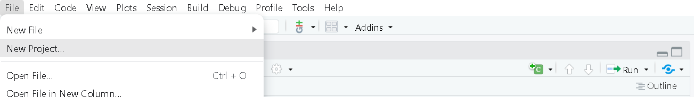

::: questions

- ¿Cómo se utilizan R y RStudio en el análisis de datos y la salud pública?

:::

::: objectives

Al final de este taller usted podrá:

- Reconocer y hacer uso de R y RStudio.
- Conocer los tipos de datos y operados básicos en R.
- Comprender las estructuras básicas de datos en R tales como vectores
    y tablas de datos.
- Comprender el proceso de creación de funciones.
- Reconocer el proceso de importación, exportación y transformación de
    bases de datos con Tidyverse.

:::

::: prereq

Esta unidad no tiene prerequisitos

:::

```{r setup, include=FALSE}
library(knitr)
opts_chunk$set(collapse = TRUE)
```

::: checklist
### Tabla de contenido

-   Módulo: Ciencia de datos en salud pública
    -   Unidad: Introducción a R y RStudio
        -   Tema 1: Introducción
        -   Tema 2: Instalación de R y RStudio
        -   Tema 3: Ambiente de RStudio
        -   Tema 4: Configuración de un proyecto en RStudio
        -   Tema 5: Tipos de datos y operadores en R
        -   Tema 6: Estructuras de datos en R
        -   Tema 7: Funciones
        -   Tema 8: Manipulación de datos con Tidyverse
        
:::

## Tema 1: Introducción

R es un lenguaje de programación especializado para análisis de datos,
es de uso gratuito y software libre. Por otra parte, RStudio es un
editor de R también disponible de manera gratuita. La diferencia entre R
y RStudio radica en que en R es el lenguaje de programación en el que
escribimos el código y RStudio es el ambiente de desarrollo que permite
trabajar con R de manera más fácil y amigable.

En los últimos años el uso de R ha crecido en el ámbito académico y de
la industria. R, además de ser un lenguaje de programación, es también
un entorno para computación estadística y creación de visualizaciones. R
y RStudio son herramientas esenciales para el estudio, análisis y toma
de decisiones en salud pública, ya que permiten realizar análisis
estadísticos detallados, modelar la propagación de enfermedades,
visualizar datos de manera efectiva y automatizar tareas. Estas
herramientas facilitan la manipulación y preparación de datos, fomentan
la colaboración en proyectos de ciencia de datos, y la toma de
decisiones basadas en evidencia. Además, son útiles en la formación y
educación en análisis de datos para profesionales de la salud, áreas
STEM y toma de decisiones.

## Tema 2: Instalación de R y RStudio

Para instalar R y RStudio debemos ir a nuestro navegador de confianza.
Allí vamos a buscar r-project, que es la página oficial de R
(<https://www.r-project.org/>). Recordemos que este es un software de
uso libre, no hay que hacer ningún pago por su descarga o uso.


Busca la opción de descarga "download R" y sigue las instrucciones.

Para instalar Rstudio debemos ir a
<https://posit.co/download/rstudio-desktop/> y buscar donde diga Install
RSudio. Si tenemos Windows podemos dar click en el recuadro azul. Si es
otro sistema operativo abajo encontraremos una lista con las diferentes
opciones. Para instalar, sigue las instrucciones.


Recuerda ejecutar el archivo que se descargó siguiendo los pasos. Es
recomendable que en el momento de la instalación elijamos la opción de
dejar un acceso directo en el escritorio.

Para comprobar que la instalación fue satisfactoria y en general para
hacer uso de R y RStudio debemos buscar en la ubicación que hayamos
elegido en la instalación donde quedó Rstudio y dar doble clic o clic
derecho y abrir. Lo primero que vemos al momento de abrir Rstudio es la
siguiente pantalla:


Escribe 2+2 donde aparece el cursor y da enter, si te aparece el
resultado 4 ¡Está todo listo para empezar!


## Tema 3: Ambiente de RStudio

RStudio está compuesto por 4 secciones principales:


1.  **Editor (sección superior izquierda)**: en esta sección escribimos
    y editamos el código a través de la creación de Scripts . Esta
    sección es fundamental para la reproducibilidad del código. Este
    editor permite guardar el código para que sea usado en futuras
    ocasiones. El código puede ser ejecutado en esta sección
    posicionando el cursor de texto al final de la línea de código que
    se ejecutará; otra opción es seleccionando la misma y empleando el
    comando `Control+Enter` para Windows o `Command+Enter` para Mac.

2.  **Entorno (sección superior derecha)**: en esta sección se pueden
    visualizar los objetos, datos y funciones creados o importados en el
    codigo que escribimos en los Scripts por ejemplo objetos como
    vectores, arreglos, `data.frames` o tablas de datos, objetos
    gráficos de `ggplot` , entre otros.

3.  **Consola (sección inferior izquierda)**: esta sección es donde se
    ejecuta el código. No solo se ejecuta el código que hemos escrito en
    el editor, sino que también el código puede escribirse y ejecutarse
    aquí directamente presionando `Enter`. Sin embargo, cuando el código
    se ejecuta directamente en la consola, no se almacenan los comandos
    que ejecutamos, cuando se cierra la sesión de R se pierde.

4.  **Visualizador (sección inferior derecha)**: en esta sección se
    pueden visualizar los archivos en "`Files`", los gráficos en
    "`Plots`", los paquetes que ya están instalados en "`Packages`", la
    ayuda de R con información de los paquetes y el funcionamiento en
    "`Help`", y páginas web en "`Viewer`".

## Tema 4: Configuración de un proyecto en RStudio

Una de las grandes ventajas de usar RStudio es la posibilidad de usar
los Proyectos en R (R Project)(indicado por un archivo `.Rproj`) lo que
permite organizar el espacio de trabajo, el historial y los documentos
fuente. Para crear un Proyecto en R, es importante seguir los siguientes
pasos:

::::::::::::::::::::::::::::::::::::: challenge 

1.  Abrir RStudio y, en la esquina superior izquierda, seleccionar la
    pestaña **File (Archivo)** -\> **New Project... (Proyecto Nuevo)**.



2.  Se desplegará una ventana con encabezado **New Project Wizard**:
    **Create Project**, ahora se debe seleccionar **New Directory
    (Directorio Nuevo)**.


3.  En la ventana con encabezado **New Project Wizard**:**Project
    Type**, se debe seleccionar **New Project**
    

4.  En la ventana con encabezado **New Project Wizard**:**Create New
    Project**. En la casilla **Directory Name (Nombre del Directorio)**
    coloque el nombre deseado para su proyecto (e.g. "`IntroR`").\
    

5.  Hacemos clic en el botón **Browse....** Para buscar la ubicación
    dentro del computador donde deseamos guardar el proyecto
    

6.  Creamos una nueva carpeta con el mismo nombre del proyecto (e.g.
    "`IntroR`"), así como las subcarpetas que necesitamos para organizar
    nuestro trabajo y resultados: datos, scripts y figuras. Al final, el
    proyecto debería parecerse a esta imagen:


:::

## Tema 5: Tipos de datos y operadores en R

::: checklist
### Tipos de datos

R tiene la capacidad de almacenar y procesar distintos tipos de datos.
Entre estos se encuentran:

-   Numéricos decimales`(double. Ej: 3.3)`
-   Enteros `(integer. Ej: 3)`
-   Caracteres `(character. Ej: Municipio, sexo o nombre.)`
-   Booleanos o lógicos `(logic. Ej: FALSE, TRUE)`
-   Tipo fechas `(date. Ej: 01/01/2022)`
-   Datos `NA`, `NAN` e `Inf`. La diferencia entre `NA`, `NAN` e `Inf`
    es que `NA` indica que hay dato faltante "missing", `NAN` significa
    "not a number"; es decir, hay información, pero es un error y el
    resultado no es numérico, por ejemplo `0/0`. Inf indica que hay
    operaciones cuyo resultado es infinito como por ejemplo `1/0`. Si se
    hace operaciones entre tipos variables se pueden obtener `Inf`.
:::

::: checklist
### Operadores matemáticos y lógicos

Los operadores son herramientas matemáticas que nos permiten realizar
diferentes tareas con los datos que tenemos disponibles; por ejemplo,
con el operador `+` podemos efectuar una suma o incrementar un índice.
Algunos de los operadores más utilizados en R son los siguientes:\
1. Operadores aritméticos (Ej: `+`, `-`, `*`, que corresponden a suma,
resta y multiplicación respectivamente)\
2. Operadores de comparación `(Ej: <, >, ==, >=, <=, !=)` 3. Operadores
booleanos `(& (and), | (or), ! (not))`
:::

### Operadores de asignación \<- y =

\<- Este es un operador común en R para asignar un determinado valor a
una variable y el alcance está dentro de la función y también fuera de
ella.

*Ejemplo*

```{r}
nombre <- "Laura"
```

Se abra creado un objeto en el ambiente global (ubiquelo en la sección
lateral derecha superior): 

= Este operador se utiliza para establecer un parámetro en un valor
dentro de una función. El alcance está solo dentro de la función. La
variable todavía contiene su valor original fuera de la función.

## Tema 6: Funciones

Imaginemos una función como una especie de "caja mágica" que recibe
ciertos datos o información como entrada y produce un resultado o
respuesta específica como salida. Es como seguir una receta que toma
ingredientes y como resultado tenemos un plato delicioso.

Para qué podamos utilizar una función debemos proporcionar unos datos de
entrada (*input*) que entran a la caja (la función) y de ahí sale un
resultado o datos de salida (*output*). La función puede ser suma,
resta, regresión logística o un modelo matemático. Entran datos y salen
otros que son producto de las operaciones en la función.

::: checklist
### Componentes básicos de una función

Los componentes básicos de una función son:

-   **`name` (nombre)**: es el nombre que se da a la función (Por
    ejemplo: myfun).

-   **`formals` (argumentos)**: son la serie de elementos que controlan
    cómo llamar a la función.

-   **`body` (cuerpo)**: es la serie de operaciones o modificaciones a
    los argumentos.

-   **`output` (salida o resultado)**: son los resultados después de
    modificar los argumentos. Si esta salida corresponde a una serie de
    datos, podemos extraerla usando el comando `return`.
:::

**Ejemplo**: con una base de datos queremos generar una variable que es
producto de una operación, por ejemplo, IMC (índice masa corporal).

La función del IMC es conocida ($$peso/(talla^2 )$$) , y sus argumentos
son peso y talla.

Recordemos que en esta fórmula el peso debe estar en kg y la talla en
metros.

Para este ejemplo el input, o datos de entrada son el peso y la variable
talla, y el output sería el índice de masa corporal. Si tenemos que el
peso es 50kg y la talla 1.5m, el IMC será igual a 22.2.


(Ilustración adaptada por Maria Paula Forero)

En R podemos producir la función IMC mediante el siguiente código:

```{r}
IMC <- function(peso_kg, talla_m) { # Aquí van los argumentos o input
    resultado <- peso_kg/ talla_m^2  # Esta es el cuerpo u operación       
    return(resultado)           # Este es el output o resultado
 }
```

Ahora, utilicemos la función para calcular el IMC de una persona de
talla 1.75 cm y peso 80 kg, mediante el siguiente código

```{r}
IMC(peso_kg = 80, talla_m = 1.75)
```

Como se puede ver, para usar la función una vez establecida solo se
requiere el nombre y los argumentos.

::: challenge
**Reto**: Usando la misma función calcula tu IMC.
:::

En general, una función consiste en una secuencia de instrucciones con
el fin de llevar a cabo una tarea. De esta forma, por medio del uso de
funciones es posible sistematizar procesos complejos que se realizan de
manera rutinaria.

### Paquetes o librerías

En R, los paquetes, también llamados "librerías" se refieren a conjuntos
de funciones organizadas de manera lógica que pueden ser utilizadas para
llevar a cabo diversas tareas, como análisis, limpieza y visualización
de datos, ente otros.

::: checklist
#### Las librerías más usadas en R son:

-   **`ggplot2`**: sirve para la creación de gráficos y visualizaciones
    de datos de alta calidad.
-   **`dplyr`**: permite la manipulación y transformación eficiente de
    datos.
-   **`tidyr`**: utilizada para organizar y reorganizar datos en un
    formato tabular ordenado.
-   **`readr`**: sirve para leer y escribir datos en formatos como
    `CSV`, `TSV` y otros.
-   **`plyr`**: funciona para dividir, aplicar y combinar datos de
    manera eficiente.
:::

A su vez, hay meta-librerías, es decir, aquellas que combinan varias
librerías. Un ejemplo de estas es la librería `tidyverse`.

## Tema 7: Estructuras en R

### Vector

En R, un vector es una estructura de datos indexada que permite
almacenar varios elementos del mismo tipo en una única estructura. Por
ejemplo, podríamos tener un vector que contenga las edades de varias
personas, o un vector que contenga los nombres de diferentes ciudades.

Los vectores en R son útiles porque permiten realizar operaciones y
cálculos con facilidad. Los elementos del vector se pueden sumar,
restar, multiplicar o dividir, y sus elementos son accesibles por medio
posición o índice.

En resumen, un vector en R es una colección ordenada de elementos del
mismo tipo de datos (ver Tema 5) que permite almacenar y manipular datos
de manera eficiente.

Para crear un vector en el código o script se escribe el nombre con el
que se va a reconocer (por ejemplo, edad o ciudad) y luego se debe
escribir el símbolo `<-` (que da la orden a R para crear el vector).
Luego se escribe letra c que es la asignación que permite inicializar el
vector. Cada componente debe ir separado por comas, si son caracteres
debe ir entre comillas (si son números no), si es dato booleano (falso o
verdadero) tampoco va en comillas.

::: challenge
Así, los vectores se pueden crear ejecutando el comando `c()`, como se
puede visualizar a continuación:

Ejemplos

```{r}
nombre <- c("Emilia", "Maximo", "Axel", "Diana") # Nombre de las personas

ciudad <- c("La Plata","Concepción", "Cuzco", "Bogota") # Ciudad de residencia

edad <- c(18, 20, 37, 42)  # Edad de las personas

vacunado <- c(TRUE, FALSE, FALSE, TRUE) # Estado de vacunación

dosis <- c(2L, 0L, 1L, 2L) # Número de dosis recibidas`
```
:::

::: callout
Nota: *El uso del símbolo `#` permite comentar el código, es decir poner
notas que expliquen una o más líneas del código.*
:::

### Data.frame (Tabla de datos)

Imaginemos un `data.frame` como una tabla con filas y columnas, similar
a una hoja de cálculo en Excel. Cada columna representa un tipo de
información específica (un vector) o variable (Por ejemplo, la edad, el
departamento o el nombre). En este ejemplo, cada fila corresponde al
registro de esas variables para un individuo. Es importante tener en
cuenta que los `data.frame` (Tabla de datos) están compuestos por
vectores cuyas dimensiones deben ser iguales, es decir que todas las
columnas deben tener el mismo número de filas. Siguiendo la analogía de
Excel, podemos pensar que cada vector es una columna de una hoja de
Excel.

Una ventaja de trabajar con `Data.frame` en R en vez de una hoja de
excel es que a medida que el tamaño de la tabla va aumentando, en R se
puede trabajar más rápido y eficientemente.

Para crear una tabla de datos se debe ejecutar el comando
`data.frame()`. Por ejemplo, utilizando los vectores que definimos en la
sección anterior:

```{r}
datos_vacunas <- data.frame(
  nombre = nombre, 
  ciudad = ciudad,
  edad = edad,
  vacunado = vacunado,
  dosis = dosis)
```

Ahora observemos cómo quedó la tabla de datos

```{r}
datos_vacunas
```

::: checklist
### Parte de un data.frame

Algunas funciones que permiten conocer características como nombres o
tamaños de las filas o columnas del `data.frame` son:

-   `colnames()`: nombres de las columnas

-   `rownames()`: nombres de las filas

-   `nrow()`: número de filas

-   `ncol()`: número de columnas

-   `length()`: longitud de la tabla de datos
:::

Ahora, para acceder a la descripción de la estructura general de una
tabla de datos (y en general cualquier objeto de R) usamos el comando
`str`, en este caso escribimos:

```{r}
str(datos_vacunas)
```

Esto nos indica que la estructura (`datos_vacunas`) corresponde a un
`data.frame` con 4 observaciones y 5 variables.

Si usamos el comando `str(datos_vacunas$nombre)` podemos ver la
estructura de esa variable, que en este caro es un vector de caracteres
con longitud de 1 a 4.

```{r}
str(datos_vacunas$nombre)
```

Para acceder a los diferentes componentes de la tabla de datos usamos la
sintaxis `[,]`, donde la primera dimensión corresponde a filas y la
segunda dimensión a columnas.

::: discussion
Por ejemplo, si queremos saber cuántas dosis de vacunas se aplicó Maximo
¿qué debemos hacer?
:::

Veamos a qué fila y columna corresponde este dato:

```{r eval=FALSE}
datos_vacunas
```


Vemos que Maximo está en la fila 2 y las dosis en la columna 5. Por lo
tanto, la intersección de estas dos variables nos dará el número de
dosis que tiene Maximo.

```{r}
datos_vacunas[2, 5] 
```

### Crear y abrir tablas de datos

R nos permite no solo crear tablas de datos sino también abrir archivos
que las contengan. De hecho, la mayoría de las veces no se crean
directamente los `data.frame` en R sino que se importa un `data.frame`
de alguna fuente de datos, por ejemplo, la base de datos del sistema de
vigilancia de algún evento de interés.

::: checklist
### FUentes de conjunto de datos

Para esto, en R hay tres fuentes de conjuntos de datos que podemos
utilizar:

-   Tabla de datos importada (desde los formatos `.xlsx`, `.csv`,
    `.stata`, o `.RDS`, entre otros)
-   Tabla de datos que forma parte de un paquete en R (Ej. `MASS`,
    `islands`, etc)
-   Tabla de datos creada durante la sesión en R (Ej. las estructuras de
    los primeros ejercicios)
:::

### Importar una tabla de datos

Para importar una tabla de datos de diferentes fuentes necesitamos
emplear diferentes tipos de funciones.

Aquí algunos ejemplos del tipo de datos, y la librería que es necesario
cargar y la función a utilizar.

|                   |                                  |             |
|-------------------|----------------------------------|-------------|
| **Tipo de datos** | **Función**                      | **Paquete** |
| csv               | `read_csv`                       | `readr`     |
| xls               | `read_excel, read_xls,read_xlsx` | `readxl`    |
| RDS               | `readRDS`                        | `base`      |
| dta               | `read_dta`                       | `haven`     |
| sas               | `read_sas`                       | `haven`     |


## Tema 8: Manipulación de datos con `tidyverse`

`tidyverse` es una meta-librería que combina varias librerías.
`tidyverse` viene de la palabra "tidy" que en inglés hacer referencia a
ordenar, limpiar y arreglar, en este caso hacer estas acciones, pero
para los datos. Por tanto, `tidyverse` es una manera de referirse al
universo de estas acciones en R.

`tidyverse` al ser una meta-librería va a cargar automáticamente varias
librerías como (`dplyr`, `tidyr`, `tibble`, `readr`, `purr`, entre
otros) que son útiles para la manipulación de datos.

Para instalar una librería usamos el comando `install.packages`. Esto
sólo lo debemos hacer una vez en nuestro computador. Veamos cómo podemos
utilizarlo para instalar tidyverse:

```{r eval = FALSE}
install.packages('tidyverse')
```

Para llamar o importar una librería ya instalada usamos el comando
`library`. Este en comando debemos ejecutarlo cada vez que re-iniciamos
R o abrimos RStudio.

```{r}
library(tidyverse)
```

### Abrir y explorar una tabla de datos importados de Excel

::: callout

Este es el conjunto de datos para esta práctica:
[datos_covid.xlsx](https://raw.githubusercontent.com/TRACE-LAC/TRACE-LAC-data/main/datos_covid.xlsx)

Dentro del directorio en el que estamos trabajando actualmente, debemos
crear una carpeta llamada *data*.\
Ahora debemos guardar la tabla de datos descargado en la carpeta data
que acabamos de crear.

:::

Para importar tablas de datos desde `RDS`, se puede usar la función
`read_excel`, que está en el paquete `readxl` vinculado a `tidyverse`.
Sin embargo, todavía es necesario cargar la biblioteca `readxl`, ya que
no es un paquete `tidyverse` principal. Para esto, escribimos en la
consola:

```{r}
library(readxl) 
 
dat <- read_excel("data/datos_covid.xlsx")
```

Ahora se ha creado un objeto tipo `data.frame`. 

A continuación, veremos algunas de las funciones más utilizadas de
`tidyverse`.

### Operador tubería (*pipe*)

El operador tubería (*pipe*) `%>%` es un operador clave en `tidyverse`,
el cual permite al usuario enfatizar una secuencia de acciones en un
objeto. Además, el uso de este operador reduce la cantidad de código y
mejora el desempeño.

**Ejemplo 1:** En el siguiente diagrama podemos ver el funcionamiento de
la función pipe que permite en este caso aplicar diferentes funciones a
un conjunto de datos y sus resultados.


(Ilustración adaptada por Maria Paula Forero)

Vamos a comparar el código cuando usamos vs cuando no usamos el pipe.
Para esto, debemos cargar la librería dplyr y vamos a hacer una tabla de
datos de ejemplo

```{r}
library(dplyr) # Esta librería se carga automáticamente con tidyverserse 

datos <- data.frame(edad = c(12, 23, 32, 60), dosis = c(1, 2, 3, 1))
```

El código del diagrama anterior sin el uso del operador *pipe* sería el
siguiente :

```{r}
datos_filtrados <- filter(datos, edad > 18) 

datos_con_esquema <- mutate(datos_filtrados, 
                            esquema = ifelse(dosis > 2, "Completo", "Incompleto")) 

datos_agrupados <- group_by(datos_con_esquema, esquema)

datos_por_esquema <- summarise(datos_agrupados, personas = n())
```

Ahora, con la ayuda de una tubería o *pipe*, tenemos:

```{r}
datos_por_esquema <- 
  filter(datos, edad > 18) %>% 
  mutate( esquema = ifelse(dosis > 2, "Completo", "Incompleto")) %>%
  group_by(esquema) %>% 
  summarise(personas = n())
```

::: checklist
### Funciones básicas de `tidyverse`

-   **`glimpse()`**: utilizado para explorar rápidamente una tabla de
    datos.

-   **`group_by()`**: crea grupos dentro de una tabla de datos.

-   **`summarise()`**: devuelve una fila para cada combinación de
    variables que han sido agrupadas

-   **`select()`**: selecciona columnas de una tabla de datos.

-   **`filter()`**: filtra filas de una tabla de datos según una
    condición de valores.

-   **`arrange()`**: ordena filas de una tabla de datos por el valor de
    una variable particular si es numérico, o por orden alfabético si es
    un carácter.

-   **`mutate()`**: genera una nueva variable

-   **`rename()`**: cambia el nombre de la variable
:::

Veamos en más detalle las funciones más comunes del paquete `dyplr`
dentro de `tidyverse`.

-   **`glimpse`** **(parpadeo)**

    Esta función se utiliza para dar un vistazo rápido o parpadeo a
    nuestros datos y explorar información como: número de filas (que en
    este caso sería el número de observaciones o datos de nuestra
    población), número de columnas y sus nombres (que en este caso
    serían el número de variables y sus nombres). Entre "\< \>"
    encontraremos el tipo de dato (`dbl` para double, `chr` para
    character, entre otros) y un breve listado de algunos de los
    primeros valores de los datos. Por ejemplo, la función `glimpse` se
    puede aplicar sobre el elemento *dat* (que se cargó arriba), así:

    ```{r}
    dat %>% glimpse()
    ```

-   **`summarise` (resumir)**

    La función `summarise` nos permite aplicar ciertas operaciones de
    interés sobre una tabla de datos. Por ejemplo, para calcular la
    media de la edad, utilizamos la función `mean()` y para el conteo
    total de casos la función `n()`:

    ```{r}
    dat %>% summarise(media = mean(edad), casos= n())
    ```

-   **`group_by`**

La función `group_by` no tiene un uso evidente si es empleada sola, dado
que ocurre un proceso interno de agrupación de los datos. Pero, al ser
usada con otras funciones como por ejemplo `summarise` es posible ver su
efecto. Por ejemplo, el siguiente comando agrupa los datos por sexo y
calcula, para cada grupo el conteo de casos y su correspondiente media
de la edad:

```{r}
dat %>% group_by(sexo) %>% 
  summarise(casos = n(), media_edad = mean(edad))
```

-   **`select` (seleccionar)**

    La función `select` es útil en caso de querer seleccionar una o
    varias columnas de un `data.frame` o tabla de datos. Por ejemplo, se
    pueden seleccionar las variables edad y sexo de *dat* mediante el
    siguiente comando:

    ```{r}
    dat %>% select(edad, sexo) #empleando el nombre de la columna
    ```

-   **`filter` (filtrar)**

Esta función se puede usar para filtrar una tabla de datos a partir de
una condición lógica del valor de sus filas. Por ejemplo, para filtrar
los registros menores de 28 años, usamos:

```{r}
dat %>% filter(edad < 28)
```

Como se puede observar, el resultado contiene todas las variables de la
tabla, pero los datos se limitan a aquellos que en edad sean menores de
28 años. Ahora, filtremos por los registros que tengan una edad menor a
28 años y con sexo femenino. En este caso, al pedir que se incluyan
adicionalmente los registros de 28 años también ya no se emplea
únicamente el signo "\<" sino que se lo acompaña del símbolo "=":

Veamos un ejemplo con doble fitro:

```{r}
dat %>% filter(sexo == "F", edad <= 28) #Ahora sabe como filtrar el sexo
```

-   **`arrange` (organizar)**

Para los casos donde se necesita organizar los datos por una o más
variables, se puede emplear la función `arrange`. Por ejemplo, para
organizar los datos por edad, o por edad y sexo:

```{r}
dat %>% arrange(edad) 

dat %>% arrange(edad,sexo)
```

Por configuración predeterminada la función organiza los valores de
menor a mayor; en caso de querer organizarlos de mayor a menor se puede
emplear `desc` al interior de la función `arrange`.

```{r}
dat %>% arrange(desc(edad))
```

-   **`mutate` (mudar)**

    Para crear una nueva columna con datos en un `data.frame` de una ya
    existente resulta de utilidad la función `mutate`. Esta función
    requiere el nombre de la columna a crear y de la columna de la que
    queremos copiar los datos. La columna nueva por configuración
    predeterminada se ubicará al final de las variables en la tabla de
    datos. En este ejemplo, vamos a crear una variable llamada pais en
    la cual usamos la variable `nombre_pais` pero en forma de mayúsculas
    con `toupper`

    ```{r}
    dat %>% mutate(SEXO= toupper(sexo)) %>% select(SEXO)
    ```

-   **`rename` (renombrar)**

En caso de que no queramos crear una nueva variable sino renombrar una
ya existente, conviene usar la función `rename`. Por ejemplo, para
cambiar el nombre `nombre_del_pais` por el nombre `pais` usamos:

```{r}
dat %>% rename(edad_años = edad)
```

-   **`slice`**

Ya se vio previamente cómo seleccionar columnas por medio de la función
`select`. En caso de requerir seleccionar filas específicas de un
`data.frame`, la función slice resulta de gran utilidad. Por ejemplo,
para seleccionar de la fila 10 a la 15:

```{r}
dat %>% slice(10:15)
```

::: challenge
## Actividad de afianzamiento:

Para esta actividad, debemos cargar un tipo diferente de datos. En el
siguiente link podrás descargarlos
[datos_reto](https://github.com/TRACE-LAC/TRACE-LAC-data/raw/refs/heads/main/otros/datos_limpios_covid.RDS).
Los datos pueden ser cargados desde el computador o desde una ubicación
en internet. Para cargar los datos `datos_limpios_covid.RDS`
directamente desde internet se deben usar los comandos:

```{r eval = FALSE}
url <- "https://github.com/TRACE-LAC/TRACE-LAC-data/raw/refs/heads/main/otros/datos_limpios_covid.RDS"

covid19 <- readr::read_rds(url)
```

Después de cargar los datos debe realizar lo siguiente:

1.  Explorar los datos
2.  Agrupar los datos por `nombre_del_pais` y cuenta los casos por cada
    uno.
3.  Filtra los datos para Perú (Tip: observa cómo está escrito el nombre
    del país en la variable "`nombre_del_pais`").
4.  Agrupa los datos por `sexo` y cuenta los casos por cada uno.
5.  Agrupa los datos por `nombre_del_pais` y calcula la media de edad de
    cada uno.
6.  Cambia el nombre de "`estado`" por "`gravedad`".
7.  Ordena los datos por `sexo` y selecciona las 5 primeras filas de
    cada uno.
8.  Realiza una tabla que muestre cuántas personas de cada `sintoma`
    aparecen en la base ubicados en Colombia.
9.  Selecciona las 5 primeras filas de solo el número de identificación
    del caso (`id_de_caso`).
:::

::: keypoints

Revise si al final de esta lección adquirió estas competencias:

-   Reconocer y hacer uso de R y RStudio.
-   Conocer los tipos de datos y operados básicos en R.
-   Comprender las estructuras básicas de datos en R tales como vectores
    y tablas de datos.
-   Comprender el proceso de creación de funciones.
-   Reconocer el proceso de importación, exportación y transformación de
    bases de datos con Tidyverse.

:::

### Contribuciones

-   Zulma M. Cucunuba: Versión inicial
-   Zhian N. Kamvar: Ediciones menores
-   Kelly A. Charniga: Ediciones menores
-   José M. Velasco-España: Traducción de Inglés a Español y edición
-   Andree Valle-Campos: Ediciones menores
-   Miguel E. Gámez López: Ediciones menores
-   Nicolás T. Domínguez: Ediciones menores
-   Laura Gómez-Bermeo: Ediciones menores
-   Geraldine Gomez: Ediciones menores
-   Jaime A. Pavlich-Mariscal: Edición

### Asuntos legales

**Copyright**: Zulma M. Cucunuba, 2019
