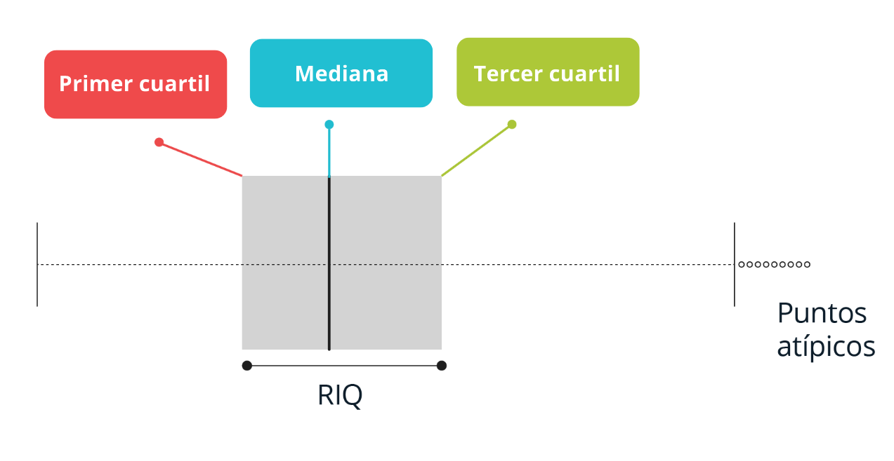
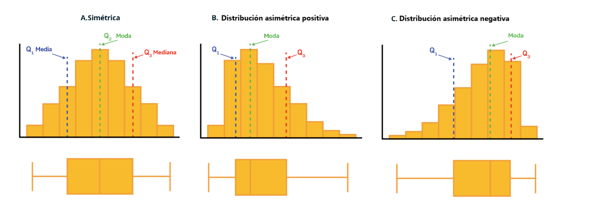
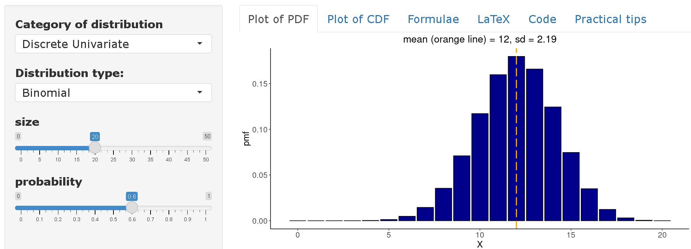
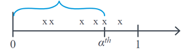

::: questions
# Pregunta introductoria

-   ¿Cómo se pueden utilizar la estadística y la probabilidad para
    resolver preguntas en la epidemiología de enfermedades infecciosas?
:::

::: objectives
# Objetivos

**Al final de este taller usted podrá:**

-   Comprender el rol de la estadística en el estudio de las
    enfermedades infecciosas.

-   Comprender las medidas estadísticas para resumir y analizar la
    información.

-   Familiarizarse con el concepto de variable aleatoria y reconocer las
    principales distribuciones de probabilidad.

-   Identificar y comprender el proceso del problema estadístico como un
    problema de inferencia desde una muestra.

-   Comprender el concepto de intervalo de confianza y el procedimiento
    de las pruebas de hipótesis.
:::

::: prereq
Esta unidad tiene como prerequisitos:

-   Introducción a R y RStudio
-   Visualización con ggplot2

Esta unidad es un complemento al ***Curso en ciencia de datos en salud
pública y modelamiento de enfermedades infecciosas***
:::

```{r setup, include=FALSE}
library(knitr)
opts_chunk$set(collapse = TRUE)
```

::: callout
# **Tabla de contenido**

+-----------------------------------------------------------------------+
| -   Tema 1: Introducción al Pensamiento Estadístico (Ver en           |
|     plataforma del curso)                                             |
|                                                                       |
| -   Tema 2: Estadística Descriptiva (Ver complemento en plataforma    |
|     del curso)                                                        |
|                                                                       |
| -   Tema 3: Probabilidad (Ver complemento en plataforma del curso)    |
|                                                                       |
| -   Tema 4: Principales distribuciones de probabilidad (Ver           |
|     complemento en plataforma del curso)                              |
|                                                                       |
| -   Tema 5: Introducción a la inferencia estadística (Ver complemento |
|     en plataforma del curso)                                          |
+-----------------------------------------------------------------------+
:::

## Antes de comenzar

Por favor revise que tenga instaladas las librerías
`tidyverse, pak, epiparameter e infer`, en caso de que no estén
instaladas ejecute el código a continuación de acuerdo a su necesidad:

```{r,eval=FALSE}
#Para instalar el paquete de epiparameter si aún no lo tiene (o no tiene seguridad de tenerlo) ejercute el siguiente código

if(!require("pak")) install.packages("pak")
if(!require("epiparameter")) pak::pak("epiverse-trace/epiparameter")

# Para instalar el paquete de tidyverse si aún no lo tiene (o no tiene seguridad de tenerlo)  ejercute el siguiente código

if(!require("tidyverse")) install.packages("tidyverse")


# Para instalar el paquete de infer si aún no lo tiene (o no tiene seguridad de tenerlo)  ejercute el siguiente código

if(!require("infer")) install.packages("infer")

# Para instalar el paquete de epitools si aún no lo tiene (o no tiene seguridad de tenerlo)  ejercute el siguiente código

if (!require(epitools)) install.packages("epitools")

# Para instalar el paquete de cfr si aún no lo tiene (o no tiene seguridad de tenerlo)  ejercute el siguiente código

if (!require("cfr")) install.packages("cfr")

```
 
 <center>  
   
[{width="100"}](https://epiverse-trace.github.io/epitkit/Banco_errores.html)  
  
</center>  
   
## **Tema 2: Estadística Descriptiva**

**Ejercicio: Visualizando y Analizando Datos en R**

Existen muchos gráficos de acuerdo al tipo de escala de la variable que
se desea analizar. A continuación presentaremos algunos ejemplos para
comprender estos conceptos.

-   Tenga en cuenta realizar previamente la unidad de introducción a R y
    la unidad de visualización de datos. La tabla de datos para este
    ejercicio puede encontrarla en:
    <https://github.com/TRACE-LAC/TRACE-LAC-data/raw/main/otros/muestra_covid.RDS> 

-   Cuando ya tenga los datos descargados en su computador y en la
    carpeta de data de su proyecto puede ejecutar el siguiente comando:

```{r}
muestra_covid <- 
  base::readRDS("data/muestra_covid.RDS")
```

**Histograma y Boxplot**

Los dos tipos de gráficos más comunes para visualizar la distribución de
las variables cuantitativas son los histogramas y los boxplot o gráfico
de caja y bigotes. 

Los **histogramas** permiten describir visualmente la distribución de
los datos agrupando los datos en intervalos en el eje x, los cuales son
generalmente de igual tamaño, y luego para cada intervalo describe la
frecuencia absoluta, la frecuencia relativa o la densidad en el eje y.
Un histograma de densidad ajusta la frecuencia relativa de cada
intervalo de acuerdo a la amplitud del mismo. En R puede ser construido
de la siguiente manera:

```{r}
library(ggplot2)
library(dplyr)

# Histograma con frecuencia absoluta

ggplot(muestra_covid, aes(x = edad)) +
  geom_histogram(color = "darkblue", 
                 fill = "lightblue") +
  labs(y = "Frecuencia Absoluta", x = "Edad en años",
       title = "Distribución de la edad")
```

```{r}
# Histograma con densidad

ggplot(muestra_covid, aes(x = edad)) +
  geom_histogram(aes(y = after_stat(density)),
                 color = "darkblue",
                 fill = "lightblue") +
  labs(y = "Densidad", x = "Edad en años",
       title = "Distribución de la edad")
```

Los **Boxplot** se construyen a partir de la visualización en sentido
horizontal o vertical de los siguientes estadísticos:

-   Primer cuartil Q1 (percentil 25): Valor que deja por debajo el 25%
    de los datos. "Primera Línea"

-   Segundo cuartil Q2 (percentil 50 o mediana): Valor que deja por
    debajo el 50% de los datos. "línea de la mitad"

-   Tercer cuartil Q3 (percentil 50 o mediana): Valor que deja por
    debajo el 75% de los datos. "Tercera Línea"

    

Adicionalmente, estos gráficos son útiles para detectar puntos atípicos
o outliers al establecer un límite inferior (Q1-1.5×RIQ) y un límite
superior (Q3+1.5×RIQ) basado en el RIQ=Q3-Q1. Los datos por fuera de
estos límites son catalogados como inusuales y deben ser revisados. En
presencia de datos atípicos, las líneas o bigotes van hasta los límites
inferior o superior, en caso contrario van hasta el valor mínimo y
máximo, respectivamente.

Otra utilidad de los **boxplot** y los **histogramas** es que ayudan a
conocer la forma de la distribución con el objetivo de decidir el mejor
indicador de tendencia central. De esta manera, una distribución puede
ser simétrica o asimétrica positiva/negativa. Cuando existe simetría, se
recomienda utilizar la media acompañada de la desviación estándar y en
caso contrario, la mediana y el rango intercuartílico debido a que la
media puede ser influenciada por los datos extremos de la distribución.
Recuerde que un indicador de tendencia central siempre debe ir
acompañado de un juez, es decir, su respectivo indicador de
variabilidad.



-   **Leyenda explicativa A:** En una distribución simétrica, la media,
    la moda y la mediana toman el mismo valor y los datos se encuentran
    distribuidos equitativamente alrededor del valor central. Para este
    tipo de distribuciones se recomienda describir la serie de datos con
    media y desviación estándar.

-   **Leyenda explicativa B:** Distribución asimétrica positiva o
    sesgada hacia la derecha. Este tipo de distribuciones se
    caracterizan por tener una mayor concentración de datos hacia el
    mínimo de la distribución, pero algunos valores se concentran hacia
    el valor máximo de la misma. El comportamiento esperado es que la
    media\>mediana\>moda puesto que la media se deja influenciar por los
    valores extremos positivos de la distribución. Se recomienda
    realizar la descripción de los datos por medio de la mediana y rango
    intercuartílico.

-   **Leyenda explicativa C:** Distribución asimétrica negativa o
    sesgada hacia la izquierda. Este tipo de distribuciones se
    caracterizan por tener una mayor concentración de datos hacia el
    máximo de la distribución, pero algunos valores se concentran hacia
    el valor mínimo de la misma (valores hacia la izquierda). El
    comportamiento esperado es que la moda\>mediana\>media dado que esta
    última se deja influenciar por los valores extremos del costado
    izquierdo. Se recomienda realizar la descripción de los datos por
    medio de la mediana y rango intercuartílico.

A continuación realizaremos la visualización de la edad de los casos de
COVID-19 a través de un boxplot.

```{r}
# Boxplot

ggplot(muestra_covid, aes(x = "", y = edad)) +
  geom_boxplot(outlier.shape = NA)
```

De acuerdo con el boxplot de la edad de la muestra de los casos de
COVID-19 es posible concluir que la distribución de los datos es
asimétrica positiva, dado que existe una mayor cercanía entre los
valores del Q1 y la mediana, por lo que es recomendar describir el
comportamiento de la misma por medio de la mediana y rango
intercuartílico, esto en R puede ser encontrado de la siguiente manera
utilizando las funciones resaltadas en azul:

```{r}
# Estadísticas Descriptivas Variables cuantitativas

muestra_covid %>%
  dplyr::summarise(
  n = n (), # Número de observaciones
  media = mean(edad), #Media
  sd = sd(edad), #Desviación estándar
  mediana = quantile(edad, 0.50), # Mediana-Percentil 50
  P25 = quantile(edad, 0.25), # Percentil 25
  P75 = quantile(edad, 0.75)) # Percentil 75
```

Finalmente, para la variable edad se puede concluir que la mitad de los
pacientes con covid-19 tienen edades entre 27 y 52 años ("RIQ") con una
mediana de 38 años, lo que indica que la mitad de los casos tienen una
edad por debajo de este valor. Es importante resaltar que, debido a la
asimetría de la distribución, la media y la mediana no coinciden,
comportamiento esperado en las distribuciones asimétricas.  

 <center>  
   
[{width="100"}](https://epiverse-trace.github.io/epitkit/Banco_errores.html)  
  
</center>
 
**Gráfico de Barras y Tablas de Frecuencia**

Las variables cualitativas se recomiendan que sean representadas por
medio de gráficos de barras. Generalmente, estos se construyen indicando
en el X las categorías de las variables y en el eje Y el valor de las
frecuencias absolutas, relativas o porcentajes de acuerdo a las
necesidades, es decir, siempre es necesario primero evaluar la tabla de
frecuencia de la variable. Supongamos que se desea conocer el tipo de
contagio de COVID-19. Esto en R puede realizarse utilizando el siguiente
comando:

```{r}
tabla <- muestra_covid %>% # se crea la tabla de frecuencia
  dplyr::count(tipo_de_contagio) %>% #conteo de frecuencia para la variable estado
  dplyr::mutate(prop = base::prop.table(n), #proporción
                perc = base::prop.table(n)*100) #porcentaje

tabla
```

Con esta información se puede concluir que el 70% de los casos de
covid-19 fueron de la comunidad y sólo el 0.06% fueron importados de
otros lugares. Esto puede ser visualizado por medio de un gráfico de
barras:

```{r}
ggplot(data = tabla, aes(x = tipo_de_contagio, y = perc)) +
  geom_bar(stat = "identity", color = "darkblue", fill = "lightblue")+
  labs(y = "%", x = " ",title = "Tipo de Contagio")
```
   
<center>  
   
[{width="100"}](https://epiverse-trace.github.io/epitkit/Banco_errores.html)  
  
</center>
  
## **Tema 3: Probabilidad**

En un estudio publicado en el NEJM en el año 2014. titulado "Ebola Virus
Disease in West Africa- The First 9 Months of the Epidemic and Forward
Projections" ([**DOI:
10.1056/NEJMoa1411100**](https://www.nejm.org/doi/full/10.1056/NEJMoa1411100)),
se describieron las características clínicas y epidemiológicas de los
casos de ébola  reportados durante la epidemia que afectó a los países
de Guinea, Liberia, Nigeria y Sierra Leona desde diciembre del 2013. En
ese estudio se describió que aquellos sujetos mayores de 44 años tenían
una mayor probabilidad de morir a causa de la enfermedad. De manera
similar al artículo de referencia, se llega a una conclusión comparable
si realizamos un cálculo equivalente utilizando medidas de asociación
vistas en la Unidad de Epidemiología General aplicada a enfermedades
infecciosas, como Riesgos relativos (RR) del la Razón de riesgos o
Riesgo relativo (RR). Para ello, se puede reconstruir una tabla 2x2,
donde el RR puede ser medido por la razón entre el CFR de un grupo A
(p.e., casos con 45 años o más) y un grupo B (p.e., casos con 44 años o
menos), donde el CFR es el riesgo de muerte en casos (del inglés Case
Fatality Risk).

De esta forma, obtenemos que el riesgo de muerte en casos con 45 años o
más es 1.20 veces el riesgo de muerte en casos con 44 años o menos, con
un intervalo de confianza del 95% de 1.13 a 1.27, y un valor p menor a
0.01. Para reproducir este cálculo puede  usar la librería **epitools**
como se muestra acontinuación.

```{r}
library(epitools)

tabla2x2 <- matrix(c(311, 51, 768, 299),nrow = 2, ncol = 2)

epitools::riskratio(tabla2x2)
```

En el Tema 5 de esta Unidad encontrará una introducción a la inferencia
estadística e intervalos de confianza.

 
 <center>  
   
[{width="100"}](https://epiverse-trace.github.io/epitkit/Banco_errores.html)  
  
</center>  
   
## **Tema 4: Principales distribuciones de probabilidad**

Cómo se describió en el Tema 3, la probabilidad estudia el
comportamiento de fenómenos aleatorios "eventos". En este proceso se
observan **variables aleatorias (v.a),** denotadas usualmente como **X**
que tienen comoobjetivo asignar un número real a cada evento que puede
suceder en el espacio muestral.

Para la explicación y ejemplos de las principales distribuciones es
importante que instale y cargue los paquetes **epiparameter** del
Epiverse.

```{r}
#cargue la librería epiparameter
library(epiparameter)
```

**Modelos Discretos**

La distribución binomial permite describir la probabilidad de ocurrencia
de un evento con dos posibles resultados, éxito (p) o fracaso (1-p), en
un número determinado de ensayos independientes n con probabilidad
constante de éxito p. La variable aleatoria en estudio corresponde a:

X: Número de éxitos en n ensayos

El modelo binomial puede ser de utilidad para conocer la probabilidad de
observar un número determinado de eventos (ej. casos, muertes,
reinfecciones) en una población de tamaño n bajo el supuesto que la
probabilidad del evento es constante. La distribución binomial depende
de dos parámetros: la probabilidad de éxito p y el número de ensayos
independientes n.

Si X tiene una distribución binomial entonces se representa de la
siguiente manera. X\~Bin(n,p)

Y su función de densidad, media, esperanza y varianza corresponden a:

$f(x)=P(X=x)=(n x )$

$p^x (1-p)^{(n-x)}$

$E(x)=np$\
$Var(x)=np(1-p)$

Ejemplo: Sí en una comunidad de 20 individuos se introduce un virus con
una tasa de ataque del 60% ¿Cuál es la probabilidad de que en esta
comunidad se infecten 10 o menos individuos?

Sea $X~Bin(n=20,p=0.60)$, entonces se necesita calcular la siguiente
expresión:

$P(X≤10)=∑_(x=0)^10 (20 x ) 〖0.60〗^x (1-0.60)^(20-x)$

En R esto puede ser calculado de la siguiente forma:

```{r}
p <- 0.60 
n <- 20 
x <- 10 

pbinom(x,n,p, lower.tail = TRUE)
```

Por lo tanto, la probabilidad de que máximo 10 individuos se infecten es
del 24.5%.

En [distribution-zoo](https://ben18785.shinyapps.io/distribution-zoo/)
se puede visualizar la distribución completa de la variable

$X~Bin(n=20,p=0.60)$. Así, se puede concluir que en promedio se
esperaría encontrar 12 infectados en una comunidad de 20 individuos
partiendo de una tasa de ataque del 60%.



**Distribución Poisson**

La distribución de *Poisson* modela el comportamiento de variables
aleatorias que describen el número de eventos, "conteos", que ocurren en
un intervalo de observación fijo, ejemplo, tiempo (número de infecciones
ocurridas en una hora, día, semana, año, etc), o área (número de
infecciones ocurridas en un municipio, hospital, etc).

Esta distribución tiene un parámetro llamado lambda ($λ$), $λ>0$, que
describe el número promedio de eventos que suceden en el intervalo fijo
de observación. Si $X$ tiene una distribución de Poisson, entonces, se
representa de la siguiente manera:

$X$\~$Poisson(λ)$

Su función de densidad, esperanza, media y varianza corresponde a:

$fx=P(X=x)=\frac{e^{-λ}λ^x}{x!}, x=0,1,2,..,$

$E(x)=λ Var(x)=λ$

En enfermedades infecciosas, la distribución de Poisson puede ser
utilizada para modelar el número de casos secundarios generados por un
caso primario. En este contexto, el parámetro está en función del número
efectivo de reproducción **R** que representa el promedio de infecciones
secundarias causadas por cada caso primario en el tiempo en una
población compuesta por individuos susceptibles y no susceptibles.

::: challenge
[**Ejemplo**]{.underline}

Supongamos que se desea estudiar la propagación de un brote con base en
un modelo de Poisson a medida que transcurren los días (t). La variable
aleatoria de interés es:

$X_{(t )}$: Número de casos secundarios causados por cada caso primario
al día t

Este es un modelo de Poisson dado que existe un intervalo fijo de
observación "cada caso primario" y se desea estudiar el número de casos
secundarios observados "eventos". Así, se podría construir el siguiente
modelo:

$X_{(t )}∼Poisson (λ= R X_{(t-1)})$

Lo anterior expresa que el número promedio de casos secundarios al día t
depende del número de reproducción $R$ y del número de casos observados
$X$ el día anterior $(t-1)$. No obstante, R es difícil de conocer en la
vida real y podría ser de interés aproximar su valor con base en los
datos observados durante el brote con el fin de generar estrategias de
control.

Supongamos que al día 1 del brote $(t=1)$ se presentaron un total de 5
casos nuevos y que al siguiente día $(t=2)$ se presentaron 10 casos
nuevos. Con la anterior información nos interesa estudiar el número de
casos secundarios en el día 2, lo que equivale a:

$X_{(2 )}$: Número de casos secundarios causados por cada caso primario
en el día 2

La cual tiene la siguiente distribución:

$X_{(2 )}∼Poisson (λ= R *5)$

De aquí, podríamos estimar el valor de $R$ al descubrir cuál valor
maximiza la probabilidad de observar este número específico de casos
secundarios en el día 2, es decir:

$P(X_{(2 )}=10)=\frac{e^{-(R *5)} (R *5)^{10}}{10!}$

**En R lo podríamos descubrir al variar diferentes valores del número de
reproducción (R) de la siguiente manera:**

```{r}
# Calculo probabilidad de poisson
prob_poisson <- function(x1, x2, r){
  dpois(x2, r*x1)
}

 # Aplicar la función con los datos observados

numeros_reproduccion <- base::seq(0,5,0.01) # Diferentes valores de R
resultados_poisson <- base::vector(length = base::length(numeros_reproduccion))

#crear un vector vacío 

for (i in seq_along(numeros_reproduccion)){
 resultados_poisson[i] <- prob_poisson(x1 = 5, x2 = 10, r = numeros_reproduccion[i])
}

datos_resultados <- base::data.frame(numeros_reproduccion, resultados_poisson)
numero_mas_probable <- datos_resultados %>%  dplyr::filter(resultados_poisson == max(resultados_poisson)) %>%  dplyr::pull(numeros_reproduccion) 

p <- ggplot(data = datos_resultados, aes(x = numeros_reproduccion, y = resultados_poisson)) + geom_line() +  geom_vline(xintercept = numero_mas_probable ,color = "red", size=1)

p+labs(y = "Probabilidad", x = "Número Reproductivo (R) ",title = "Modelo de Poisson")
```

Por lo tanto, si el número de casos secundarios se comporta de acuerdo a
una distribución de Poisson, existe una alta probabilidad de que el
número de casos nuevos observados en el día 2 hayan sido generados con
un número de reproducción de R=2.  Lo que implica que el promedio de
casos secundarios por cada caso primario es de 2. No obstante, este
modelo simple supone que el número de casos secundarios generados por
cada caso primario tienen igual media y varianza, lo que implica que
todos los casos primarios generan el promedio un número similar de casos
secundarios. Este supuesto puede ser difícil de asumir en algunas
enfermedades infecciosas en especial cuando siguen un patrón de
sobredispersión (20% de los casos causan el 80% de la transmisión) por
lo que el modelo de Poisson tiene limitaciones en su aplicación.
:::

**Distribución Binomial Negativa**

Al igual que la distribución de Poisson, la distribución binomial
negativa permite modelar el número de eventos que ocurren "conteos". Si
$X$ tiene una distribución Binomial Negativa, entonces, se representa de
la siguiente manera.

\$X $~$ BN(μ,k)\$

Donde, $μ$ representa la media de la distribución y $k$ es el parámetro
de dispersión que permite que la media y la varianza de los eventos no
sean iguales. Este parámetro $k$ permite introducir al modelo el grado
de dispersión en cómo se generan los eventos. Así, $k$ mide inversamente
el grado de variación de los eventos ocurridos dado que la media y la
varianza de la distribución corresponden a:

$E(x)=μ$

$Var(x)=μ(1+\frac{μ}{k})$

Con función de densidad:

$f(x)=\frac{Γ(x+k)}{Γ(k)Γ(x+1)} (\frac{μ}{μ+k})^x (\frac{k}{μ+k})^k,x=0,1,2...$

::: challenge
[**Ejemplo**]{.underline}

En el estudio de las enfermedades infecciosas, la distribución binomial
negativa juega un rol relevante dado que permite modelar la distribución
del número de casos secundarios generados por un caso primario, es
decir, permite conocer la distribución del número de reproducción básico
R_0. En este contexto, la media de la distribución corresponde a
$R_0$(Número de casos secundarios en una población totalmente
susceptible) y el parámetro $k$ controla la variación entre los casos
primarios. Así, valores pequeños de k sugieren que los casos secundarios
son generados por un grupo pequeño de casos primarios, mientras que
valores grandes sugieren que la propagación del virus es alta. Así,
siendo $X$ el número de casos secundarios, entonces:

$X \sim Bn(R_0,k)$

$E(x)=R_0$

$Var(x)=R_0 (\frac{1+R_0}{k})$

En el artículo de Lloyd-Smith et al. se muestra cómo la distribución
binomial negativa permite modelar la distribución de casos secundarios
de varios patógenos. Con base en los casos reportados durante el brote
de SARS ocurrido en Singapur en el año 2023, se logró estimar los
parámetros de la distribución binomial negativa encontrando un
$R_0=1.630$ y $k=0.160$. Estas estimaciones se encuentran disponibles en
el paquete `epiparameter`, el cual es un paquete disponible en `R` que
recopila las principales estimaciones para varios parámetros
epidemiológicos de interés en el estudio de las enfermedades
infecciosas.

```{r}
SARS_R <- epiparameter::epiparameter_db(
    disease = "SARS",
    epi_name = "offspring distribution",
    single_epiparameter = TRUE
)
SARS_R
```

Con estos resultados sería posible graficar la distribución del número
de casos secundarios del SARS para poder sugerir medidas de control.
Esto también está disponible en el paquete `epiparameter` con la función
`plot`.

```{r}
plot(SARS_R)
```

Finalmente, es posible concluir que la mayoría de casos infectados con
SARS no propagan la enfermedad dado que la moda de la distribución es
$0$. Este resultado es esperado dado que $k<1$, lo que indica que los
casos secundarios son generados por un pequeño grupo de infectados y que
el valor estimado de $R_0$ varía para los casos.
:::

**Distribución geométrica**

Otra distribución discreta de interés que puede ser utilizada para
modelar conteos o número de eventos es la distribución geométrica. En
enfermedades infecciosas su principal uso surge cuando el parámetro de
dispersión de la distribución negativa es igual a 1. Esta distribución
depende de la probabilidad de que ocurra el evento de interés y se
representa de la siguiente manera.

$X \sim Geom(p)$

donde p representa la probabilidad de éxito o la probabilidad de que
ocurra el evento de interés con media igual a:

$E(x)=\frac{1}{p}$

::: challenge
**Ejemplo**

Si en el caso del brote de SARS de Singapur en el año 2023, el valor
estimado de $k$ hubiera sido $1$, entonces, la distribución de casos
secundarios podría ser modelado con una distribución geométrica de tal
manera que su media sea igual al $R_0$ estimado, es decir se debe
cumplir que:

$E(x)=\frac{1}{p}=1.630$ y por lo tanto, $p=\frac{1}{1.630}$

Por lo que la distribución del número de contactos secundarios se podría
escribir como:

$X \sim Geom(p=0.613)$

En R podríamos simular el comportamiento del número de casos secundarios
con el siguiente código:

```{r}
# Distribución Geométrica
x <- base::seq(0,20,1) # Diferentes valores de R
prob <- 1/(1.630)
datos_geome <- base::data.frame(x, probg = dgeom(x, prob))

ggplot(data = datos_geome, aes(x = x, y = probg)) +
  geom_bar(stat = "identity") +
  labs(y = "Probabilidad", x = "Casos secundarios",
       title = "Distribución Geométrica")
```

Bajo la distribución geométrica, entonces existe una mayor probabilidad
de que un caso primario pueda transmitir el virus dado que la
probabilidad de que un caso primario genere 1,2, o más casos secundarios
es mayor con este modelo en comparación de lo estimado con el modelo
binomial negativo.
:::

**Modelos Continuos**

**Distribución Uniforme**

La distribución uniforme modela una variable continua que toma valores
dentro de un intervalo $[a,b]$ con igual probabilidad. Esta distribución
suele utilizarse en la simulación de números aleatorios. Si $X$ sigue
una distribución uniforme, esto se puede representar por:

$X ∼U(a,b)$

Sus parámetros a y b, representan el valor mínimo y máximo que puede
tomar la variable, respectivamente. Su función de densidad está
determinada por:

$f(x)=\frac{1}{b-a}$,con $a<x<b$

La media y varianza está determinada por:

$E(x)=\frac{a+b}{2}$ y $V(x)=\frac{(b-a)^2}{12}$

::: challenge
**Ejemplo**

Un investigador desea simular el comportamiento del COVID-19 y necesita
generar aleatoriamente el valor que puede tomar el número básico de
reproducción $R_0$ para luego utilizarlo dentro de su modelo de
propagación. Para esto, él supone que el $R_0$ del COVID-19 sigue una
distribución uniforme entre 2 y 5:

$R0∼U[2,5]$

Para su simulación necesita generar cinco posibles valores de $R_0$ con
igual probabilidad, lo anterior en `R` se resuelve utilizando el
siguiente código:

```{r}
# Generación de números aleatorios con la distribución uniforme
n <- 5
a <- 2
b <- 5
stats::runif(n, a, b)
```
:::

**Distribución Normal**

La distribución normal es sin duda el modelo probabilístico más
importante en la teoría estadística debido a que permite modelar
múltiples problemas de la vida real y a su relevante rol en el campo de
la inferencia. Esta distribución intenta modelar variables aleatorias
que pueden estar influenciadas por múltiples factores, cuyos efectos al
ser sumados hacen que los valores de la distribución tiendan hacia el
centro (media). Por ejemplo, la temperatura corporal puede seguir una
distribución normal dado que esta es influenciada por múltiples factores
biológicos y ambientales, los cuales al sumar sus efectos hacen que la
mayoría de los individuos se encuentran alrededor de un valor central.

Para expresar matemáticamente que una variable continua tiene
distribución normal se escribe:

$X ∼N(μ,σ)$

La cual tendrá asociada la siguiente función de densidad de
probabilidad:

$f(x)=\frac{1}{ σ\sqrt{2\pi}}exp[-\frac{1}{2 σ^2}(x-u)^2]$

Donde $μ$ y $σ$ son los parámetros de la distribución y representan
respectivamente la media y la desviación estándar de la variable
aleatoria, es decir, el valor central y la dispersión de los datos
respecto a este. Estos parámetros corresponden a los valores que se
obtendría si se logrará estudiar toda la población y no una muestra de
la misma.

Cuando $μ=0$ y $σ=1$, recibe el nombre de **distribución normal
estándar**. Sin embargo, existen muchas distribuciones normales de
acuerdo a los valores que tomen sus parámetros, pero sin importar el
valor de estos, la forma de la distribución siempre es **simétrica** y
siempre puede ser transformada a una distribución normal estándar por
medio de un procedimiento de estandarización aplicando la siguiente
fórmula:

$Z=\frac{X-μ}{σ}∼N(0,1)$

::: challenge
**Ejemplo**,

Si se sabe que en una comunidad la edad de los casos que fallecieron por
COVID-19 tiene una distribución normal con media 67.8 y desviación
estándar de 15.4 años. ¿Cuál es la probabilidad de que un fallecido sea
menor de 40 años?

Primero se define la variable a estudiar, la cual tiene una distribución
normal

$X∼N(67.8,15.4)$

$X$: La edad de los casos fallecidos por COVID-19

En R, podemos usar la función `pnorm()` de la siguiente manera para
encontrar:

$P(X<40)=?$

```{r}
mu <- 67.8
sigma <- 15.4 
x <- 40 
stats::pnorm(x, mean = mu, sd = sigma)
```

Por lo tanto, la probabilidad de que un fallecido por COVID-19 sea menor
de 40 años es del 3.5%.
:::

**Distribución Log-normal**

La distribución log-normal surge cuando se consideran variables
aleatorias continuas que no toman el valor de cero o números negativos
cuya distribución tiene una forma asimétrica y su variación es generada
por múltiples factores cuyos efectos no son simétricos. Si una v.a sigue
una distribución lognormal, su transformación al aplicar la función
logaritmo generará una variable normal y de ahí surge su nombre. En el
campo de las enfermedades infecciosas, la distribución log-normal tiene
gran utilidad para modelar los periodos de incubación (tiempo desde la
infección hasta el inicio de síntomas).

Si $X ∼LogN(μ,σ)$, entonces, se cumple que $Y=log (X) ∼N(μ,σ)$ y la
función de densidad de $X$ está dada por:

$f(x)=\frac{1}{ xσ\sqrt{2\pi}}e^{-\frac{1}{2}(\frac{ln(x)-u}{σ})^2}$

A diferencia de la distribución normal, en la distribución log-normal el
parámetro μ cumple el rol de un parámetro de escala dado que aumenta la
dispersión de los datos al incrementar su grado de amplitud y el
parámetro σ controla la forma, es decir, el grado de asimetría.

::: challenge
**Ejemplo**

En el año 2009 en el artículo de Lessler et al. se modelaron los
periodos de incubación de varios patógenos con base en una distribución
lognormal. El interés principal era estimar los parámetros de $(μ,σ)$.
Por ejemplo en el caso del SARS se encontró una estimación de $μ=0.660$,
y $σ=1.205$, lo que implica que en promedio un caso infectado desarrolla
síntomas en 0.7 días. Esta información puede ser obtenida en el paquete
epiparameter con el siguiente comando:

```{r}
SARS_incubacion <- epiparameter::epiparameter_db(
    disease = "SARS",
    epi_name = "incubation period",
    single_epiparameter = TRUE
)
SARS_incubacion
```

La distribución completa del periodo de incubación para SARS puede
graficarse por medio de:

```{r}
plot(SARS_incubacion)
```

Lo anterior es útil para responder preguntas tipo: ¿Cuál es la
probabilidad de que un caso de SARS desarrolle síntomas dos días después
de la infección?

```{r}
stats::plnorm(2, meanlog = 0.660, sdlog = 1.205, lower.tail = FALSE)
```
:::

**Distribución Gamma**

Cuando estamos estudiando variables aleatorias de Poisson, generalmente,
nos interesa estudiar el número de eventos que ocurren con media $λ$ por
un intervalo de tiempo definido. La distribución Gamma se centra en
estudiar la v.a $X$: el tiempo que transcurre hasta que ocurra un
determinado número de eventos $α^th$. Por ejemplo, si estamos evaluando
el número de contagios por hora y queremos estudiar cuánto tiempo puede
transcurrir hasta encontrar α contagios, gráficamente $X$ corresponde a:



La distribución Gamma es ampliamente utilizada en análisis de
supervivencia debido a su flexibilidad que viene dada por sus parámetros
de forma $α$ y escala $θ$, que determinan su función de densidad, la
cual tiene un comportamiento asimétrico. Aquí, $θ$ representan el tiempo
promedio de espera hasta que el primer evento ocurre y $α$ es el número
de eventos que se espera ocurran. Esta distribución se denota de la
siguiente manera:

$X ∼Gamma(α,θ)$

$f(x)=\frac{1}{(α-1)!θ^α}e^{\frac{-x}{θ}} x^{α-1}$

$E(x)=αθ$

$Var(x)=αθ^2$

Cuando $θ$ aumenta su valor, la concentración de la probabilidad se
corre hacia la derecha, lo mismo ocurre al esperar un mayor número de
eventos $α$ dado que el tiempo de espera $X$ puede ser mayor.

::: challenge
**Ejemplo**

Una posible aplicación de la distribución Gamma es en el modelamiento
del intervalo serial de las enfermedades infecciosas. El intervalo
serial (s) se define como el tiempo que transcurre entre el inicio de
síntomas del caso primario y el inicio de síntomas del caso secundario.
En el estudio de Ghani et al. se describió la distribución del intervalo
serial de la influenza *Influenza-A-H1N1Pdm* por medio de la
distribución gamma encontrando los siguientes parámetros:

$s ∼Gamma( α=2.622,θ=0.957)$

Esta información puede ser obtenida también en el paquete `epiparameter`
con el siguiente comando:

```{r}
influenza_s <- epiparameter::epiparameter_db(
  disease = "Influenza",
  epi_name = "serial_interval",
  single_epiparameter = TRUE
)
influenza_s
```

```{r}
graphics::plot(influenza_s)
```

Con esta información se podría encontrar la media y desviación estándar
de la distribución con base en la aplicación de la distribución gamma:

```{r}
shape <- 2.622
scale <- 0.957
mean <- shape*scale
sd <- sqrt(shape*scale^2)
print(c(mean, sd))
```

Por lo tanto, el promedio del intervalo serial de la influenza es de
5.51 días con una desviación estándar de 1.55 días.
:::

**Distribución Weibull**

Al igual que la distribución Gamma, la distribución Weibull es de gran
utilidad en el análisis de v.a´s que representan tiempos de espera hasta
observar un evento en particular. La distribución Weibull tiene dos
parámetros y su función de densidad está definida por:

$f(x)= \frac{β}{η}(\frac{x}{η})^{β-1}{e^{-(x/η)}}^β$

Aquí, $η$ es el parámetro de escala y $β$ el de forma. El parámetro de
forma $β$ también es conocido como pendiente e intenta modelar la
relación entre la probabilidad y los tiempos de espera. Así cuando $β>1$
la tasa de ocurrencia de eventos incrementa con el tiempo, mientras si
$β<1$ describe que el riesgo del evento disminuye con el tiempo. El
parámetro de escala maneja el grado de variabilidad de la distribución y
se encuentra en las mismas unidades de $X$.

::: challenge
**Ejemplo**

En el estudio de Virlogeux et al. se describió la distribución del
tiempo de incubación de la influenza por medio de la distribución
Weibull encontrando los siguientes parámetros:

$x∼Gamma( β=2.101,η=3.839)$

Esta información puede ser obtenida también en el paquete epiparameter
con el siguiente comando:

```{r}

influenza_incubacion <- epiparameter::epiparameter_db(
  disease = "Influenza",
  epi_name = "incubation period",
  single_epiparameter = TRUE
)
influenza_incubacion

```

```{r}
plot(influenza_incubacion)
```
:::
   
<center>  
   
[{width="100"}](https://epiverse-trace.github.io/epitkit/Banco_errores.html)  
  
</center>
  
## **Tema 5: Introducción a la inferencia estadística**

La estadística puede dividirse en dos grandes ramas: descriptiva e
inferencial. Cómo lo vimos en unidades anteriores, la primera comúnmente
busca resumir y explorar los datos que han sido recolectados en una
muestra seleccionada de una población. En cambio, la segunda tiene por
objetivo realizar generalizaciones y concluir sobre toda la población a
partir de la información o datos provenientes de una muestra.

Por la naturaleza del proceso inferencial que es basado en la toma de
muestras aleatorias de la población, un estimador puede tomar múltiples
valores dado que depende de las unidades que fueron seleccionadas en la
muestra. Esta variación debida al azar, denominada **variación
muestral**, debe ser involucrada al proceso de inferencia como lo
veremos más adelante.

Es importante recalcar que la variación muestral dependerá del tamaño de
la muestra. Por ejemplo, si tomamos muestras de tamaño 10 y calculamos
la CFR en cada una de ellas, estas estimaciones se parecerán más entre
sí en comparación con las obtenidas cuando se seleccionan sólo 5
individuos por muestra. Lo anterior, puede ser comprobado al realizar
una simulación en R y seleccionar 1000 muestras de tamaño 5 y 10,
respectivamente. Como se observa en la siguiente figura, las CFR
estimadas al incrementar el tamaño de la muestra de 5 a 10 fueron más
similares con un menor RIQ. 

```{r}
library(infer)
set.seed(200)
poblacion <- base::data.frame(muerto=c(base::rep(1,40), base::rep(0,160)))
muestrasn5 <- poblacion %>%
  infer::rep_sample_n(size = 5, reps = 100, replace = FALSE)

cfrn5 <-muestrasn5 %>%
  dplyr::group_by(replicate) %>%
  dplyr::summarise(cfr = mean(muerto))

muestrasn10 <- poblacion %>%
  infer::rep_sample_n(size = 10, reps = 100, replace = FALSE)

cfrn10<-muestrasn10 %>%
  dplyr::group_by(replicate) %>%
  dplyr::summarise(cfr = mean(muerto))

cfr <- dplyr::bind_rows(cfrn5, cfrn10)
cfr <- cfr %>% 
  dplyr::mutate(size = base::as.factor(c(base::rep(5,100), base::rep(10, 100))))


# Plot sampling distribution
ggplot(cfr, aes(x =size, y=cfr, fill=size)) +
  geom_boxplot(show.legend = FALSE) +
  labs(x = "Tamaño muestral", y = "CFR estimación",
       title = " ") + scale_fill_brewer(palette="Blues")

```

Si calculamos la media y desviación estándar de los valores estimados de
la CRF con las muestras de tamaño 5 y tamaño 10, vemos que efectivamente
la desviación estándar de las estimaciones es menor al incrementar el
tamaño de la muestra, pero en ambos casos en promedio las muestras se
acercaron al verdadero valor del parámetro del 0.20. 

```{r}
cfr %>%
  group_by(size) %>%
  summarise(
    media = mean(cfr),
    sd = sd(cfr),
    mediana = median(cfr),
    P25 = quantile(cfr, 0.25),
    P75 = quantile(cfr, 0.75)
  )
```

Pero, si en la vida real solo podemos tomar una muestra aleatoria, esto
significa que solo vamos a tener una única oportunidad de calcular un
estadístico que será el **estimador puntual** del parámetro. No
obstante, ese único valor no va a poder proveer información sobre la
variabilidad inmersa en la selección aleatoria de la muestra.
Adicionalmente, como vimos en el ejemplo anterior, existe una alta
probabilidad de que muchas de las posibles configuraciones de las
muestras den estimaciones que se encuentren alejadas del verdadero valor
del parámetro. Por lo tanto, debemos intentar involucrar la variabilidad
muestral en el proceso de estimación.

**Estimación por intervalos de confianza**

El objetivo de la estimación por intervalos de confianza es proveer un
rango de valores, un límite inferior y superior (a; b), que con una
elevada probabilidad "**confianza**" contenga el verdadero valor del
parámetro que se desea estimar. Aunque con cada muestra aleatoria que
pueda ser seleccionada se obtendrían límites diferentes, este
procedimiento garantiza que un $(1-α) \%$ determinado de los intervalos
construidos, contendrán el verdadero valor del parámetro. Lo anterior,
también implica que un $α\%$ de los intervalos no contendrán el
verdadero valor. El símbolo α es conocido como nivel de significancia.

De manera general un intervalo de confianza se construye con los
siguientes ingredientes:

$\text{Estimador} ±(\text{coeficiente de confiabilidad})*(\text{error estándar})$

::: challenge
**Ejemplo**

En el paquete CFR de la iniciativa Epiverse-TRACE se encuentra
disponible la información de un brote de ébola que sucedió en 1976 en
Zaire, ahora llamada República del Congo, documentando el número de
casos y muertes durante 73 días. Finalmente, se reportaron 245 casos de
ébola y de estos 234 fueron casos fatales. Si el interés es realizar una
estimación por intervalo de la CFR al 95%. ¿Cuál debería ser el
procedimiento a realizar?

●       [**Paso 1-Estimador**]{.underline}: se debe iniciar por
encontrar la estimación en la muestra observada:

$\hat{p} = \widehat{\text{CFR}} = \frac{234}{245}= 0.955$

Por lo que la CFR estimada fue del 95.5%

●       [**Paso 2-Coeficiente de confiabilidad**]{.underline} basado en
la distribución normal para un 95% de confianza correspondería a 1.96

●       [**Paso 3-Error estándar:**]{.underline}

$\sqrt{\frac{\hat{p}(1-\hat{p})}{n}}=\sqrt{\frac{0.955 (1-0.955)}{245}}$

●       [**Paso 4-Juntar los ingredientes**]{.underline}

Como hasta ahora se han dado cuenta este paso a paso puede llegar a ser
engorroso por los cálculos, pero en R podemos obtener todo de una manera
más rápida y eficaz de la siguiente manera:

${\left[p ̂±z_{\frac{α}{2}} \sqrt{\frac{p ̂(1-p ̂)}{n}}\right]}={\left[0.955±1,96\sqrt{\frac{0.955 (1-0.955)}{245}}\right]}$

Como hasta ahora se han dado cuenta este paso a paso puede llegar a ser
engorroso por los cálculos, pero en R podemos obtener todo de una manera
más rápida y eficaz de la siguiente manera:

```{r}
#Cargue librería cfr
library(cfr)
# Cargue los datos de Ebola 1976 
utils::data(ebola1976)
ebola1976%>%  dplyr::summarise(
    n=sum(cases), #Total de casos
    muertes = sum(deaths), #Total de muertes
    cfr_est = muertes/n, # Estimación 
    error = sqrt((cfr_est*(1-cfr_est))/n),
    lim_inf = cfr_est -1.96*error, #Limite inferior del IC
    lim_sup = cfr_est +1.96*error #Limite superior del IC
) 
```
:::

Finalmente, podemos concluir que con una confianza del 95%, la CFR de
ébola en la epidemia de 1976 en la República Democrática del Congo se
encuentra contenida en el intervalo entre 92.9% y 98.1%.

El paquete CFR también tiene una función incorporada para estimar
automáticamente con su respectivo intervalo al 95% la CFR durante una
epidemia por medio de la función:

```{r}
cfr::cfr_static(data = ebola1976)
```

Cómo pueden observar existen ligeras diferencias entre el IC construido
paso a paso y el reportado por la función `cfr_static`. Esto se debe a
que el paquete CFR realiza la construcción del IC por el método basado
en máxima verosimilitud y diferentes distribuciones estadísticas según
el número total de casos, pero la interpretación no cambia.
  
<center>  
   
[{width="100"}](https://epiverse-trace.github.io/epitkit/Banco_errores.html)  
  
</center>
   
::: keypoints
**Al final de la sesión revise si alcanzo los objetivos:**

-   Comprender el rol de la estadística en el estudio de las
    enfermedades infecciosas.

-   Comprender las medidas estadísticas para resumir y analizar la
    información.

-   Familiarizarse con el concepto de variable aleatoria y reconocer las
    principales distribuciones de probabilidad.

-   Identificar y comprender el proceso del problema estadístico como un
    problema de inferencia desde una muestra.

-   Comprender el concepto de intervalo de confianza y el procedimiento
    de las pruebas de hipótesis.
:::

## Contribuciones

-   Erika Cantor: Versión inicial
-   Zulma M. Cucunuba: Edición
-   Laura Gómez-Bermeo: Edición
-   Andree Valle-Campo: Ediciones menores
-   José M. Velasco-España: Ediciones menores
