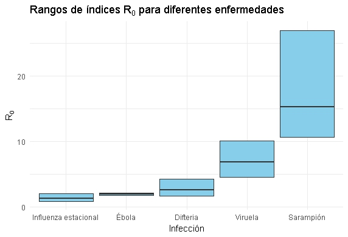

# Teoría epidémica y modelos

[Modelo Matemático de Enfermedades Infecciosas]{#modelo}

:   Un modelo matemático en la teoría epidémica de enfermedades
    infecciosas es una representación abstracta que utiliza ecuaciones
    matemáticas y algoritmos para describir la dinámica de la
    propagación de infecciones dentro de una población. Estos modelos
    permiten comprender, predecir o proyectar cómo una enfermedad
    infecciosa puede propagarse y afectar a una comunidad, considerando
    diversos factores como la tasa de transmisión, el período
    infeccioso, la recuperación y la inmunidad.

    El clásico modelo matemático es el modelo SIR: Susceptible,
    Infeccioso y Recuperado. Este tradicionalmente hace uso de
    ecuaciones diferenciales ordinarias (ODEs)-

    Hay varios tipos de modelos matemáticos, los más comunes son:
    [deterministas](determinista) y [estocásticos](estocastico)

[Ecuaciones Diferenciales Ordinarias]{#ODE}

:   Las ecuaciones diferenciales ordinarias (ODEs) se pueden usar para
    representar la tasa de cambio de una variable (por ejemplo, el
    número de individuos infectados) con respecto a otra (por ejemplo,
    el tiempo). Las ODEs se utilizan ampliamente en la modelización de
    enfermedades infecciosas para modelar el flujo de individuos entre
    diferentes estados de la enfermedad. 

    Para profundizar en el tema consulte esta introducción a las
    [ODEs](https://mathinsight.org/ordinary_differential_equation_introduction).

[Modelo Determinista]{#determinista}

:   Un modelo determinista es un tipo de modelo matemático en el cual el
    comportamiento del sistema está completamente determinado por sus
    condiciones iniciales y los parámetros del modelo, sin involucrar
    elementos de aleatoriedad o incertidumbre. En otras palabras, dado
    un conjunto de condiciones iniciales y parámetros, el modelo siempre
    producirá el mismo resultados.

[Modelo Estocástico]{#estocastico}

:   Un modelo estocástico aborda la variación aleatoria de los
    parámetros en las simulaciones del modelo para las mismas
    condiciones iniciales. Esto significa que no siempre se van a
    obtener exactamente los mismos resultados en todas las simulaciones.
    Ejemplos incluyen ecuaciones diferenciales estocásticas y modelos de
    procesos de ramificación. Para más detalles, consulta [Allen
    (2017).](https://www.sciencedirect.com/science/article/pii/S2468042716300495?via%3Dihub)

[Condiciones iniciales]{#iniciales}

:   En las Ecuaciones Diferenciales Ordinarias (ODEs por sus siglas en
    inglés de Ordinary differential equations), las condiciones
    iniciales son los valores de cada compartimento en el tiempo inicial
    del modelo (tiempo cero). Estas condiciones son necesarias para
    iniciar la simulación de la epidemia en el modelo y pueden afectar
    significativamente los resultados posteriores.

Ejemplo: Si hay un individuo infeccioso en una población de 1000 en un
modelo Susceptible-Infeccioso-Recuperado, las condiciones iniciales
serían 

-   $S_0=999$

-   $I_0=1$

-   $R_0=0$

[Parámetros de los modelos de transmisión]{#params}

:   Los parámetros del modelo son valores que permiten el movimiento de
    los individuos entre los diferentes compartimentos; describen el
    flujo entre estados de enfermedad. Estos incluyen, por ejemplo: la
    tasa de recuperación la cual es un parámetro del modelo que se puede
    usar para describir el flujo entre estados infecciosos y
    recuperados. 

[Variables de estado]{#compartimento}

:   Las variables de estado en un modelo representado por ecuaciones
    diferenciales ordinarias son los estados de la enfermedad en los que
    los individuos pueden estar. Por ejemplo, si los individuos pueden
    ser susceptibles, infecciosos o recuperados, las variables de estado
    son S, I y R. Hay una ecuación diferencial ordinaria para cada
    variable de estado.

[Susceptible]{#susceptible}

:   Población sin exposición previa ni actual al patógeno, o sin
    vacunación y que por lo tanto no tiene infección ni tampoco
    protección inmunológica humoral (anticuerpos neutralizantes) contra
    el patógeno. (Relacionado a variables de estado)

**Ejemplos**

-   En 2020, al inicio de la pandemia por COVID-19, toda la población
    mundial se consideraba susceptible.

-   Niños no vacunados contra sarampión y que tampoco han estado
    infectados o no han desarrollado anticuerpos post-infección.

[Infeccioso]{#infeccioso}

:   Población que tiene presencia activa del patógeno con capacidad de
    transmitirlo a los individuos susceptibles de la población. Este
    estado tiene una duración equivalente al periodo infeccioso. 

**Ejemplo**

-   Paciente que convive con VIH sin recibir tratamiento antirretroviral
    con alta carga viral que sostiene relaciones sexuales sin
    preservativo.

[Recuperado]{#recuperado}

:   Población con anticuerpos neutralizantes frente al patógeno. Esta
    inmunidad pudo haber sido adquirida vía infección natural o vía
    vacunación. Este estado tiene una duración equivalente al periodo de
    duración de la inmunidad neutralizante. (Relacionado a variables de
    estado)

**Ejemplo**

-   Persona vacunada frente a fiebre amarilla. Esta vacuna tiene una
    alta protección de larga duración frente a la infección.

[Expuesto]{#expuesto}

:   Población que ha sido contagiada con un patógeno pero que aún no es
    capaz de transmitir la infección (infectado, pero no infeccioso).
    Este estado tiene una duración equivalente al periodo de latencia. 

**Ejemplo**

-   La transmisión del bacilo de la tuberculosis se da a partir de
    sujetos bacilíferos positivos que emiten bacilos al medio y los
    individuos expuestos suelen contagiarse con facilidad. Sin embargo,
    durante muchos años los individuos pueden permanecer infectados,
    pero controlando la enfermedad, sin transmitirla, estos individuos
    son considerados expuestos en los modelos dinámicos de transmisión.

# Parámetros de Transmisión

[Número de reproducción básico, R0]{#R0}

:   Se define como el número promedio de casos secundarios que se
    producen a partir de un caso primario en una población totalmente
    susceptible, es decir, en el tiempo 0. Este número es propio de cada
    agente infeccioso, aunque también se puede ver afectado por
    variables climáticas y sociales, y representa el potencial de
    transmisión que tiene el patógeno. Este valor es teórico y también
    determina el umbral de la inmunidad de rebaño. Es una medida de la
    transmisibilidad de una infección. Se calcula como:

 $R0 = p * c *  D$

Donde,

$p$ = probabilidad de infección posterior al contacto 

$c$= tasa de contactos

$D$ = duración del periodo infeccioso

**Ejemplo**

-   En el siguiente diagrama se compara el $R_0$ del síndrome
    respiratorio de la Influenza estacional, Ébola, Difteria, Viruela y
    Sarampión.

    

[Número de reproducción efectivo,]{#rt}$R_t$

:   Se define como el número promedio de casos secundarios a partir de
    un caso infeccioso en la población compuesta por huéspedes
    susceptibles y no susceptibles por unidad de tiempo (t). Se calcula
    así:

$R_t = R_0 * S$

Donde: 

$R_0$ = Número básico de reproducción

$S$ = proporción de susceptibles en la población

**Características del Número de Reproducción Efectivo,** $R_t$**:**

-   **Temporal:** $R_t$ refleja la situación actual de la transmisión de
    la enfermedad y cambia con el tiempo.

-   **Contextual:** A diferencia de $R_0$, que asume una población
    completamente susceptible, R(t) considera el impacto de la inmunidad
    adquirida (por infección o vacunación) y las intervenciones de salud
    pública (como el distanciamiento social, cuarentenas y uso de
    mascarillas).

**Interpretación:**

-   $R_t >1$: La infección se está propagando en la población.

-   $R_t =1$ : La infección se mantiene estable en la población.

-   $R_t < 1$ : La infección está disminuyendo y eventualmente puede
    desaparecer.

El $R_t$ puede estar influenciado por dos grandes grupos de factores: 

-   Medidas de control: medicamentos antimicrobianos, medidas de barrera
    (preservativo, tapabocas), y medidas de reducción de contacto
    (aislamiento, distanciamiento, uso de mosquiteros, fumigación, etc)

-   Adquisición de inmunidad mediante anticuerpos neutralizantes
    (reducción de susceptibles a medida que avanza una epidemia o
    vacunación).

[Tasa de contacto]{#tcontacto}

:   La **tasa de contacto** es una medida epidemiológica que describe la
    frecuencia con la que los individuos de una población entran en
    contacto unos con otros, en un periodo de tiempo específico, de
    manera que existe la posibilidad de transmisión de una enfermedad
    infecciosa. Esta tasa es fundamental para entender y modelar la
    dinámica de la propagación de enfermedades dentro de una comunidad.

**Características de la Tasa de Contacto:**

-   **Frecuencia:** Refleja el número de contactos potencialmente
    infecciosos por individuo en un periodo de tiempo determinado.

-   **Homogénea vs Heterogénea:** La tasa de contacto puede ser
    homogénea, si los contactos se distribuyen uniformemente entre todos
    los individuos, o heterogénea, si algunos individuos tienen más
    contactos que otros, lo cual es común en la realidad.

-   **Influencia de Factores:** La tasa puede variar dependiendo de
    factores como edad, comportamiento, entorno y medidas de control
    (por ejemplo, distanciamiento social).

**Cálculo de la Tasa de Contacto:** La tasa de contacto se puede estimar
a partir de datos empíricos recolectados mediante encuestas, estudios
observacionales o inferencias a partir de modelos matemáticos.

[Matriz de contacto]{#mcontacto}

:   Una **matriz de contacto** es una herramienta epidemiológica que
    representa las tasas de contacto entre diferentes grupos de una
    población, normalmente organizados por categorías como edad, género
    o ubicación geográfica. Cada elemento en la matriz indica la
    frecuencia con la que individuos de un grupo específico tienen
    contacto con individuos de otro grupo.

**Características de la Matriz de Contacto:**

-   **Estructura:** Es una matriz cuadrada, donde las filas y columnas
    representan los diferentes grupos de la población.

-   **Elementos:** Cada celda de la matriz muestra el número de
    contactos promedio entre los individuos de los grupos
    correspondientes.

-   **Datos:** Los datos pueden ser recolectados mediante encuestas,
    estudios observacionales o inferidos a partir de modelos
    matemáticos.

[Periodo de latencia]{#platencia}

:   Intervalo de tiempo entre la exposición a un agente infeccioso con
    una transmisión exitosa y el inicio del periodo infeccioso. Durante
    el período de latencia, las personas infectadas no transmiten la
    infección. 

**Ejemplos**

-   Para la tuberculosis el periodo de latencia suele ser prolongado, y
    luego del contagio los individuos permanecen sin transmitir la
    enfermedad por muchos años.

-   Para la infección por SARS-CoV-2 el periodo de latencia era corto
    (2-4 días) y además era más corto que el periodo de incubación, por
    lo que los individuos podían contagiar la infección antes de la
    aparición de los síntomas.

[Periodo de incubación]{#pincubacion}

:   Intervalo de tiempo entre la exposición a un agente infeccioso con
    una transmisión exitosa y el inicio de la enfermedad clínica (signos
    y síntomas). Para enfermedades en las que el inicio del periodo
    infeccioso coincide con la aparición de los signos y síntomas, los
    períodos de latencia y de incubación son los mismos.

**Ejemplo**

-   En el estudio de Wu et al 2022.  se realiza una revisión sistemática
    de los periodos de incubación de SARS-CoV2. Se encuentra que: el
    período de incubación promedio de COVID-19 fue de 5,00 días (IC del
    95%, 4,94-5,06 días) para los casos causados por la variante Alfa,
    4,50 días (IC del 95%, 1,83-7,17 días) para la variante Beta, 4,41
    días (IC del 95%, 3,76-5,05 días) para la variante Delta y 3,42 días
    (IC del 95%, 2,88-3,96 días) para la variante Ómicron. Los hallazgos
    de este estudio sugieren que el SARS-CoV-2 ha evolucionado y mutado
    continuamente a lo largo de la pandemia de COVID-19, produciendo
    variantes con diferentes niveles de transmisión y virulencia.
    Identificar el período de incubación de las diferentes variantes es
    un factor clave para determinar el período de aislamiento.  [(Wu et
    al. 2022)](https://paperpile.com/c/uKZiEn/yGCE)

[Periodo infeccioso]{#pinfeccioso}

:   Intervalo de tiempo en el que el individuo infectado tiene
    replicación activa del patógeno y puede transmitirlo a otros
    individuos. Dado que este período puede superponerse con el período
    de incubación, puede ser difícil obtener estimaciones precisas del
    período infeccioso. La carga viral y la detección del virus
    infeccioso son los dos parámetros clave para estimar la
    infecciosidad ([Puhach et al.,
    2022](https://www.nature.com/articles/s41579-022-00822-w) y [Hakki
    et al,
    2022](https://www.thelancet.com/journals/lanres/article/PIIS2213-2600(22)00226-0/fulltext)).

**Ejemplo**

-   En los casos de virus respiratorios (e.g. influenza, SARS-CoV-2)
    este periodo puede durar días, mientras que enfermedades como VIH o
    tuberculosis puede durar años.

[Tiempo de recuperación]{#trecuperacion}

:   Intervalo de tiempo que transcurre entre el inicio del periodo
    infeccioso y el momento en que un individuo deja de transmitir el
    patógeno.

**Ejemplo**

-   En los casos de varicela, los sujetos dejan de transmitir el
    patógeno en el momento en que todas las lesiones han formado
    costras. Por lo tanto, el periodo de recuperación aparece antes de
    la desaparición de las lesiones. Luego de este periodo los sujetos
    se consideran recuperados.

[Tiempo generacional]{#tgeneracional}

:   Intervalo de tiempo entre el inicio del periodo infeccioso de un
    caso primario y el inicio del periodo infeccioso en un caso
    secundario, infectado por el caso primario. Normalmente es desconocido 
    y se hace una aproximación con el intervalo serial. No se puede medir, sólo
    estimar. 

**Ejemplo**

-   El estudio de Hart et al. 2022 en el Reino Unido entre febrero y
    agosto de 2021, se reclutó 227 hogares con 559 participantes. Se
    encontró que la variante delta se transmitía más rápido que la
    variante alfa en los hogares, con un tiempo medio de generación más
    corto: 4,7 días para la delta frente a 5,5 días para la alfa. Esto
    sugiere que la delta se propaga más rápidamente en los hogares
    debido a una rápida disminución de individuos susceptibles, lo que
    podría hacer que las intervenciones como el rastreo de contactos y
    el aislamiento sean menos efectivas.  [(Hart et al.
    2022)](https://paperpile.com/c/uKZiEn/PspE)

[Intervalo Serial]{#iserial}

:   Período de tiempo entre el **inicio de los síntomas** de un caso
    primario y el inicio de los síntomas en un caso secundario infectado
    por el caso primario. Es medible dado que se pueden obtener los
    datos como fechas de la aparición de síntomas. Este valor puede ser
    negativo cuando ocurre una infección presintomática. La distribución
    del intervalo serial de una infección se utiliza comúnmente para
    estimar la distribución del tiempo de generación ([Cori et al.,
    2017](https://royalsocietypublishing.org/doi/10.1098/rstb.2016.0371)).
    La relación entre el intervalo serial y el período de incubación
    ayuda a definir el tipo de transmisión de la infección (sintomática
    o presintomática) ([Nishiura et al.,
    2020](https://www.ijidonline.com/article/S1201-9712(20)30119-3/fulltext#gr2))

**Ejemplo**: en el estudio de Nishuura et al. 2020 se estimó el
intervalo serial del COVID-19 a partir de 28 pares de infectores e
infectados. Se analizaron las fechas de inicio de la enfermedad de los
casos primarios y secundarios, ajustando por truncamiento a la derecha
debido a que la epidemia aún estaba en crecimiento. Los resultados
mostraron que el intervalo serial mediano fue de 4,0 días en el conjunto
completo de datos y de 4,6 días en el subconjunto de pares con mayor
certeza. Se concluye que el intervalo serial de COVID-19 es cercano o
más corto que su período de incubación, lo que sugiere una transmisión
significativa antes del inicio de síntomas, y es más corto que el
intervalo serial del SARS, lo que podría introducir sesgos en los
cálculos basados en SARS.

[Tasa de Ataque]{#tataque}

:   La **tasa de ataque** es una medida epidemiológica que describe la
    proporción de personas en una población específica que desarrollan
    una enfermedad o infección durante un periodo de tiempo definido,
    generalmente en el contexto de un brote o epidemia. Esta tasa
    incluye tanto los casos de enfermedad como las infecciones
    asintomáticas, y puede requerir estudios de seroprevalencia o
    modelos matemáticos para su cálculo preciso.

**Características:**

-   **Propósito:** Evalúa la proporción de personas que se enferman o se
    infectan entre los inicialmente expuestos.

-   **Contexto:** Utilizada para medir el impacto inmediato de la
    exposición a un agente infeccioso.

[Tasa Secundaria de Ataque Sintómática]{#tsataquesint}

:   La **tasa de ataque sintomática** mide la proporción de personas
    expuestas que desarrollan síntomas clínicos de la enfermedad. Se
    enfoca exclusivamente en aquellos individuos que presentan síntomas,
    diferenciándose así de la tasa de ataque general que puede incluir
    casos asintomáticos.

**Características:**

-   **Propósito:** Evalúa la proporción de personas expuestas que
    desarrollan síntomas clínicos, proporcionando una medida de la
    manifestación clínica de la enfermedad.

-   **Contexto:** Utilizada para entender la gravedad y el impacto
    clínico de la enfermedad en una población específica.

[Tasa Secundaria de Ataque (Secondary Attack Rate, SAR)]{#tsataque}

:   La **tasa de ataque secundaria** mide la proporción de casos que
    ocurren entre los contactos cercanos de los casos primarios. Se
    enfoca en la transmisión secundaria de la enfermedad, es decir, la
    propagación de la enfermedad de los casos iniciales a otros
    individuos en contacto cercano.

**Características:**

-   **Propósito:** Mide la transmisión de la enfermedad entre contactos
    cercanos de los casos primarios.

-   **Contexto:** Utilizada para evaluar la efectividad de las medidas
    de control y para entender mejor la dinámica de transmisión de la
    enfermedad.

[Umbral de Inmunidad de Rebaño]{#uir}

:   El **umbral de inmunidad de rebaño** es la proporción de la
    población que debe ser inmune a una enfermedad infecciosa, ya sea a
    través de vacunación o infección previa, para que la propagación de
    la enfermedad disminuya y eventualmente se detenga. Cuando se
    alcanza este umbral, incluso los individuos no inmunes están
    protegidos indirectamente debido a la reducción de la probabilidad
    de transmisión del patógeno.

**Características del Umbral de Inmunidad de Rebaño:**

-   **Proporción Crítica:** Representa la fracción de la población que
    necesita ser inmune para interrumpir la transmisión sostenida de la
    infección..

-   **Dependencia de R₀:** El umbral está directamente relacionado con
    el número de reproducción básico (R₀) de la infección, que es el
    número promedio de casos secundarios producidos por un caso primario
    en una población completamente susceptible.

**Cálculo:** El umbral de inmunidad de rebaño depende del número de
reproducción básica $R_0$ y se define como $1 – \frac{1}{R0}$. Mientras
más contagioso sea un patógeno, mayor será su $R_0$ y mayor la
proporción de la población que deberá ser inmune para poder bloquear la
transmisión en forma sostenida.

**Ejemplo**

-   En el caso de sarampión, para un $R_0$ de 18, la inmunidad de rebaño
    es aproximadamente 95%.

["Overshoot"]{#overshoot}

:   El término **overshoot** se refiere al fenómeno en el cual el número
    de casos de una enfermedad infecciosa supera el umbral de inmunidad
    de rebaño durante un brote o epidemia, antes de que la transmisión
    de la enfermedad disminuya y se estabilice. Este exceso de casos
    ocurre a pesar de que una proporción suficiente de la población ha
    alcanzado la inmunidad necesaria para frenar la propagación de la
    enfermedad.

**Características del Overshoot:**

-   **Exceso de Casos:** Ocurre cuando hay más casos de lo esperado
    incluso después de alcanzar el umbral de inmunidad de rebaño.

-   **Temporal:** Es un fenómeno transitorio que se observa antes de que
    la enfermedad se estabilice o desaparezca.

-   **Inmunidad de Rebaño:** Indica que el umbral de inmunidad de rebaño
    se ha alcanzado pero la transmisión continua inicialmente debido a
    la dinámica de la epidemia.

**Causas del Overshoot:**

-   **Inercia Epidémica:** La enfermedad sigue propagándose debido a la
    cantidad de individuos susceptibles que todavía están expuestos al
    agente infeccioso antes de que la transmisión se reduzca.

-   **Distribución Heterogénea de la Inmunidad:** La inmunidad no está
    uniformemente distribuida en la población, lo que permite que
    ocurran brotes localizados.

[Tamaño crítico poblacional (Critical Community Size, CCS)]{#ccs}

:   Es el tamaño mínimo de una población cerrada que se requiere para
    que un agente infeccioso persista en esa población. Si el número de
    la población es muy bajo, luego de un brote el patógeno no puede
    persistir y desaparece. Esta masa crítica de susceptibles está
    determinada por las características del agente, por la estructura
    demográfica y por las condiciones higiénicas de la población de
    hospederos. 

**Ejemplo:** Para el sarampión, que tiene un R₀ alto, el CCS es
relativamente grande. Estudios han mostrado que el sarampión necesita
una población de al menos 250,000 a 500,000 individuos para mantenerse
endémico. En contraste, enfermedades con un R₀ más bajo pueden tener un
CCS mucho menor.

[Superdispersión]{#superd}

:   La **superdispersión** es un fenómeno en la epidemiología de
    enfermedades infecciosas donde un pequeño número de individuos
    infectados es responsable de una gran proporción de las nuevas
    infecciones. Estos individuos, conocidos como "superpropagadores",
    infectan a un número de personas mucho mayor que el promedio
    esperado, acelerando así la propagación de la enfermedad.

**Características de la Superdispersión:**

-   **Variabilidad en la Transmisión:** Existe una gran heterogeneidad
    en la capacidad de los individuos para transmitir la enfermedad, con
    unos pocos individuos causando muchas infecciones mientras que la
    mayoría causa pocas o ninguna.

-   **Factor de Dispersión (k):** El grado de superdispersión se puede
    cuantificar mediante el parámetro k. Valores bajos de k indican alta
    superdispersión, mientras que valores cercanos a 1 indican que la
    dispersión es más uniforme.

-   **Contexto Específico:** Los eventos de superdispersión suelen
    ocurrir en contextos específicos como reuniones masivas, espacios
    cerrados y actividades donde hay un contacto cercano prolongado.

**Ejemplo:** Durante la pandemia de COVID-19, se observaron varios
eventos de superdispersión, como una sola persona infectada que contagió
a decenas de personas en una reunión religiosa en Corea del Sur. En otro
caso, un evento de coro en los Estados Unidos resultó en muchas
infecciones a partir de un solo individuo infectado.

**Ejemplo**

-   En Corea del Sur durante la pandemia por COVID-19 se produjeron
    eventos de sobredispersión en el contexto de coros religiosos, con
    11 clusters de transmisión asociados a 641 casos de enfermedad por
    COVID-19. 

[Tasa de crecimiento exponencial]{#tce}

:   La **tasa de crecimiento exponencial** es una medida epidemiológica
    que describe la velocidad a la cual el número de casos de una
    enfermedad infecciosa aumenta en una población en el tiempo inicial
    de una epidemia, cuando las medidas de control no han sido
    implementadas o son mínimas. Esta tasa es fundamental para entender
    la dinámica de la propagación de una enfermedad en sus primeras
    etapas y para planificar intervenciones de salud pública.

**Cálculo de la Tasa de Crecimiento Exponencial:** La tasa de
crecimiento exponencial se puede calcular utilizando la fórmula: 

$$r = \frac{\ln(C_t) - \ln(C_0)}{t}$$

Donde:

-   $r$ es la tasa de crecimiento exponencial.

-   $C_t$​ es el número de casos en el tiempo t.

-   $C_0$​ es el número de casos inicial.

-   $t$ es el tiempo transcurrido.

# [Parámetros de Severidad]{.smallcaps}

[Letalidad]{#letalidad}

:   Hace referencia a la severidad de la enfermedad con respecto a la
    muerte. Esta puede ser clasificada con IFR o como CFR.

[Infection Fatality Ratio (IFR)]{#ifr}

:   Probabilidad de muerte tras la infección (sintomática o
    asintomática).

**Ejemplo**

-   Para el SARS-CoV-2, la edad es, con diferencia, el principal factor
    de riesgo de muerte. Por ello, el IFR promedio de una población,
    depende de su estructura demográfica.

[Case Fatality Ratio (CFR)]{#CFR}

:   Probabilidad de muerte entre los casos reportados. Por lo general
    sólo incluye casos sintomáticos confirmados por laboratorio o por
    clínica. Por ello, el CFR siempre será superior que el IFR.

**Ejemplo**

-   El CFR reportado para Ébola se ha estimado en los diferentes brotes
    entre 30-70%. 

[Hospitalisation Fatality Ratio (HFR)]{#hfr}

:   El **Hospitalisation Fatality Ratio (HFR)** es un parámetro
    epidemiológico que mide la proporción de individuos hospitalizados
    con una enfermedad específica que fallecen a causa de esa
    enfermedad. Este ratio es una medida de la gravedad de la enfermedad
    entre aquellos que requieren hospitalización y proporciona
    información crucial sobre la eficacia del tratamiento hospitalario y
    la severidad de la enfermedad en los casos más graves

# Sesgos en el reporte de Parámetros

[Sesgo de fase (dinámica o epidémica)]{#sesgofase}

:   Considera la susceptibilidad de la población en los momentos en que
    se observan los pares de transmisión (casos y contactos). Es un tipo
    de sesgo de muestreo. Afecta los datos retrospectivos y está
    relacionado con la fase de la epidemia: durante la fase de
    crecimiento exponencial, los casos que desarrollaron síntomas
    recientemente están sobrerrepresentados en los datos observados,
    mientras que, durante la fase de declive, estos casos están
    subrepresentados, lo que lleva a la estimación de intervalos de
    demora más cortos y más largos, respectivamente. ([Park et al., en
    progreso](https://github.com/parksw3/epidist-paper))

[Retraso en el reporte]{#retrasoreporte}

:   Demora o retraso entre el momento en que ocurre un evento (por
    ejemplo, la aparición de síntomas) y el momento en que se reporta
    ([Lawless, 1994](https://www.jstor.org/stable/3315820)). Podemos
    cuantificar comparando la lista de casos con versiones sucesivas de
    la misma o con los recuentos agregados de casos reportados
    actualizados ([Cori et al.,
    2017](https://royalsocietypublishing.org/doi/10.1098/rstb.2016.0371)).

[Sesgo de truncamiento derecho]{#sesgotderecho}

:   Tipo de sesgo de muestreo relacionado con el proceso de recolección
    de datos. Surge porque solo se pueden observar los casos que han
    sido reportados. No tener en cuenta el truncamiento derecho durante
    la fase de crecimiento de una epidemia puede llevar a una
    subestimación del promedio del retraso ([Park et al., en
    progreso](https://github.com/parksw3/epidist-paper)).

[Censura]{#censura}

:   Significa que sabemos que un evento ocurrió, pero no sabemos
    exactamente cuándo ocurrió. La mayoría de los datos epidemiológicos
    están "doblemente censurados" porque hay incertidumbre tanto en los
    tiempos de eventos primarios como secundarios. No tener en cuenta la
    censura puede llevar a estimaciones sesgadas de la desviación
    estándar del retraso ([Park et al., en
    progreso](https://github.com/parksw3/epidist-paper)). Diferentes
    enfoques de muestreo pueden generar sesgos debido a la censura a la
    izquierda y a la derecha en la estimación del intervalo serial, lo
    que puede propagar el sesgo a la estimación del período de
    incubación y el tiempo de generación ([Chen et al.,
    2022](https://www.nature.com/articles/s41467-022-35496-8/figures/2)).

# Riesgos Relativos

[Risk Ratio (RR)]{#rr}

:   La medida Risk Ratio (RR) también llamada Razón de riesgo o riesgo
    relativo, compara el riesgo de desarrollar un evento de salud
    (enfermedad, muerte) entre dos grupos Lo hace dividiendo el riesgo
    (proporción de incidencia, tasa de ataque) en el grupo 1 por el
    riesgo (proporción de incidencia, tasa de ataque) en el grupo 2. Los
    dos grupos generalmente se diferencian por factores demográficos
    como el sexo o por exposición a un factor de riesgo sospechoso, por
    ejemplo, consumo de alimento o contacto con casos sospechosos. 

La fórmula para la razón de riesgo (RR) es:

Riesgo de enfermedad (proporción de incidencia, tasa de ataque) en el
grupo de interés primarioRiesgo de enfermedad (proporción de incidencia,
tasa de ataque) en el grupo de comparación

De ahí se puede tener que: 

-   Si RR es igual a 1 indica un riesgo idéntico entre los dos grupos. 

-   Si RR es mayor a 1 indica un mayor riesgo para el grupo del
    numerador, generalmente el grupo expuesto.

-   Si RR es menor a 1 indica una disminución del riesgo para el grupo
    expuesto, lo que indica que tal vez la exposición en realidad
    protege contra la aparición de enfermedades.

**Ejemplo**

-   En un brote de un virus respiratorio entre estudiantes de una
    escuela, 28 de 157 estudiantes de primaria desarrollaron
    tuberculosis, en comparación con 4 de 137 estudiantes de secundaria.
    Definiendo la exposición cómo ser estudiante de la sede primaria, y
    la no exposición ser estudiante de la sede secundaria, se tiene
    que: 

|  | Enfermos | Sanos | Total |
|---|---|---|---|
| **Estudiantes primaria** | 30 | 120 | 150 |
| **Estudiantes secondaria** | 5 | 135 | 140 |
| Total | 35 | 265 | 290 |

Para calcular RR, primero se debe calcular la tasa de ataque para cada
grupo. 

Tasa de ataque para expuestos (Tuberculosis Sede primaria) =
$\frac{30}{150}=0,2=20\%$

Tasa de ataque para no expuestos (Tuberculosis Sede secundaria) =
$\frac{51}{40}=0,036 = 3,6\%$

Así, la RR es simplemente la razón de estos dos riesgos:

$RR = \frac{20}{3,6}= 5,5$

Por lo tanto, quienes eran estudiantes de la sede primaria tenían 5,5
veces la posibilidad de desarrollar tuberculosis comparado con los
estudiantes de la sede secundaria.

[Odd Ratio (OR)]{#or}

:   En los estudios de casos y controles, el **Odds Ratio (OR)** se
    utiliza para comparar las probabilidades de exposición a un factor
    de riesgo entre los casos (individuos con la enfermedad) y los
    controles (individuos sin la enfermedad). Esta medida ayuda a
    evaluar la asociación entre la exposición y la enfermedad.

 Odds Odds de exposición entre casosOdds de exposición entre controles

Es importante tener en cuenta que el resultado no es una probabilidad.

Además, si este número es: 

-   Igual a 1, significa que la frecuencia del evento es igual en
    expuestos y no expuestos, es decir no existe una asociación entre la
    exposición y el evento.

-   Mayor a 1, se tiene que la frecuencia del evento es mayor en
    expuesto que en no expuestos, lo que significa que la exposición es
    un factor de riesgo.

-   Menor a 1, significa que la frecuencia del evento es menor en
    expuestos que en no expuestos y en este caso se interpreta como que
    la exposición es un factor protector.

**Ejemplo**

Luego de una Conferencia Académica se notificó un brote de vómito y
diarrea después del almuerzo. El almuerzo incluyó sándwiches. El total
de asistentes fue de 100 personas; de las cuales 50 asistentes se
enfermaron. Al realizar la investigación inicial, se encontró que en
total 60 personas reportaron haber comido el sándwich del almuerzo. De
estas 60, 35 se enfermaron y de las 40 que no comieron sándwich 15
reportaron síntomas de enfermedad. Resumiendo:

|  | Enfermos (Casos) | Sanos (Controles) | Total |
|---|---|---|---|
| **Expuestos (Consumió Sandwish)** | 35 | 25 | 60 |
| **No expuestos (No consumió Sandwish)** | 15 | 25 | 40 |
| Total | 50 | 50 | 100 |

Calculando se tiene que; 

Odds de la exposición en los casos: $\frac{35}{15} = 2.3$

Odds de la exposición en los controles: $\frac{25}{25}=1$

Razón de chances de la exposición (OR) $= \frac{2.3}{1} = 2.3$

Esto quiere decir que la posibilidad de presentar los síntomas
reportados de enfermedad por la exposición al consumo del sandwich es
2.33 veces la posibilidad de desarrollar estos síntomas sin haber
consumido el sándwich. Lo cual puede interpretarse como que el haber
comido el sandwich significó un factor de riesgo.

# [Investigación de Brotes]{.smallcaps}

[Curva epidémica]{#cepidemica}

:   La **curva epidémica** es una representación gráfica que muestra la
    distribución de los casos de una enfermedad en función del tiempo
    durante un brote o epidemia. Es una herramienta fundamental en
    epidemiología para comprender la dinámica de una epidemia,
    identificar su origen, evaluar la efectividad de las intervenciones
    y predecir su evolución.

**Características de la Curva Epidémica:**

-   **Eje X (Horizontal):** Representa el tiempo (días, semanas, meses,
    etc.).

-   **Eje Y (Vertical):** Representa el número de casos nuevos de la
    enfermedad en cada unidad de tiempo.

-   **Patrones:** La forma de la curva puede variar dependiendo de cómo
    se transmite la enfermedad y de las características del brote.

**Tipos de Curvas Epidémicas:**

1.  **Curva de Punto (o de Fuente Común de Exposición):**

    -   **Características:** Tiene un pico agudo seguido de un descenso
        rápido. Suele ocurrir cuando todos los casos están expuestos a
        una fuente común de infección en un solo momento o en un periodo
        breve de tiempo.

    -   **Ejemplo:** Un brote de intoxicación alimentaria en un evento
        social donde todos los casos están expuestos a un alimento
        contaminado al mismo tiempo.

2.  **Curva de Fuente Común Persistente:**

    -   **Características:** La curva muestra una meseta prolongada
        seguida de una caída, lo que indica una exposición continua o
        intermitente a una fuente común de infección.

    -   **Ejemplo:** Un brote de cólera en una comunidad debido al
        suministro de agua contaminada que no se corrige de inmediato.

3.  **Curva de Transmisión Persona a Persona:**

    -   **Características:** Muestra múltiples picos sucesivos, que
        reflejan la transmisión de la enfermedad de una persona a otra.
        Cada pico representa una nueva generación de casos.

    -   **Ejemplo:** Un brote de gripe estacional, donde el primer caso
        infecta a otros, quienes a su vez infectan a más personas,
        creando varios picos a lo largo del tiempo.

[Endemicidad]{#endemicidad}

:   Implica niveles relativamente estables de transmisión que se
    reflejan en una incidencia más o menos constante de casos. No quiere
    decir que no se presenten cambios bruscos en la incidencia, con
    períodos de transmisión alta, debidos por ejemplo a fenómenos
    estacionales o cambios bruscos en el número de susceptibles
    (inmigrantes, por ejemplo). El límite entre endemicidad y
    endemicidad es muy difícil de establecer, con excepción de aquellas
    enfermedades importadas, en que el nivel endémico previo era cero.
    Las endemias pueden experimentar cambios temporales en su
    manifestación, los cuales se pueden describir como ciclos.

[Epidemicidad]{#epidemicidad}

:   Implica inestabilidad en la transmisión, niveles cambiantes que
    pueden ir desde cero hasta millones de casos. 

[Brote]{#brote}

:   Es un término empleado comúnmente para describir la aparición brusca
    e inesperada de casos de una enfermedad.

[Ciclos estacionales]{#ciclos}

:   Se presentan ligados a las estaciones (invierno y virus
    respiratorios en países templados), o a los ciclos climáticos
    (temporada de lluvias y malaria en el trópico).

[Pandemia]{#pandemia}

:   Se refiere a epidemias de gran magnitud en cuanto a extensión
    geográfica, y prolongada duración, del tipo de la influenza, el
    cólera o el SIDA en nuestra época.

# Conceptos Básicos

[Infección vs. enfermedad]{#infvsenf}

:   La infección es el proceso en el cual un agente infeccioso entra, se
    desarrolla y se multiplica en el organismo de una persona o animal.
    Durante la infección, un individuo puede ser infeccioso, es decir,
    capaz de transmitir el agente a otros, incluso si no presenta
    síntomas.

La enfermedad, por otro lado, es el estado en el cual una infección
resulta en el desarrollo de síntomas clínicos. Un individuo con
enfermedad generalmente es infeccioso, pero puede haber periodos en los
que sea infeccioso antes de mostrar síntomas.

**Ejemplo:** Una persona puede estar infectada con el virus del VIH y
ser infecciosa sin mostrar síntomas durante años. Sin embargo, cuando
desarrolla SIDA, presenta síntomas graves. Es crucial entender que se
transmite el agente infeccioso (como el VIH), no los síntomas de la
enfermedad (como el SIDA).

Esta distinción es muy importante en epidemiología de enfermedades
infecciosas.

[Agente Patógeno]{#patogeno}

:   Un **agente patógeno** es un microorganismo que puede causar
    enfermedades en un organismo hospedero. Estos pueden subdividirse en
    vivos y no vivos. Los vivos incluyen bacterias, como el
    Mycobacterium tuberculosis que causa tuberculosis; parásitos, como
    el Plasmodium falciparum que causa malaria; y hongos, como el
    Candida albicans que causa candidiasis. Aunque los virus, como el
    SARS-CoV-2 que causa COVID-19, también son agentes patógenos, no se
    consideran vivos porque no pueden llevar a cabo procesos metabólicos
    por sí mismos y requieren una célula huésped para replicarse. Todos
    estos patógenos invaden, se replican y dañan los tejidos del
    huésped, provocando enfermedades. Su estudio es fundamental en
    epidemiología para desarrollar estrategias efectivas de prevención,
    control y tratamiento de enfermedades infecciosas.

[Caso]{#caso}

:   Un **caso** es una persona identificada como padeciente de una
    enfermedad o evento de interés epidemiológico, ya sea mediante
    diagnóstico clínico, pruebas de laboratorio o criterios
    epidemiológicos. Los casos se pueden clasificar de la siguiente
    manera:

-   **Caso sospechoso:** Individuo que presenta síntomas compatibles con
    una enfermedad pero aún no ha sido confirmado por pruebas de
    laboratorio.

-   **Caso probable:** Individuo que muestra signos y síntomas de una
    enfermedad y cumple con criterios epidemiológicos específicos, pero
    no tiene confirmación de laboratorio.

-   **Caso confirmado:** Individuo diagnosticado con una enfermedad
    mediante pruebas de laboratorio específicas.

-   **Caso índice (caso primario):** El primer caso detectado o
    notificado en un brote epidémico.

-   **Caso secundario:** Un caso que ocurre como resultado de la
    transmisión desde el caso índice o primario.

[Hospedero]{#hospedero}

:   Persona o animal vivo (mamífero, reptil, ave, etc), que en
    circunstancias naturales permite la subsistencia o el alojamiento de
    un agente infeccioso. No se consideran hospederos a los insectos
    artrópodos.

[Vector]{#vector}

:   Un vector puede definirse como un organismo vivo capaz de transmitir
    un agente infeccioso entre otros organismos vivos [(OMS,
    2020).](https://www.who.int/news-room/fact-sheets/detail/vector-borne-diseases)
    Sin embargo, esta definición puede variar de acuerdo con los
    criterios que se empleen. Algunos de los criterios empleados
    incluyen el enfoque antropocéntrico (enfermedades transmitidas hacia
    humanos), el de microdepredador (que enfatiza la ingesta de fluidos
    del huésped mediante contacto directo), el de artrópodos hematófagos
    (artrópodos que se alimentan de sangre), el basado en morbilidad
    (transmisión de enfermedades al huésped), el basado en movilidad
    (vector con alta movilidad) y el de transmisión secuencial de la
    infección (transmisión mutua de la infección entre el vector y el
    huésped) [(Wilson et al.,
    2017).](https://www.ncbi.nlm.nih.gov/pmc/articles/PMC5352812/#RSTB20160085C19)
    Dependiendo de los puntos seleccionados, la definición puede variar
    y abarcar diversos seres vivos. Además, la transmisión puede
    tratarse de una función de simple acarreo mecánico (Transmisión
    Mecánica), o el agente infeccioso puede multiplicarse o
    desarrollarse dentro del vector (Transmisión Biológica).

Ejemplo: El mosquito Aedes aegypti es vector del virus del Dengue.

[Portador]{#portador}

:   Persona (o animal) que alberga un agente infeccioso específico sin
    presentar síntomas o signos clínicos de esta, y que constituye una
    fuente potencial de infección para el ser humano. 

[Reservorio]{#reservorio}

:   Cualquier ser humano, animal, artrópodo, planta, suelo o materia
    inanimada, o combinación de estos, donde normalmente vive y se
    multiplica un agente infeccioso y del cual depende para su
    supervivencia, reproduciéndose de manera que pueda ser transmitido a
    un huésped susceptible.

[Mínimo tamaño poblacional (Minimum Community Size)]{#mcz}

:   Se define como el tamaño mínimo de una población cerrada dentro del
    cual un patógeno no zoonótico de persona a persona puede persistir
    indefinidamente. En otras palabras, es el tamaño total de la
    población (de individuos susceptibles e infectados, u otros)
    necesario para sostener un brote una vez que ha aparecido. 

[Superdispersión]{#superdispersion}

:   Evento en el que una enfermedad infecciosa se propaga mucho más de
    lo habitual. Asimismo, un individuo que infecta de manera
    desproporcionada a un gran número de individuos y probablemente
    impulsa la velocidad y la gravedad de un brote se conoce como
    superpropagador. 

[Transmisión vectorial]{#tvectorial}

:   La transmisión vectorial significa que una infección puede ser
    transmitida de un vector (por ejemplo, mosquitos) a los humanos.
    Ejemplos de enfermedades transmitidas por vectores incluyen la
    malaria y el dengue. La Organización Mundial de la Salud tiene una
    [hoja
    informativa](https://www.who.int/news-room/fact-sheets/detail/vector-borne-diseases)
    sobre las enfermedades transmitidas por vectores con información
    clave y una lista de ellas según su vector.

[Excreción viral (Viral Shedding)]{#shedding}

:   La **excreción viral** es el proceso mediante el cual un virus se
    libera del organismo infectado al medio ambiente, donde puede
    potencialmente infectar a otros individuos. Este fenómeno es
    fundamental en la transmisión de enfermedades virales, ya que
    determina cuándo y cómo una persona infectada puede ser contagiosa.

[Patogenicidad]{#patogenicidad}

:   La **patogenicidad** es la capacidad de un agente infeccioso, como
    un virus, bacteria, hongo o parásito, para causar enfermedad en un
    huésped. Esta capacidad depende de varios factores inherentes al
    agente infeccioso y su interacción con el huésped. La patogenicidad
    se evalúa en términos cualitativos, es decir, si un microorganismo
    es capaz de causar enfermedad o no.

**Características de la Patogenicidad:**

-   **Capacidad para Causar Enfermedad:** No todos los microorganismos
    son patógenos; la patogenicidad indica si un organismo puede causar
    enfermedad en condiciones normales.

-   **Mecanismos de Patogenicidad:** Incluye varios procesos biológicos
    que permiten al agente infeccioso invadir y dañar al huésped, como
    la adhesión a células huésped, la invasión de tejidos, la evasión
    del sistema inmunitario y la producción de toxinas.

[Virulencia]{#virulencia}

:   La **virulencia** es una medida cuantitativa de la gravedad de la
    enfermedad causada por un agente infeccioso. Representa la
    intensidad de la patogenicidad de un microorganismo, es decir, su
    capacidad no solo para infectar, sino también para causar daño
    significativo al huésped. A menudo, la virulencia se evalúa en
    términos de la tasa de mortalidad, la gravedad de los síntomas y el
    impacto en la salud del huésped.

**Características de la Virulencia:**

-   **Gravedad de la Enfermedad:** Cuantifica el daño que un patógeno
    puede causar en el huésped, incluyendo la severidad de los síntomas
    y la tasa de mortalidad.

-   **Factores de Virulencia:** Moléculas y mecanismos que permiten al
    patógeno invadir al huésped, evadir su sistema inmunitario, y causar
    daño. Estos incluyen toxinas, enzimas, proteínas de adhesión y
    mecanismos de evasión inmunitaria.

[Resistencia natural]{#rnatural}

:   La **resistencia natural** a un patógeno se refiere a la capacidad
    inherente de un organismo para evitar la infección o combatir un
    agente infeccioso sin la necesidad de una exposición previa,
    vacunación o tratamiento. Esta resistencia puede ser el resultado de
    varias características biológicas y genéticas del huésped que
    impiden la entrada, replicación o propagación del patógeno.

**Características de la Resistencia Natural:**

-   **Inherente:** Es una característica innata del organismo, presente
    sin necesidad de una exposición previa al patógeno.

-   **Genética:** A menudo, la resistencia natural está determinada por
    factores genéticos que pueden variar entre individuos y poblaciones.

-   **Específica del Patógeno:** La resistencia natural puede ser
    específica para ciertos patógenos mientras que otros pueden no verse
    afectados.

**Ejemplo:** En estudios realizados en África Subsahariana, se ha
observado que las poblaciones con un alto porcentaje de individuos
Duffy-negativos presentan una muy baja incidencia de infecciones por
Plasmodium vivax. En contraste, en regiones de Asia y América del Sur,
donde la mayoría de las personas son Duffy-positivas, la malaria por
Plasmodium vivax es más común.

[Infestación]{#infestacion}

:   Es un término empleado para un hospedero afectado por ectoparásitos,
    pulgas por ejemplo. También para referirse a la infestación por
    insectos o reservorios en casas o lugares (la casa está infestada de
    tratominos, la ciudad está infestada por ratas, la tasa de
    infestación es del 10%). 

[Infección patente]{#ipatente}

:   Es el período durante el cual el agente infeccioso todavía no ha
    producido ningún signo ni síntoma, pero ya es detectable por algún
    medio en el hospedero.

[Infección latente o subclínica]{#ilatente}

:   El agente infeccioso está presente en el hospedero, pero no hay
    indicios de su presencia. Este estado es muy difícil de diferenciar
    de la incubación en el hospedero.

[Enfermo]{#enfermo}

:   El hospedero presenta signos o síntomas patológicos.

Portador

:   Es un estado infectivo prolongado, con eliminación persistente del
    agente infeccioso. Puede ser portador enfermo, portador
    convaleciente o portador sano.

[Inmune]{#inmune}

:   Posee protección activa o pasiva, celular y/o humoralmente mediada
    contra la infección.

[Inmunidad Activa]{#inmuneactiva}

:   Inmunidad debida a una exposición previa a antígenos del agente o
    similares a él.

[Inmunidad Pasiva]{#inmunepasiva}

:   Inmunidad debida a la transferencia de anticuerpos, maternos o de
    otro origen.

[Rango de hospederos]{#rhospederos}

:   Aquellas especies de organismos que son naturalmente susceptibles a
    cierto agente infeccioso.

Reservorio

:   Especies o poblaciones que son capaces de mantener en la naturaleza
    un determinado agente infeccioso.

[Hospedero definitivo]{#hostdefinitivo}

:   Aquel en el cual se realiza la reproducción sexual del agente,
    cuando este tiene una fase sexual obligatoria en su ciclo de vida.
    Esto sucede en muchos helmintos y protozoarios.

[Hospedero intermediario]{#hostintermed}

:   Cuando el ciclo vital involucra dos especies diferentes de
    hospederos, este término describe al hospedero en el cual se realiza
    la fase asexual de la reproducción.

[Hospedero amplificador]{#hostamplif}

:   Una especie de hospedero que desarrolla epidemias periódicas por un
    determinado agente, y que genera un aumento en el tamaño de la
    población de agentes lo suficientemente grande, como para propagarse
    a otras especies usualmente no expuestas a ese agente.

[Hospedero final]{#hotfinal}

:   Aquella especie o especies, cuyos individuos son infectados pero no
    son funcionalmente infectivos, y por consiguiente no transmiten la
    infección.

[Duración de la infectividad]{#tinfect}

:   Guarda relación directa con el tiempo durante el cual el hospedero
    infectado excreta cantidades considerables del agente infeccioso.

[Recaída o recrudescencia]{#recaida}

:   Implica la recurrencia de los signos clínicos después de un período
    de enfermedad inaparente o subclínica.

[Transmisión vertical]{#tvertical}

:   Implica la transferencia directa de un agente infeccioso desde un
    progenitor hacia la prole, bien sea por la vía transplacentaria o
    transovárica.

[Transmisión horizontal]{#thorizontal}

:   Se refiere a la transferencia directa del patógeno desde alguien
    diferente a los progenitores.

# REFERENCIAS

-   Alzate, A. (1996). Conceptos básicos de enfermedades infecciosas.
    Boletín SIEI, 2(2), 2-5

-   Cambridge English Dictionary. (n.d.). Shedding. En Cambridge English
    Dictionary. Recuperado de <https://dictionary.cambridge.org>

-   Epiverse-Trace. (n.d.). Glossary. Recuperado de
    <https://epiverse-trace.github.io/tutorials-late/reference.html#glossary>

-   Glosario epidemiológico. Gobierno de
    Mexico. <https://www.insp.mx/nuevo-coronavirus-2019/glosario-epidemiologico.html> 

-   [Hart, William S., Elizabeth Miller, Nick J. Andrews, Pauline
    Waight, Philip K. Maini, Sebastian Funk, and Robin N.
    Thompson. 2022. "Generation Time of the Alpha and Delta SARS-CoV-2
    Variants: An Epidemiological Analysis." The Lancet Infectious
    Diseases 22 (5): 603--10.](http://paperpile.com/b/uKZiEn/PspE)

-   Holmdahl, I., & Buckee, C. (2020). COVID-19 epidemic prediction and
    the impact of public health interventions: A review of COVID-19
    epidemic models. ScienceDirect. Recuperado de
    <https://www.sciencedirect.com>

-   Keeling, M. J., & Rohani, P. (2008). A primer on stochastic epidemic
    models: Formulation, numerical simulation, and analysis.
    ScienceDirect. Recuperado de <https://www.sciencedirect.com>

-   Kucharski, A. J., & Edmunds, W. J. (2018). Key data for outbreak
    evaluation: Building on the Ebola experience. Philosophical
    Transactions of the Royal Society B: Biological Sciences. Recuperado
    de <https://royalsocietypublishing.org>

-   Lloyd-Smith, J. O., Schreiber, S. J., Kopp, P. E., & Getz, W. M.
    (2005). Superspreading and the effect of individual variation on
    disease emergence. Nature. Recuperado de <https://www.nature.com>

-   Math Insight. (n.d.). An introduction to ordinary differential
    equations. Recuperado de <https://mathinsight.org>

-   Milwid, R. (2016, 28 septiembre). Toward Standardizing a Lexicon of
    Infectious Disease Modeling Terms.
    Frontiers. <https://www.frontiersin.org/articles/10.3389/fpubh.2016.00213/full> 

-   Nishiura, H., Linton, N. M., & Akhmetzhanov, A. R. (2020). Serial
    interval of novel coronavirus (COVID-19) infections. International
    Journal of Infectious Diseases. Recuperado de
    <https://www.ijidonline.com>

-   Organización Panamericana de la Salud. COVID-19, GLOSARIO SOBRE
    BROTES Y EPIDEMIAS. PAHO.
    <https://www.paho.org/es/documentos/covid-19-glosario-sobre-brotes-epidemias-recurso-para-periodistas-comunicadores> 

-   Organización Panamericana de la Salud. Módulo de Principios de
    Epidemiología para el Control de Enfermedades (MOPECE) Segunda
    Edición Revisada. Unidad 5. Investigación epidemiológica de campo:
    aplicación al estudio de brotes.
    <https://www3.paho.org/hq/index.php?option=com_content&view=article&id=9161:2013-mopece-training-modules-epidemiology&Itemid=0&lang=es#gsc.tab=0> 

-   Park, S. (n.d.). Epidist-paper. GitHub. Recuperado de
    <https://github.com>

-   Wellcome Open Research. (n.d.). Estimating the overdispersion in
    COVID-19. Recuperado de <https://wellcomeopenresearch.org>

-   World Health Organization. (n.d.). Vector-borne diseases. Recuperado
    de <https://www.who.int>

-   [Wu, Yu, Liangyu Kang, Zirui Guo, Jue Liu, Min Liu, and Wannian
    Liang. 2022. "Incubation Period of COVID-19 Caused by Unique
    SARS-CoV-2 Strains: A Systematic Review and Meta-Analysis." JAMA
    Network Open 5 (8): e2228008.](http://paperpile.com/b/uKZiEn/yGCE)
