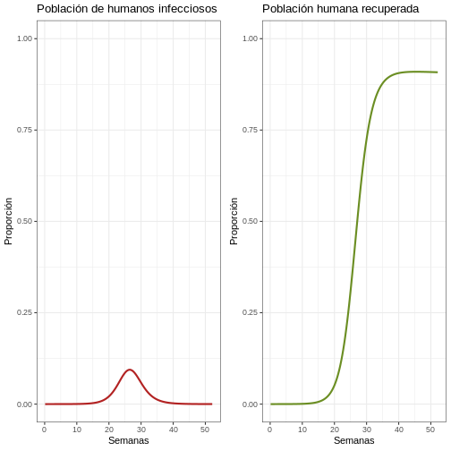
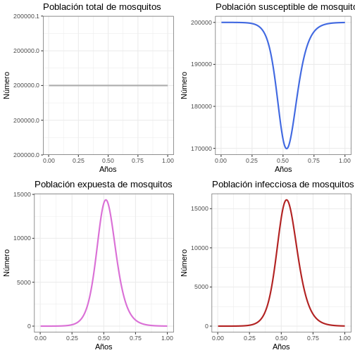

:::::::::::::::::::::::::::::::::::::: questions 

## Pregunta introductoria

-   ¿Cómo construir un modelo simplificado de zika?

::::::::::::::::::::::::::::::::::::::::::::::::

::::::::::::::::::::::::::::::::::::: objectives
## Objetivos

Al final de este taller usted podrá:

-   Reconocer cómo se construye un modelo determinístico simple mediante
    ecuaciones diferenciales ordinarias.
-   Identificar parámetros relevantes para modelar epidemias de ETV.
-   Diagramar la interacción entre los diferentes compartimentos del
    sistema mediante los parámetros.
-   Traducir ecuaciones matemáticas del modelo determinístico a código
    de lenguaje R.
-   Explorar el uso de las simulaciones del modelo para proyectar
    escenarios de transmisión y potencial impacto de las intervenciones
::::::::::::::::::::::::::::::::::::::::::::::::


::::::::::::::::::::: prereq

Esta unidad tiene como prerequisitos:

-   Introducción a R y RStudio
-   Introducción a la teoría epidémica
-   Historia de las epidemias y las pandemias
-   Visualización de datos en R con ggplot
:::::::::::::::::::::


::::::::::::::::::: checklist
## **Tabla de contenido**

+--------------------------------------------------------------------+
| 1.  Tema 1: Enfermedades transmitidas por vectores: Biología del   |
|     vector, virus del Zika, diagnóstico e intervenciones           |
|                                                                    |
| 2.  Tema 2: Repaso ¿Qué es un modelo determinístico simple?        |
|                                                                    |
| 3.  Tema 3: Modelo SIR simple Zika                                 |
|                                                                    |
| 4.  Tema 4: Elaborando diagramas y ecuaciones del modelo Zika      |
|                                                                    |
| 5.  Tema 5. Elaborando la tabla de parámetros del modelo simple de |
|     Zika.                                                          |
|                                                                    |
| 6.  Tema 6: Modelo Zika en R                                       |
|                                                                    |
| 7.  Tema 7: Parametrización de intervenciones de control para Zika |
+--------------------------------------------------------------------+
:::::::::::::::::::

# Introducción

En esta unidad abordaremos la construcción de un modelo determinístico
simple, específicamente para el virus del Zika, una enfermedad que
desencadenó una gran epidemia en Latinoamérica y el Caribe, y que fue
declarada como emergencia de salud pública de importancia internacional.
Utilizando los conocimientos previos de teoría epidémica, construiremos
un modelo determinístico tipo SIR que incorpora aspectos demográficos.

Para la construcción de este modelo, aprenderemos sobre la dinámica de
interacción entre humanos y vectores, así como de los parámetros
fundamentales que rigen estos procesos biológicos. Mediante la
construcción de un diagrama, examinaremos estas relaciones y
formularemos ecuaciones que describen el comportamiento del sistema.
Estas ecuaciones serán la base para simular el modelo en el lenguaje de
programación R. A su vez propondremos y modelaremos estrategias de
intervención.

Mediante el análisis del modelo, evaluaremos el potencial impacto de
esta epidemia en la sociedad, contextualizando algunas de estas
intervenciones en América Latina. Además, reforzaremos y aplicaremos
temas clave como son: Modelo SIR, Inmunidad de rebaño, Parámetros e
intervenciones de control (fumigación, mosquiteros y vacunación) para
una Enfermedad transmitida por vectores (ETV).

# **Tema 6: Modelo Zika en R**

En esta sección pondremos en uso el conocimiento adquirido sobre el
Zika, los mecanismos involucrados en la transmisión y las ecuaciones del
modelo. El objetivo es construirlo en R.

El único paquete que se requiere para el modelamiento es deSolve, el
cual permite resolver las ecuaciones diferenciales. Adicionalmente para
manejar los datos y graficar los resultados recomendamos usar tidyverse
y cowplot.

## 6.1 Inicio práctica en R

Para iniciar nuestra práctica en **R**, por favor abra un **proyecto de
R** y cree un nuevo documento. En este documento debemos cargar las
funciones que acabamos de explicar. Si tiene dificultades con este
proceso por favor repase la **unidad Introducción a R**.

install.packages(deSolve) \# Paquete deSolve para resolver las
ecuaciones diferenciales

Una vez instalado el paquete deSolve por favor cárgue los paquetes con
las siguientes líneas de código, cópielas en su script de R y
ejecútelas.


``` r
library(deSolve)

library(tidyverse)
── Attaching core tidyverse packages ──────────────────────── tidyverse 2.0.0 ──
✔ dplyr     1.1.4     ✔ readr     2.1.5
✔ forcats   1.0.0     ✔ stringr   1.5.1
✔ ggplot2   3.5.1     ✔ tibble    3.2.1
✔ lubridate 1.9.3     ✔ tidyr     1.3.1
✔ purrr     1.0.2     
── Conflicts ────────────────────────────────────────── tidyverse_conflicts() ──
✖ dplyr::filter() masks stats::filter()
✖ dplyr::lag()    masks stats::lag()
ℹ Use the conflicted package (<http://conflicted.r-lib.org/>) to force all conflicts to become errors

library(cowplot)

Attaching package: 'cowplot'

The following object is masked from 'package:lubridate':

    stamp
```

Recordemos que para crear un modelo necesitamos compartimentos,
condiciones iniciales, parámetros y ecuaciones.

Para este modelo en R empezaremos por definir los parámetros, es decir,
todos aquellos valores que a través de la investigación se han
recopilado y hacen parte del comportamiento de la enfermedad. En la
sección anterior hablamos sobre ellos y los completamos en una tabla. Es
hora de ingresarlos en R.

**Instrucción**: Por favor, tome la tabla que trabajó anteriormente e ingrese el valor de cada uno de estos parámetros.

:::::::::::::::::::::::::::::::::::: callout
### NOTA: 
Es importante recordar que en R, puede utilizar objetos
previamente creados para realizar cálculos. Por ejemplo, el parámetro
muv es el inverso del parámetro Lv, es decir, muv = 1/Lv. Por lo tanto,
en R se puede asignar este valor directamente con muv \<- 1/Lv. No es
necesario realizar la división y asignar el resultado manualmente.
:::::::::::::::::::::::::::::::::::::::::::

::::::::::::::::::::::::::::::::::::: challenge 
## Desafío 1

Instrucción: Por favor, tome la tabla que trabajó anteriormente e
ingrese el valor de cada uno de estos parámetros.


``` r
Lv       <-        # Esperanza de vida de los mosquitos (en días)
Lh       <-        # Esperanza de vida de los humanos (en días)
PIh      <-        # Periodo infeccioso en humanos (en días)
PIv      <-        # Periodo infeccioso en vectores (en días)
PEI      <-        # Período extrínseco de incubación en mosquitos adultos (en días)
muv      <-        # Tasa per cápita de mortalidad de la población de mosquitos (1/Lv)
muh      <-        # Tasa per cápita de mortalidad de la población de humanos (1/Lh)
alphav   <-        # Tasa per cápita de natalidad de la población de mosquitos. Por ahora asumiremos que es la misma de tasa de mortalidad.
alphah   <-        # Tasa per cápita de natalidad de la población de humanos.  Por ahora asumiremos que es la misma de tasa de mortalidad
gamma    <-        # Tasa de recuperación en humanos (1/PIh)
delta    <-        # Tasa extrínseca de incubación (1/PEI)
Nh       <-        # Número de humanos. Para este ejercicio proponemos 100.000 humanos. Puede cambiarlos si desea de acuerdo a su contexto.
m        <-        # Densidad de mosquitos hembra por humano
Nv       <-        # Número de mosquitos (m * Nh)
R0       <-        # Número reproductivo básico
ph       <-        # Probabilidad de transmisión de un mosquito infeccioso a un humano susceptible después de una picadura.
pv       <-        # Probabilidad de transmisión de un humano infeccioso a un mosquito susceptible después de una picadura.
b        <-        sqrt((R0 * muv*(muv+delta) * (muh+gamma)) /
                   (m * ph * pv * delta)) # Tasa de picadura
betah    <-        # Coeficiente de transmisión de un mosquito infeccioso a un humano susceptible después de una picadura (ph*b)
betav    <-        # Coeficiente de transmisión de un humano infeccioso a un mosquito susceptible después de una picadura (pv*b)
TIME     <-  1      # Número de años que se va a simular. Para este ejercicio iniciaremos con el primer año de la epidemia.
```
::::::::::::::::::::::::::::::::::::::::::::::::

:::::::::::::::::::::::::::::::::::::::::::::::::::::::::::::::::::: instructor 
## Solución 1


``` r

Lv       <-   10     # Esperanza de vida de los mosquitos (en días)
Lh       <-   50*365 # Esperanza de vida de los humanos (en días)
PIh      <-   7      # Periodo infeccioso en humanos (en días)
PIv      <-   6      # Periodo infeccioso en vectores (en días)
PEI      <-   8.4    # Período extrínseco de incubación en mosquitos adultos (en días)
muv      <-   1/Lv   # Tasa per cápita de mortalidad de la población de mosquitos (1/Lv)
muh      <-   1/Lh   # Tasa per cápita de mortalidad de la población de humanos (1/Lh)
alphav   <-   muv    # Tasa per cápita de natalidad de la población de mosquitos. Por ahora asumiremos que es la misma de tasa de mortalidad.
alphah   <-   muh    # Tasa per cápita de natalidad de la población de humanos.  Por ahora asumiremos que es la misma de tasa de mortalidad
gamma    <-   1/PIh  # Tasa de recuperación en humanos (1/PIh)
delta    <-   1/PEI  # Tasa extrínseca de incubación (1/PEI)
Nh       <-   100000 # Número de humanos. Para este ejercicio proponemos 100.000 humanos. Puede cambiarlos si desea de acuerdo a su contexto.
m        <-   2      # Densidad de mosquitos hembra por humano
Nv       <-   m*Nh   # Número de mosquitos (m * Nh)
R0       <-   3      # Número reproductivo básico
ph       <-   0.7    # Probabilidad de transmisión de un mosquito infeccioso a un humano susceptible después de una picadura.
pv       <-   0.7    # Probabilidad de transmisión de un humano infeccioso a un mosquito susceptible después de una picadura.
b        <-        sqrt((R0 * muv*(muv+delta) * (muh+gamma)) /
                   (m * ph * pv * delta)) # Tasa de picadura
betah    <-  ph*b    # Coeficiente de transmisión de un mosquito infeccioso a un humano susceptible después de una picadura (ph*b)
betav    <-  pv*b    # Coeficiente de transmisión de un humano infeccioso a un mosquito susceptible después de una picadura (pv*b)
TIME     <-  1       # Número de años que se va a simular. Para este ejercicio iniciaremos con el primer año de la epidemia.
```
:::::::::::::::::::::::::::::::::::::::::::::::::::::::::::::::::::::::::::::::: 

## 6.2 Ecuaciones del modelo
Ahora que ya ingresamos al script los parámetros es hora de emplear las
ecuaciones que se escribieron antes, las cuales permiten conocer el
número de individuos en cada uno de los seis compartimentos en función
del tiempo. Tres compartimentos para los humanos y tres compartimentos
para los mosquitos, los cuales están identificados por una **h** (para
humanos) y una **v** (para mosquitos). Para los humanos tenemos los
compartimentos; susceptibles, infectados y recuperados (de ahí la
palabra **SIR**) y para los mosquitos los compartimientos son:
susceptibles, expuestos e infecciosos (**SEI**).

::::::::::::::::::: checklist
### Compartimentos
-   $S_h$ : Humanos susceptibles

-   $I_h$ : Humanos infecciosos

-   $R_h$ : Humanos recuperados de la infección (inmunizados frente a
    nueva infección)

-   $S_v$ : Vectores susceptibles

-   $E_v$ : Vectores expuestos

-   $I_v$ : Vectores infecciosos
:::::::::::::::::::


Para este modelo emplearemos las siguientes ecuaciones diferenciales:

### 6.2.1 Humanos

$$\ \frac{dSh}{dt}  = \alpha_h N_h - \beta_h \frac {I_v}{N_h}S_h - \mu_h  S_h $$

$$\ \frac{dIh}{dt}  = \beta_h \frac {I_v}{N_h}S_h - (\gamma + \mu_h) I_h $$\

$$\ \frac{dRh}{dt}  = \gamma I_h  - \mu_h R_h$$

### 6.2.2 Vectores

$$\ \frac{dSv}{dt}  = \alpha_v N_v  - \beta_v \frac{ I_h} {N_h}S_v  - \mu_v Sv$$

$$\ \frac{dE_v}{dt}  = \beta_v \frac{I_h} {N_h}S_v- (\delta + \mu_v) Ev$$\

$$\ \frac{dI_v}{dt}  = \delta Ev - \mu_v I_v$$

## 6.3 Fórmula para calcular $R_0$ (Número reproductivo básico)

Fórmula necesaria para estimar $R_0$:

$$ R_0 = \frac{mb^2 p_h p_v \delta}{\mu_v (\mu_v+\delta)(\mu_h+\gamma)} $$

::::::::::::::::::::::::::::::::::::: challenge 

**Instrucción**: Traduzca las ecuaciones a R


``` r

# Humanos
         dSh   <-  alphah * Nh - betah * (Iv/Nh) * Sh - muh * Sh   
         dIh   <-______ * (Iv/Nh) * Sh - (____ + _____) * Ih
         dRh   <-  ______ * Ih  - ______ * Rh
         
 # Mosquitos
         dSv  <-  alphav * Nv - _____ * (Ih/Nh) * Sv - _____ * Sv 
         dEv  <-  _____ * (Ih/Nh) * Sv - (____ + _____)* Ev
         dIv  <-  _____ * Ev - _____ * Iv

```
::::::::::::::::::::::::::::::::::::::::::::::::

Una vez sepamos traducir las ecuaciones a código,  se procederá a
ejecutar el modelo. Para esto se usará la función ode del
paquete deSolve.

Se empezará por crear la función (que luego se usará en el argumento
**fun**). Para ello es necesario traducir las ecuaciones del modelo de
Zika a **R**. Abajo encontrará la función ya construida `modelo_zika`
para que usted reemplace las ecuaciones que ya completó arriba.

::::::::::::::::::::::::::::::::::::: challenge 
## Desafío 3

**Instrucción**: Reemplace las ecuaciones incompletas del siguiente
código por las ecuaciones completas del modelo Zika que trabajó  en la
instrucción anterior.


``` r

# Modelo determinístico simple (fun)
modelo_zika <- function(tiempo, variable_estado, parametros) {
  
  with(as.list(c(variable_estado, parametros))
, # entorno local para evaluar derivados
       {
         # Humanos
         dSh   <-  ____ * Nh - ____ * (Iv/Nh) * Sh - ____ * Sh   
         dIh   <-  ____ * (Iv/Nh) * Sh - (____ + ____) * Ih
         dRh   <-  ____ * Ih  - ____ * Rh
         
         # Mosquitos
         dSv  <-  alphav * Nv - ____ * (Ih/Nh) * Sv - ____ * Sv 
         dEv  <-  ____ * (Ih/Nh) * Sv - (____ + ____)* Ev
         dIv  <-  ____ * Ev - ____ * Iv
         
         list(c(dSh, dIh, dRh, dSv, dEv, dIv))
       }
  )
}

```
::::::::::::::::::::::::::::::::::::::::::::::::

:::::::::::::::::::::::::::::::::::::::::::::::::::::::::::::::::::: instructor 
## Solución 3


``` r

# Modelo determinístico simple (fun)
modelo_zika <- function(tiempo, variable_estado, parametros) {
  
  with(as.list(c(variable_estado, parametros))
, # entorno local para evaluar derivados
       {
         # Humanos
         dSh   <-  alphah * Nh - betah * (Iv/Nh) * Sh - muh * Sh
         dIh   <-  betah * (Iv/Nh) * Sh  - (gamma + muh) * Ih
         dRh   <-  gamma * Ih  - muh * Rh
         
         # Vectores
         dSv   <-  alphav * Nv - betav * (Ih/Nh) * Sv - muv * Sv 
         dEv   <-  betav * (Ih/Nh) * Sv - (delta + muv)* Ev
         dIv   <-  delta * Ev - muv * Iv
         
         dx    <- c(dSh, dIh, dRh, dSv, dEv, dIv)
        list(c(dSh, dIh, dRh, dSv, dEv, dIv))
       }
  )
}
```
:::::::::::::::::::::::::::::::::::::::::::::::::::::::::::::::::::::::::::::::: 

## 6.4 Resolviendo el Sistema

Para resolver el sistema es necesario crear los tres argumentos
faltantes (**times**, **parms** y **y**) para usar la función `ode`.

::::::::::::::::::::::::::::::::::::: challenge 
## Desafío 4

**Instrucción:** Para `times` y `parms`, copie el código que se
encuentra a continuación y ejecútelo.


``` r
# Secuencia temporal (times)
tiempo <- seq(1, 365 * TIME , by = 1)
# Los parámetros (parms)
params <- c(
  muv      = muv,     
  muh      = muh, 
  alphav   = alphav,
  alphah   = alphah,
  gamma    = gamma,   
  delta    = delta,   
  betav    = betav,       
  betah    = betah,   
  Nh       = Nh,      
  Nv       = Nv
)
```
::::::::::::::::::::::::::::::::::::::::::::::::

En el código que ejecutó se creó tiempo (**times)** y parametros
(**params)**. Aún nos falta crear el argumento **y**, el cual
desarrollaremos en la siguiente sección.

### 6.4.1. **Condiciones iniciales del sistema (y)**

Para definir las condiciones iniciales, recuerde que el escenario a
modelar en este ejercicio es para una fecha **antes del reporte del
primer caso**.  Por lo tanto estos valores deben reflejar ese
contexto.  

::::::::::::::::::::::::: discussion
**Reflexión:** ¿Qué condiciones iniciales tendrían cada uno de los
compartimientos?
:::::::::::::::::::::::::


::::::::::::::::::::::::::::::::::::: challenge 
## Desafío 5

**Instrucción:** Complete los espacios según lo aprendido en el
tutorial.


``` r
# Condiciones iniciales del sistema (y)
inicio <- c(Sh = _______ ,        # COMPLETE Y COMENTE
            Ih = _______ ,        # COMPLETE Y COMENTE
            Rh = _______ ,        # COMPLETE Y COMENTE
            Sv = _______ ,        # COMPLETE Y COMENTE
            Ev = _______ ,        # COMPLETE Y COMENTE
            Iv = _______ )        # COMPLETE Y COMENTE
```
::::::::::::::::::::::::::::::::::::::::::::::::


:::::::::::::::::::::::::::::::::::::::::::::::::::::::::::::::::::: instructor 
## Solución 5


``` r
# Condiciones iniciales del sistema (y)
inicio <- c(Sh = Nh ,      # Número inicial de Sh en el tiempo 0
           Ih = 0,        # Número inicial de Ih en el tiempo 0
           Rh = 0,        # Número inicial de Rh en el tiempo 0
           Sv = Nv,     # Número inicial de Sv en el tiempo 0
           Ev = 0,        # Número inicial de Ev en el tiempo 0
           Iv = 0)        # Número inicial de Iv en el tiempo 0
```
:::::::::::::::::::::::::::::::::::::::::::::::::::::::::::::::::::::::::::::::: 

### 6.4.2 Función ode

Una vez creados todos los argumentos necesarios, es hora de ingresarlos
a ode.  Recordemos los cuatro argumentos de ode y a que corresponden a:

-   **y**:**inicio**. Vector creado con las condiciones iniciales de los
    seis compartimentos.

-   **times**:**tiempo**. Vector con la secuencia temporal

-   **fun:modelo_zika**. Función que contiene las ecuaciones necesarias
    para simular el modelo.

-   **parms:parametros.** Vector en el cual se recopilaron los
    parámetros necesarios para simular el modelo.

::::::::::::::::::::::::::::::::::::: challenge 
## Desafío 6

**Instrucción**: Complete los espacios en blanco según lo trabajado
hasta el momento.


``` r

# Resuelva las ecuaciones
salida <- ode(y      =   _______ , # COMPLETE Y COMENTE
              times  = _______ ,   # COMPLETE Y COMENTE
              fun    = _______ ,   # COMPLETE Y COMENTE
              parms  = _______  # COMPLETE Y COMENTE
) %>%
  as.data.frame() # Convertir a data frame
```
::::::::::::::::::::::::::::::::::::::::::::::::

:::::::::::::::::::::::::::::::::::::::::::::::::::::::::::::::::::: instructor 
## Solución 6


``` r
# Resuelva las ecuaciones
salida <- ode(y      = inicio,     # Condiciones iniciales
             times  = tiempo,      # Tiempo
             fun    = modelo_zika, # Modelo
             parms  = params    # Parámetros
) %>%
  as.data.frame() # Convertir a data frame
```
:::::::::::::::::::::::::::::::::::::::::::::::::::::::::::::::::::::::::::::::: 

### 6.4.3 **Introduciendo el primer caso**

Ahora que tenemos todos los compartimentos definidos, es hora de
ingresar al modelo un individuo infeccioso para iniciar la epidemia. 

::::::::::::::::::::::::: discussion
**Reflexión:** ¿Qué cree que es más probable, que a una población (en
otro país) ingrese un humano infeccioso o un mosquito infeccioso?
:::::::::::::::::::::::::

Para nuestro caso hipotético, vamos a suponer que una persona se infectó
en Brasil mientras estaba de turismo y regresó posteriormente a la
ciudad \_\_\_\_\_\_\_\_\_\_\_\_\_\_ (la ciudad que usted definió al
comienzo del ejercicio) siendo el primer sujeto infeccioso en esta
población. En este contexto, el compartimento de humanos infecciosos
tendrá entonces un individuo, **Ih** = 1 y el compartimento de humanos
susceptibles tendrá  un individuo menos, **Sh** = **Nh** - 1.

::::::::::::::::::::::::::::::::::::: challenge 

**Pista:** Cambie en R las condiciones iniciales (inicio) de forma que
Ih = 1 y Sh = Nh - 1.

::::::::::::::::::::::::::::::::::::::::::::::::

:::::::::::::::::::::::::::::::::::::::::::::::::::::::::::::::::::: instructor 

## Solución


``` r
# Condiciones iniciales del sistema (y)

inicio <- c(Sh = Nh ,      # Número inicial de Sh en el tiempo 0            
            Ih = 0,        # Número inicial de Ih en el tiempo 0            
            Rh = 0,        # Número inicial de Rh en el tiempo 0            
            Sv = Nv-1,     # Número inicial de Sv en el tiempo 0            
            Ev = 0,        # Número inicial de Ev en el tiempo 0            
            Iv = 1)        # Número inicial de Iv en el tiempo 0 
```


``` r
# Resuelva las ecuaciones
salida <- ode(y      = inicio,     # Condiciones iniciales
             times  = tiempo,      # Tiempo
             fun    = modelo_zika, # Modelo
             parms  = params    # Parámetros
) %>%
  as.data.frame() # Convertir a data frame
```

:::::::::::::::::::::::::::::::::::::::::::::::::::::::::::::::::::::::::::::::: 

## 6.5 **¡Ahora ejecutaremos el modelo!**

**Hasta este punto, usted ha completado toda la información faltante en
el script  para poder ejecutar el modelo.**

:::::::::::::::::::::::::::::::::::: callout
**Instrucción:** Ejecute cada conjunto de las líneas del script vistas
anteriormente, es decir, ejecute las secciones: Lista de parámetros, la
sección Modelo determinístico simple (donde construyó el modelo), las
secciones Secuencia temporal (tiempo (times)),  Los parámetros
(parametros (parms)), la sección Condiciones iniciales del sistema
(inicio (y)) y la sección final Resuelva las ecuaciones.

**Instrucción:** Verifique que no aparezca ningún error. En caso de
error por favor verifique la escritura del código y que no haya quedado
en el código otros caracteres que no corresponden como por ejemplo
"\_\_\_\_\_" los guiones de los espacios para completar.
:::::::::::::::::::::::::::::::::::::::::::


## 6.6 **Visualizando los resultados**

**En nuestro curso usaremos ggplot para la visualización de datos. Es
importante que repase la Unidad 4. Visualización de datos en ggplot**

Hay que recordar que la unidad de tiempo del modelo de Zika está ya
definida desde los parámetros como  **días**.  

Sin embargo, si usted quisiera visualizar los resultados en semanas,
meses o años puede hacerlo a partir de los resultados del modelo
(`salida$time`). Para hacerlo, puede usar el siguiente código.

::::::::::::::::::::::::::::::::::::: challenge 
## Desafío 7

Para tener una visualización más significativa de los resultados,
convierta las unidades de tiempo de *días* a *años* y a *semanas*.


``` r
# Cree las opciones de tiempo para años y semanas 
salida$años <- salida$time/365
salida$semanas <- salida$time/7
```
::::::::::::::::::::::::::::::::::::::::::::::::

### 6.7 **Visualice y analice la primer epidemia**

Empecemos realizando una visualización de la primera epidemia. Dado que
es un periodo de un año visualicemos las gráficas en semanas. 

Instrucción: Ejecute el código a continuación y analice las gráficas
resultantes. 


``` r
# Revise la primera epidemia
p1e <- ggplot(data = salida, aes(y = Ih, x = semanas)) +
  geom_line(color = 'firebrick', linewidth = 1) +
  ggtitle('Población de humanos infecciosos') +
  theme_bw() + ylab('Número') + xlab('Semanas') +
 coord_cartesian(ylim = c(0,10000)) #creamos gráfico de población humana infecciosa
p2e <- ggplot(data = salida, aes(y = Rh, x = semanas)) +
  geom_line(color = 'olivedrab', linewidth = 1) +
  ggtitle('Población humana recuperada') +
  theme_bw() + ylab('Número') + xlab('Semanas') +
 coord_cartesian(ylim = c(0,100000))  #creamos gráfico de población humana recuperada


plot_grid(p1e, p2e) #creamos gráfico comparativo de la gráfica de población humana infecciosa y población humana recuperada
```


::::::::::::::::::::::::: discussion
**Reflexión:** ¿Qué puede observar en la gráfica? Observe bien el eje Y.
¿Qué proporción de humanos son infecciosos al mismo tiempo? 
:::::::::::::::::::::::::

Para tener mayor claridad de esto podemos crear gráficas de las
proporciones:


``` r
# Revise la primera epidemia con proporciones
p1p <- ggplot(data = salida, aes(y = Ih/(Sh+Ih+Rh), x = semanas)) +
  geom_line(color = 'firebrick', linewidth = 1) +
  ggtitle('Población de humanos infecciosos') +
  theme_bw() + ylab('Proporción') + xlab('Semanas') +
 coord_cartesian(ylim = c(0,1)) #creamos gráfico de población humana infecciosa
p2p <- ggplot(data = salida, aes(y = Rh/(Sh+Ih+Rh), x = semanas)) +
  geom_line(color = 'olivedrab', linewidth = 1) +
  ggtitle('Población humana recuperada') +
  theme_bw() + ylab('Proporción') + xlab('Semanas') +
 coord_cartesian(ylim = c(0,1))  #creamos gráfico de población humana recuperada


plot_grid(p1p, p2p) #creamos gráfico comparativo de la gráfica de población humana infecciosa y población humana recuperada
```



**Comportamiento general (Población humana)**

Ya observamos la primera epidemia es momento de proyectar la epidemia a
un tiempo superior. 

**Instrucción:** Regrese a los parámetros y modifique el parámetro TIME
a 100 años. Ejecute el siguiente bloque de código y observe cuántos
brotes se producen en la población humana y el tamaño de cada brote.


``` r
# # Revise el comportamiento general del modelo para 100 años
p1h <- ggplot(data = salida, aes(y = (Rh + Ih + Sh), x = años)) +
  geom_line(color = 'grey68', linewidth = 1) +
  ggtitle('Población humana total') +
  theme_bw() + ylab('Número') + xlab('Años')
p2h <- ggplot(data = salida, aes(y = Sh, x = años)) +
  geom_line(color = 'royalblue', linewidth = 1) +
  ggtitle('Población humana susceptible') +
  theme_bw() + ylab('Número') + xlab('Años')
p3h <- ggplot(data = salida, aes(y = Ih, x = años)) +
  geom_line(color = 'firebrick', linewidth = 1) +
  ggtitle('Población humana infecciosa') +
  theme_bw() + ylab('Número') + xlab('Años')
p4h <- ggplot(data = salida, aes(y = Rh, x = años)) +
  geom_line(color = 'olivedrab', linewidth = 1) +
  ggtitle('Población humana recuperada') +
  theme_bw() + ylab('Número') + xlab('Años')
plot_grid(p1h, p2h, p3h, p4h, ncol = 2)
```


**Comportamiento General (Población de mosquitos)**

**Instrucción:** Ejecute el siguiente bloque de código y observe cuántos
brotes se producen en la población de mosquitos y el tamaño de cada
brote. Compare las gráficas con las gráficas de la población humana.


``` r
# Revise el comportamiento general del modelo
p1v <- ggplot(data = salida, aes(y = (Sv + Ev + Iv), x = años)) +
  geom_line(color = 'grey68', linewidth = 1) +
  ggtitle('Población total de mosquitos') +
  theme_bw() + ylab('Número') + xlab('Años')
p2v <- ggplot(data = salida, aes(y = Sv, x = años)) +
  geom_line(color = 'royalblue', linewidth = 1) +
  ggtitle('Población susceptible de mosquitos') +
  theme_bw() + ylab('Número') + xlab('Años')
p3v <- ggplot(data = salida, aes(y = Ev, x = años)) +
  geom_line(color = 'orchid', linewidth = 1) +
  ggtitle('Población expuesta de mosquitos') +
  theme_bw() + ylab('Número') + xlab('Años')
p4v <- ggplot(data = salida, aes(y = Iv, x = años)) +
  geom_line(color = 'firebrick', linewidth = 1) +
  ggtitle('Población infecciosa de mosquitos') +
  theme_bw() + ylab('Número') + xlab('Años')
plot_grid(p1v, p2v, p3v, p4v, ncol = 2)
```



**Proporción**

**Instrucción:** Ejecute el siguiente bloque de código y compárelo con
las gráficas generadas para la población humana. 


``` r
p1 <- ggplot(data = salida, aes(y = Sh/(Sh+Ih+Rh), x = años)) +
  geom_line(color = 'royalblue', linewidth = 1) +
  ggtitle('Población humana susceptible') +
  theme_bw() + ylab('Proporción') + xlab('Años') +
  coord_cartesian(ylim = c(0,1))
p2 <- ggplot(data = salida, aes(y = Ih/(Sh+Ih+Rh), x = años)) +
  geom_line(color = 'firebrick', linewidth = 1) +
  ggtitle('Población humana infecciosa') +
  theme_bw() + ylab('Proporción') + xlab('Años') +
  coord_cartesian(ylim = c(0,1))
p3 <- ggplot(data = salida, aes(y = Rh/(Sh+Ih+Rh), x = años)) +
  geom_line(color = 'olivedrab', linewidth = 1) +
  ggtitle('Población humana recuperada') +
  theme_bw() + ylab('Proporción') + xlab('Años') +
  coord_cartesian(ylim = c(0,1))
plot_grid(p1, p2, p3, ncol = 2)  
```


::::::::::::::::::::::::::::::::::::: keypoints 

## Puntos clave

Revise si al final de esta lección adquirió estas competencias:

-   Aplicar conceptos como parámetros, $R_0$ e inmunidad de rebaño,
    aprendidos en la sesión A del taller
-   Traducir fórmulas matemáticas de las interacciones entre los
    parámetros del modelo a código de R
-   Realizar un modelo simple en R para una enfermedad transmitida por
    vector
-   Discutir cambios en las proyecciones del modelo cuando se instauran
    diferentes estrategias de control de la infección
::::::::::::::::::::::::::::::::::::::::::::::::

### Contribuciones

-   Zulma Cucunuba & Pierre Nouvellet: Versión inicial
-   Kelly Charinga & Zhian N. Kamvar: Edición
-   José M. Velasco-España: Traducción de Inglés a Español y Edición
-   Andree Valle-Campos: Ediciones menores

### Asuntos legales

**Copyright**: Zulma Cucunuba & Pierre Nouvellet, 2017

### Referencias

de Carvalho, S. S., Rodovalho, C. M., Gaviraghi, A., Mota, M. B. S.,
Jablonka, W., Rocha-Santos, C., Nunes, R. D., Sá-Guimarães, T. da E.,
Oliveira, D. S., Melo, A. C. A., Moreira, M. F., Fampa, P., Oliveira, M.
F., da Silva-Neto, M. A. C., Mesquita, R. D., & Atella, G. C. (2021).
Aedes aegypti post-emergence transcriptome: Unveiling the molecular
basis for the hematophagic and gonotrophic capacitation. PLoS Neglected
Tropical Diseases, 15(1), 1--32.
<https://doi.org/10.1371/journal.pntd.0008915>

Chang, C., Ortiz, K., Ansari, A., & Gershwin, M. E. (2016). The Zika
outbreak of the 21st century. Journal of Autoimmunity, 68, 1--13.
<https://doi.org/10.1016/j.jaut.2016.02.006>

Cori, A., Ferguson, N. M., Fraser, C., & Cauchemez, S. (2013). A new
framework and software to estimate time-varying reproduction numbers
during epidemics. American Journal of Epidemiology, 178(9), 1505--1512.
<https://doi.org/10.1093/aje/kwt133>

Duffy, M. R., Chen, T.-H., Hancock, W. T., Powers, A. M., Kool, J. L.,
Lanciotti, R. S., Pretrick, M., Marfel, M., Holzbauer, S., Dubray, C.,
Guillaumot, L., Griggs, A., Bel, M., Lambert, A. J., Laven, J., Kosoy,
O., Panella, A., Biggerstaff, B. J., Fischer, M., & Hayes, E. B. (2009).
Zika Virus Outbreak on Yap Island, Federated States of Micronesia. New
England Journal of Medicine, 360(24), 2536--2543.
<https://doi.org/10.1056/nejmoa0805715>

Ferguson, N. M., Cucunubá, Z. M., Dorigatti, I., Nedjati-Gilani, G. L.,
Donnelly, C. A., Basáñez, M. G., Nouvellet, P., & Lessler, J. (2016).
Countering the Zika epidemic in Latin America. Science, 353(6297).
<https://doi.org/10.1126/science.aag0219>

Heesterbeek, J. A. P. (2002). A brief history of R0 and a recipe for its
calculation. Acta Biotheoretica, 50(3).
<https://doi.org/10.1023/A:1016599411804>

Lee, E. K., Liu, Y., & Pietz, F. H. (2016). A Compartmental Model for
Zika Virus with Dynamic Human and Vector Populations. AMIA ... Annual
Symposium Proceedings. AMIA Symposium, 2016, 743--752.

Pettersson, J. H. O., Eldholm, V., Seligman, S. J., Lundkvist, Å.,
Falconar, A. K., Gaunt, M. W., Musso, D., Nougairède, A., Charrel, R.,
Gould, E. A., & de Lamballerie, X. (2016). How did zika virus emerge in
the Pacific Islands and Latin America? MBio, 7(5).
<https://doi.org/10.1128/mBio.01239-16>
